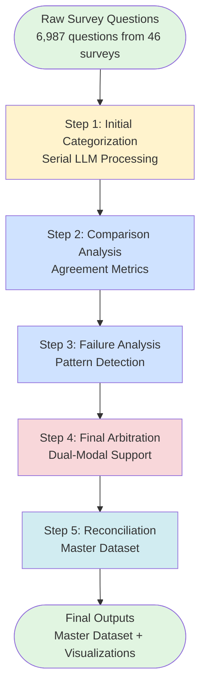
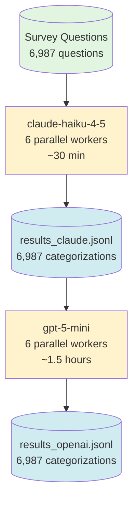
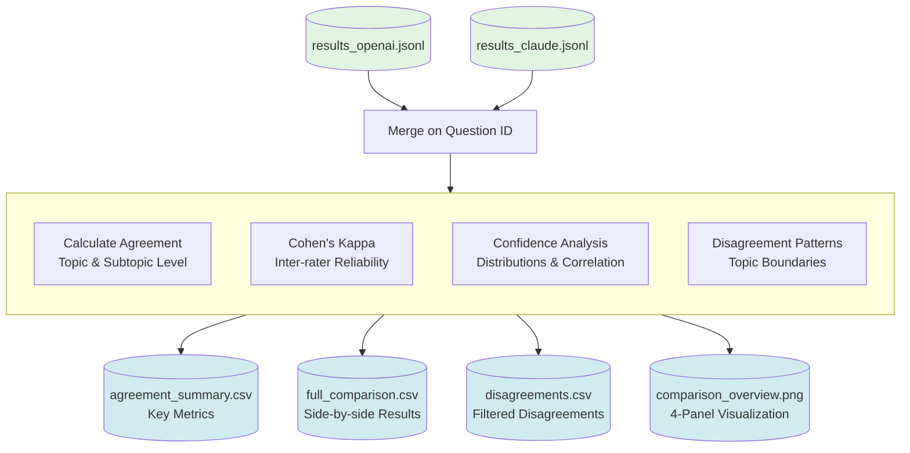
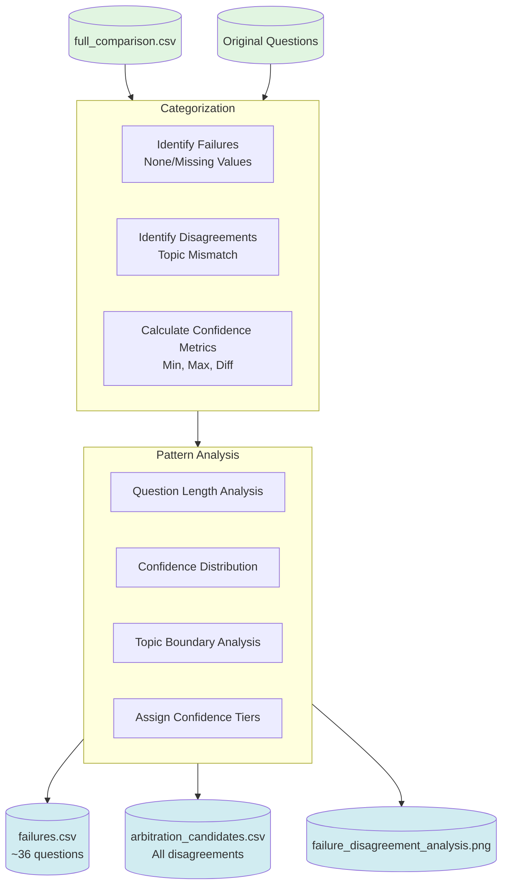
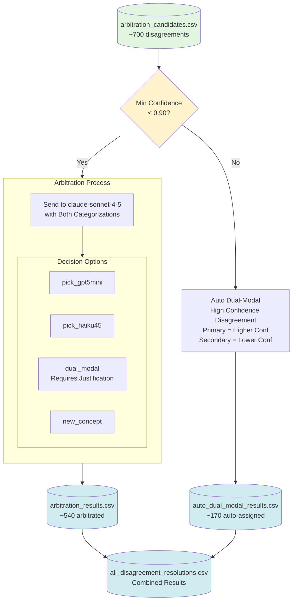
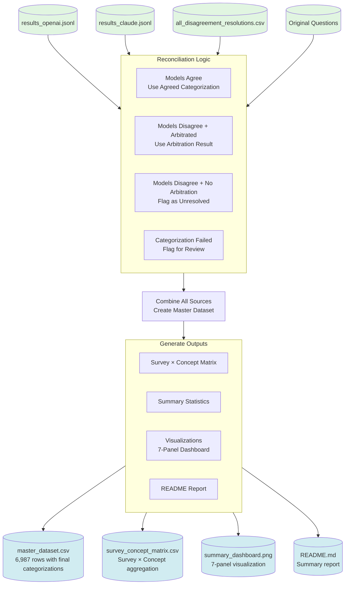
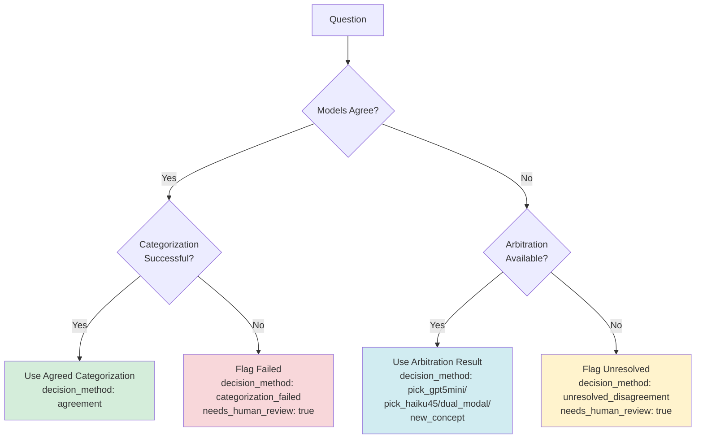

# Federal Survey Concept Mapping Pipeline Documentation

## Pipeline Overview

This document provides detailed technical documentation of the survey concept mapping pipeline, including data flows, decision logic, and architectural diagrams.

---

## 1. High-Level Pipeline Architecture



**Pipeline Inputs:**
- Raw survey questions CSV (6,987 rows × 49 columns)
- Census Bureau taxonomy JSON (5 topics, 152 subtopics)

**Pipeline Outputs:**
- Master dataset CSV with final categorizations
- Survey × concept matrix for analysis
- Summary visualizations and reports
- Confidence tier breakdowns
- Dual-modal question identification

**Key Assumptions:**
1. Census taxonomy is authoritative and complete
2. Survey context matters (same question in different surveys may differ)
3. Questions can span multiple concepts (dual-modal)
4. LLM confidence scores are meaningful indicators

**Implementation Note:**
The categorization script (`llm_categorization.py`) supports running models independently via command-line flags:
- `--openai-only`: Run only gpt-5-mini (useful for re-runs)
- `--claude-only`: Run only claude-haiku-4-5 (useful for re-runs)
- No flag: Run both models serially - Claude first, then OpenAI (default)

---

## 2. Step 1: Initial Categorization



**Inputs:**
- `PublicSurveyQuestionsMap.csv` - Wide format with questions and survey mappings
- `census_survey_explorer_taxonomy.json` - Official Census taxonomy

**Processing Logic:**

Each model receives:
```json
{
  "question": "What is your total household income?",
  "survey": "Survey of Income and Program Participation",
  "taxonomy": {full Census taxonomy}
}
```

Each model returns:
```json
{
  "id": 123,
  "primary_topic": "Economic",
  "primary_subtopic": "Income",
  "confidence": 0.95,
  "secondary_concepts": [
    {"topic": "Demographic", "subtopic": "Household Composition"}
  ],
  "reasoning": "Direct question about household income measurement."
}
```

**Technical Details:**
- **Batch size:** 10 questions per API call
- **Execution:** Serial - Claude runs first (6 workers), then OpenAI runs (6 workers)
- **Error handling:** Exponential backoff (1s, 2s, 4s, 8s, 16s)
- **JSON parsing:** Robust extraction handles malformed responses
- **Checkpoint system:** Resume capability after interruption
- **Total time:** ~2 hours for 6,987 questions (30 min Claude, 1.5 hrs OpenAI)

**Outputs:**
- `results_openai.jsonl` - One JSON object per line
- `results_claude.jsonl` - One JSON object per line
- `categorization_checkpoint.json` - Progress tracking

**Quality Metrics:**
- Production success rate: 99.5% (35 failures out of 6,987)
- Typical failures: Very short questions (<10 chars), malformed text

---

## 3. Step 2: Comparison Analysis



**Inputs:**
- OpenAI categorizations (JSONL)
- Claude categorizations (JSONL)

**Agreement Calculation Logic:**

```python
# Topic agreement
topic_match = (df['primary_topic_openai'] == df['primary_topic_claude'])

# Subtopic agreement (stricter)
subtopic_match = (
    (df['primary_topic_openai'] == df['primary_topic_claude']) &
    (df['primary_subtopic_openai'] == df['primary_subtopic_claude'])
)

# Cohen's Kappa (accounts for chance agreement)
kappa = cohen_kappa_score(topics_openai, topics_claude)
```

**Key Metrics Generated:**
1. **Topic Agreement Rate** - % where both models chose same high-level topic
2. **Subtopic Agreement Rate** - % where both models chose same granular subtopic
3. **Cohen's Kappa** - Statistical measure of inter-rater reliability
   - >0.80 = "Almost perfect agreement"
   - 0.60-0.80 = "Substantial agreement"
4. **Confidence Correlation** - Pearson correlation of confidence scores
5. **Disagreement Patterns** - Most common topic boundary confusions

**Production Results:**
- Cohen's Kappa (topics): 0.842 ("almost perfect agreement")
- Topic agreement: ~89%
- Subtopic agreement: ~68%

**Outputs:**
- `agreement_summary.csv` - Summary statistics
- `confidence_stats.csv` - Per-model confidence distributions
- `topic_distribution.csv` - Frequency counts
- `disagreements.csv` - All cases where models disagree (~700 questions)
- `full_comparison.csv` - Complete side-by-side comparison (6,987 rows)
- `comparison_overview.png` - Confusion matrix, scatter plots, distributions

---

## 4. Step 3: Failure & Disagreement Analysis



**Inputs:**
- `full_comparison.csv` - Merged OpenAI + Claude results
- `PublicSurveyQuestionsMap.csv` - Original questions with metadata

**Failure Detection Logic:**

```python
# Identify failures (both models returned None)
failures = df[
    df['primary_topic_openai'].isna() & 
    df['primary_topic_claude'].isna()
]

# Typical failure pattern: Very short questions
# Mean failure length: ~9 chars vs ~132 overall
```

**Disagreement Analysis:**

```python
# Find disagreements
disagreements = df[
    df['primary_topic_openai'] != df['primary_topic_claude']
]

# Calculate confidence metrics
disagreements['min_confidence'] = df[
    ['confidence_openai', 'confidence_claude']
].min(axis=1)

disagreements['confidence_diff'] = abs(
    df['confidence_openai'] - df['confidence_claude']
)
```

**Confidence Tier Assignment:**

| Tier | Min Confidence Range | Description |
|------|---------------------|-------------|
| Very Low | < 0.60 | Both models uncertain |
| Low | 0.60 - 0.75 | Low confidence disagreement |
| Medium | 0.75 - 0.90 | Moderate confidence disagreement |
| High | 0.90 - 0.95 | High confidence disagreement |
| Very High | ≥ 0.95 | Both very confident but disagree |

**Key Findings:**
- **Failures:** ~36 questions (0.5%) - mostly very short text
- **Disagreements:** ~700 questions (10%)
- **Most common boundaries:**
  - Economic ↔ Social (employment, benefits)
  - Social ↔ Government (policy vs services)
  - Social ↔ Demographic (population characteristics)

**Outputs:**
- `failures.csv` - Questions that failed categorization
- `arbitration_candidates.csv` - All disagreements with confidence tiers
- `failure_disagreement_analysis.png` - Length distributions, confidence scatter plots

---

## 5. Step 4: Final Arbitration (Dual-Modal)



**Confidence Threshold Logic:**

```python
# Split disagreements by confidence
needs_arbitration = disagreements[
    disagreements['min_confidence'] < 0.90
]  # ~540 questions

auto_dual_modal = disagreements[
    disagreements['min_confidence'] >= 0.90
]  # ~170 questions
```

**Arbitration Prompt Structure:**

```
Context:
- Question text and survey name
- Both model categorizations with confidence
- Full Census taxonomy
- Confidence tier

Rules:
1. Single primary is default
2. Dual-modal only if question genuinely spans TWO topics
3. Dual-modal requires explicit justification
4. All concepts must be from taxonomy

Decision Options:
- pick_gpt5mini: Select gpt-5-mini's categorization
- pick_haiku45: Select claude-haiku-4-5's categorization
- dual_modal: Both valid, assign primary + secondary_primary
- new_concept: Both wrong, provide correct categorization
```

**Output Structure:**

```json
{
  "id": 123,
  "decision": "dual_modal",
  
  "primary_topic": "Economic",
  "primary_subtopic": "Income",
  "primary_confidence": 0.92,
  
  "secondary_primary_topic": "Social",
  "secondary_primary_subtopic": "Programs",
  "secondary_primary_confidence": 0.85,
  
  "all_relevant_subtopics": [
    "Economic.Income",
    "Economic.Employment Status",
    "Social.Programs",
    "Demographic.Household Composition"
  ],
  
  "reasoning": "Question asks about income from government assistance programs, genuinely spanning economic measurement and social program participation.",
  
  "is_dual_modal": true,
  "confidence_tier": "medium"
}
```

**Auto Dual-Modal Logic:**

For high-confidence disagreements (min_conf ≥ 0.90):
```python
# Pick higher confidence as primary
if conf_openai >= conf_claude:
    primary = openai_categorization
    secondary_primary = claude_categorization
else:
    primary = claude_categorization
    secondary_primary = openai_categorization
```

**Expected Distribution:**
- Single primary: ~90% of arbitrated cases
- Dual-modal: ~10% of arbitrated cases
- Total dual-modal (arbitrated + auto): ~180-200 questions (~2.5% of all questions)

**Outputs:**
- `arbitration_results.csv` - Arbitrated disagreements with reasoning
- `auto_dual_modal_results.csv` - Auto-assigned dual-modal cases
- `all_disagreement_resolutions.csv` - Combined final resolutions

---

## 6. Step 5: Final Reconciliation & Summary



**Reconciliation Decision Tree:**



**Master Dataset Schema:**

| Column | Type | Description |
|--------|------|-------------|
| id | int | Question identifier |
| question | str | Original question text |
| primary_survey | str | Primary survey name |
| models_agree | bool | Whether gpt-5-mini and claude-haiku-4-5 agreed |
| final_topic | str | Final primary topic |
| final_subtopic | str | Final primary subtopic |
| secondary_primary_topic | str | Secondary primary topic (if dual-modal) |
| secondary_primary_subtopic | str | Secondary primary subtopic (if dual-modal) |
| is_dual_modal | bool | Whether question spans two primary topics |
| confidence_tier | str | very_low/low/medium/high/very_high |
| decision_method | str | How final categorization was determined |
| needs_human_review | bool | Whether flagged for human review |
| all_relevant_subtopics | json | Combined subtopics from all sources |

**Survey × Concept Matrix:**

Pivot table showing question counts:
- Rows: Surveys (46 surveys)
- Columns: Concepts (152 subtopics)
- Values: Count of questions

Used for:
- Survey redundancy analysis
- Concept coverage assessment
- Survey similarity calculations

**Summary Dashboard Panels:**

1. **Decision Methods** - Pie chart of categorization methods
2. **Topic Distribution** - Bar chart of final topic counts
3. **Top 10 Concepts** - Most frequently assigned subtopics
4. **Survey Size Distribution** - Histogram of questions per survey
5. **Concept Diversity** - Histogram of unique concepts per survey
6. **Top 15 Surveys** - Bar chart of largest surveys
7. **Survey × Topic Heatmap** - Top 15 surveys vs all topics

**Outputs:**
- `master_dataset.csv` - Complete question-level results
- `survey_concept_matrix.csv` - Aggregated for analysis
- `summary_dashboard.png` - Visual overview
- `README.md` - Narrative summary with key findings

---

## Appendix A: Data Quality Metrics

**Expected Quality Thresholds:**

| Metric | Expected Range | Action if Outside Range |
|--------|----------------|-------------------------|
| Categorization success rate | > 99% | Investigate model prompts |
| Topic agreement | 85-92% | Normal variance |
| Subtopic agreement | 65-75% | Normal variance |
| Cohen's Kappa (topics) | > 0.80 | Indicates good reliability |
| Dual-modal rate | 2-5% | > 10% suggests prompt issue |
| Failures (None returned) | < 1% | Check question quality |

**Confidence Tier Distributions:**

Based on disagreements (~700 questions):
- Very Low (<0.60): ~8% (54 questions)
- Low (0.60-0.75): ~14% (100 questions)
- Medium (0.75-0.90): ~54% (384 questions)
- High (0.90-0.95): ~22% (155 questions)
- Very High (≥0.95): ~2% (14 questions)

---

## Appendix B: Technical Specifications

**Compute Requirements:**
- API calls: ~14,000 total (7,000 per model + 540 arbitrations)
- Wall time: ~2 hours for complete pipeline (30 min Claude, 1.5 hrs OpenAI, serial execution)
- Parallelization: 6 workers per model (serial execution, not concurrent)
- Memory: < 2GB RAM
- Storage: ~50MB for all outputs

**Dependencies:**
```
python >= 3.10
pandas >= 2.0
numpy >= 1.24
anthropic >= 0.18
openai >= 1.12
scikit-learn >= 1.3
matplotlib >= 3.7
seaborn >= 0.12
tqdm >= 4.66
python-dotenv >= 1.0
```

**Production Cost (6,987 questions):**
- Initial categorization: ~$8 (claude-haiku-4-5 + gpt-5-mini)
- Arbitration: ~$7 (claude-sonnet-4-5, single pass)
- **Total pipeline: ~$15**

**Error Handling:**
- Exponential backoff for rate limits
- Robust JSON extraction (3 strategies)
- Checkpoint system for resume capability
- Incremental saves every 10 questions
- Transaction-safe file writes

---

## Appendix C: Key Decision Rationale

**Why Two Models?**
- Cross-validation of categorizations
- Identifies ambiguous questions
- Reduces single-model bias
- Enables confidence-weighted decisions

**Why 0.90 Confidence Threshold?**
- Balances arbitration cost vs quality
- Below 0.90: Genuine uncertainty exists
- Above 0.90: Models confident in different answers (legitimately multi-dimensional)
- Empirically captures ~76% of disagreements for arbitration

**Why Dual-Modal Support?**
- Some questions genuinely span topics
- Single categorization loses information
- Allows richer downstream analysis
- Rare enough (~2-5%) to maintain clarity

**Why Sonnet 4.5 as Arbitrator?**
- Superior reasoning capability
- Better instruction following
- More reliable JSON generation
- Cost-effective vs GPT-4 alternatives

**Why Single-Pass Arbitration?**
- Production system uses `arbitrate_final.py` (single-pass with confidence tiers)
- Experimental `arbitrate_agentic.py` exists with multi-agent feedback loops (future research)
- Single-pass proven sufficient: 99.5% success, 0.842 Cohen's Kappa
- Cost-effective and deterministic

---

*Generated: 2025-12-16*
*Pipeline Version: 1.0*
*Documentation Author: Claude (Sonnet 4.5)*
