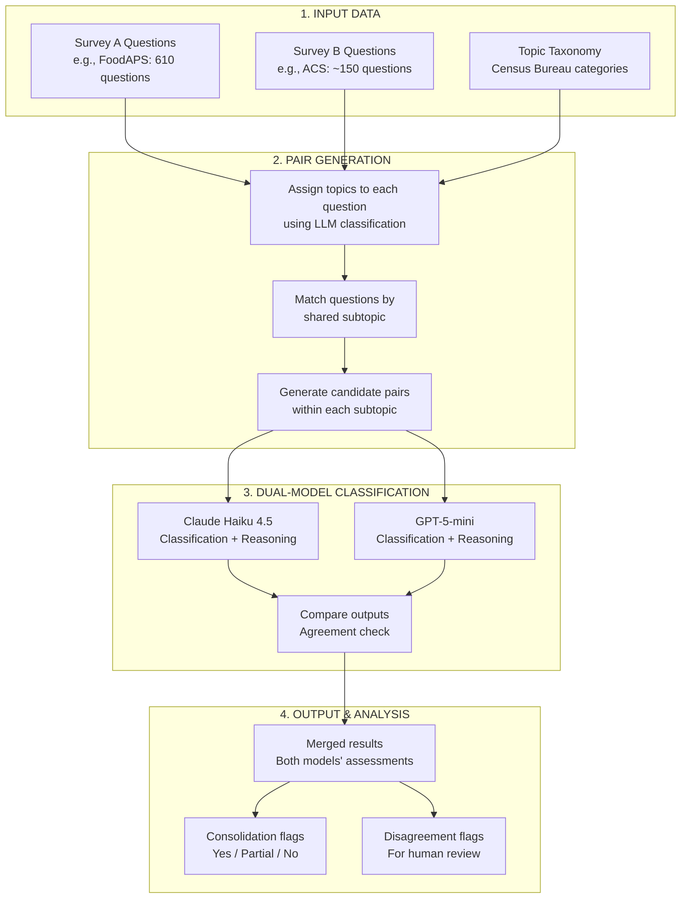
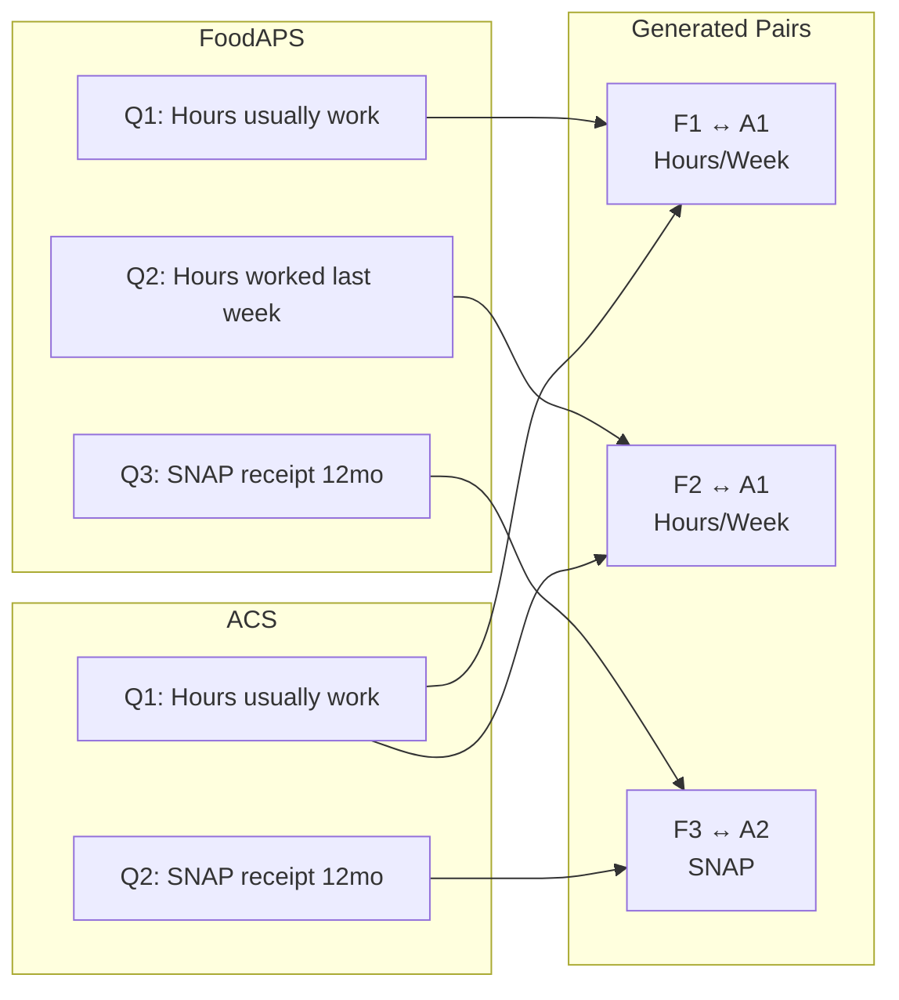
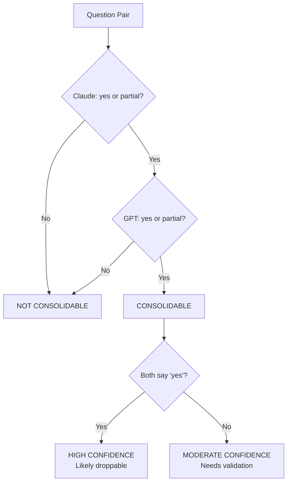

# Classification Methodology: Question-Level Survey Consolidation Analysis

## Overview

This document describes the complete workflow for identifying survey consolidation opportunities through question-level comparison. The methodology uses dual-LLM classification to assess whether question pairs from different surveys measure the same construct with compatible reference periods and response formats.

---

## Interactive Diagrams

The diagrams in this document use Mermaid syntax. Click the links below to view and edit them interactively:

| Diagram | Description | Link |
|---------|-------------|------|
| Main Workflow | End-to-end classification pipeline | [View/Edit](https://mermaid.ai/live/edit#pako:eNqVU11vmzAU_StXPOxlCx3Q7KGaKjmQZEjkY4E8VGQPDjhgFezMxk2rafvtMzHpoO0mjRd84Jx7z7m2f1gZz4l1Yx0qfspKLBpIJjsG-pFqXwh8LCFcrrcJpDvLsbt1gBK0s74ZXvsgJ42VeCBPgOCrIrKhnMnPe3F1S-zC_gAzznO0jm_gk_MRvl8I_QLupcDkzQLI1-Jfzvgvai9N-JFmkOBHznj9dFb6hEklYaIEwQoy3JCCC0ouQsLyHXsRdY3CTZvUtc1yPl1ONygJV8tB3ImTIilpwaBp20r9AoKz8tncub-SlBUQRQvIKqzpB6o96J_9Qm66wE1PKGFvzEu9FyRvnZ1b9DVeOieMCJ1Hh2I5zdvVEVNhBnaiTUmZ8fNC_lZkP0Jx3Gb2bAi2KBotVsE0Mp_DWei_Tu87qV9hlRP4gum9gmt7bOY9SAnvYUOw5EwPoS920_k6GY1HNWX0P2Re6vP6qGcCXDVH1ZisqBCE1IQ1kJUku_9HzNU26U7xtX0B7wAtUXQXh_EgX-CkCyIKPX1BpKq6VhPelFDry1JJ0IaJlG3f_ikMXO2RSV61O9JGOVS4MOI7IuEK1vp6UVzp1ZL3dV4aUImfo_yRzbiAUtWYaScPlJxe50MOjEa3-kB20B1CbwAnHdntYEf2OmjIvjOEHdk3Wr8j--4QGnLQaQNDDtwh9KyfvwEWQVPk) |
| Decision Tree | Consolidation determination logic | [View/Edit](https://mermaid.ai/live/edit#pako:eNp1kMGKwjAQhl9l6F32LqK0SayFbqq7vbixh2hmMWwwJakupfXd1yiLRXQOcxj-7-NnumhnFUbj6NvY391eugZKujnAZWKxOqJvtD3AUmpXwWg0haQjRh4VjqFFD9ZBfUG0NLPzDUpCque2hy_BixJIwT-LPKNxkrNqGFmj74F06bJ8pSJ31fBwBal4Ir5teu3JusQ2e_CyDfZ_Jbsb5mKRpYvQb55RxgmbbN3bNNc_aFpQzta13Bqshlyokor3grKPuGSPKEdUHk7SaCXD06ro_Afismo-) |
| Pair Matching | How question pairs are generated | [View/Edit](https://mermaid.ai/live/edit#pako:eNqVj81qwzAQhF9l0T0ESTdTAiKg5hCK3Bx6kHNQ7M0Pda0g25hS-u6VLAXsUmiyJ83uaOfbL1LaCklGjrUdyrNxHWxfiwZ8tf3h5Mz1DNLaSqhd7IaSVOc0g43tXQt925u6_oTBuvf9xMN0zm6eMMMKatN2MCDOfFznPIPdi1DgsMTLtQPKPmyyYFPFxy8msZ7wiDt4ROR5NEeZi9-pC_KMDTrT-SvGVkEmuxXVksLCczwd3HI1cizf5ncqpiX7z8O15MHDRk9g_RsvpC1WPjdJFiWLUsynN5mmISFInqbpLyffP1AYkEM) |

---

## Workflow Architecture



---

## Stage 1: Input Data

### Source Questions

Questions are extracted from official survey instruments:

| Survey | Source | Questions Extracted |
|--------|--------|---------------------|
| FoodAPS | USDA FoodAPS questionnaire PDFs | 610 unique questions |
| CPS | Census Bureau CPS instrument | ~400 unique questions |
| ACS | Census Bureau ACS instrument | ~150 unique questions |

### Topic Taxonomy

We use the Census Bureau's official topic taxonomy, which provides standardized categories:

**Top-level topics:**
- Demographics (Age, Sex, Race, Relationship, etc.)
- Economics (Income, Earnings, Employment, etc.)
- Housing (Tenure, Costs, Structure, etc.)
- Social (Education, Veterans, Disability, etc.)

**Subtopics** (examples):
- Demographics → Age, Sex, Race, Hispanic Origin, Citizenship
- Economics → Employment Status, Hours/Week, Earnings, Unemployment
- Social → Disability, Veterans, School Enrollment

---

## Stage 2: Pair Generation

### Step 2a: Topic Assignment

Each question is classified into the taxonomy using LLM:

```
INPUT:  "How many hours do you usually work per week at your main job?"
OUTPUT: Topic: Economics
        Subtopic: Hours/Week, Weeks/Year
        Confidence: 0.95
```

**Classification prompt structure:**
```
Given this survey question and the Census Bureau topic taxonomy,
assign the most appropriate topic and subtopic.

Question: {question_text}
Survey: {survey_name}

Taxonomy:
{taxonomy_structure}

Respond with:
- topic: [top-level category]
- subtopic: [specific category]
- confidence: [0.0-1.0]
- reasoning: [brief explanation]
```

### Step 2b: Pair Matching

Questions are paired **within shared subtopics only**:



**Pairing logic:**
- Only questions with **matching subtopics** are paired
- This is a **many-to-many** relationship within subtopics
- Cross-subtopic pairs are not generated (reduces noise)

**Example pair counts:**

| Subtopic | FoodAPS Qs | ACS Qs | Pairs Generated |
|----------|------------|--------|-----------------|
| Hours/Week | 8 | 7 | 56 (8 × 7) |
| SNAP | 23 | 1 | 23 (23 × 1) |
| Disability | 2 | 6 | 12 (2 × 6) |
| Sex | 27 | 1 | 27 (27 × 1) |

---

## Stage 3: Dual-Model Classification

### Classification Schema

Each model assigns one of six classifications:

| Classification | Definition | Consolidation Potential |
|----------------|------------|------------------------|
| `exact_duplicate` | Identical wording, format, reference period | **Yes** |
| `near_duplicate` | Minor wording differences, same construct | **Yes** |
| `related_but_distinct` | Same topic, different specifics | No |
| `reference_period_mismatch` | Same construct, incompatible time windows | No |
| `response_format_mismatch` | Same construct, incompatible response types | No |
| `not_comparable` | Different constructs or topics | No |

### Classification Prompt

Each question pair is sent to both models with identical prompts:

```
You are analyzing two survey questions to determine if they measure 
the same construct and could potentially be consolidated through 
record linkage.

QUESTION A (from {Survey A}):
"{question_a_text}"

QUESTION B (from {Survey B}):
"{question_b_text}"

Analyze these questions and provide:

1. CLASSIFICATION: Choose exactly one:
   - exact_duplicate: Identical or nearly identical wording, same 
     response format, same reference period
   - near_duplicate: Minor wording differences but measuring the 
     same construct with compatible formats
   - related_but_distinct: Same general topic but different specific 
     measures or purposes
   - reference_period_mismatch: Same construct but different time 
     frames (e.g., "last week" vs "past 12 months")
   - response_format_mismatch: Same construct but incompatible 
     response formats (e.g., count vs yes/no)
   - not_comparable: Different constructs or not meaningfully related

2. CONFIDENCE: high, medium, or low

3. REASONING: 2-3 sentences explaining your classification

4. CONSOLIDATION_POTENTIAL: yes, partial, or no
   - yes: Question A response could fully substitute for Question B
   - partial: Some overlap but not fully substitutable
   - no: Cannot be substituted

5. REFERENCE_PERIOD_A: Extract the time frame from Question A 
   (e.g., "last week", "past 12 months", "usually", "not specified")

6. REFERENCE_PERIOD_B: Extract the time frame from Question B

Respond in JSON format.
```

### Model Configuration

| Parameter | Claude Haiku 4.5 | GPT-5-mini |
|-----------|------------------|------------|
| Temperature | 0.0 | 0.0 |
| Max tokens | 500 | 500 |
| Batch size | 10 questions | 10 questions |
| Parallel workers | 6 | 6 |
| Rate limiting | Exponential backoff | Exponential backoff |

**Why two models?**
- Reduces single-model bias
- Disagreements flag ambiguous cases
- Agreement increases confidence
- Different training data → different blind spots

---

## Stage 4: Output and Analysis

### Merging Results

Both models' outputs are merged into a single record per pair:

```
pair_id: FOODAPS_0594
survey_q_id: FOODAPS_Q123
survey_text: "Did you receive SNAP in the last 12 months?"
acs_q_id: ACS_Q45
acs_text: "IN THE PAST 12 MONTHS, did you receive SNAP benefits?"

claude_classification: exact_duplicate
claude_confidence: high
claude_consolidation_potential: yes
claude_reasoning: "Both questions ask about SNAP receipt over 
                   identical 12-month periods with same response format."

gpt_classification: exact_duplicate
gpt_confidence: high
gpt_consolidation_potential: yes
gpt_reasoning: "Identical construct, reference period, and binary 
                response format. Only minor wording differences."

models_agree: True
```

### Consolidation Determination

A pair is flagged as **consolidable** when:



**Decision rules:**
- **Both models say YES** → High confidence, likely droppable
- **Both models say PARTIAL** → Moderate confidence, partial overlap
- **One YES, one PARTIAL** → Moderate confidence, needs review
- **Any NO** → Not consolidable (conservative approach)

### Disagreement Handling

When models disagree on classification:

| Disagreement Type | Action |
|-------------------|--------|
| Classification differs, consolidation same | Use consolidation consensus |
| Consolidation differs | Flag for human review |
| One high confidence, one low | Weight toward high confidence |

**Example disagreement:**
```
Pair: CPS_0288
Claude: partial (overlapping reference periods)
GPT: no (different constructs - "having job" vs "working")

Resolution: Flag for human review - genuine ambiguity about 
whether "having a job" and "working at a job" are the same construct
```

---

## Classification Criteria Deep Dive

### Exact Duplicate Criteria

All must be true:
- [ ] Same core construct (what is being measured)
- [ ] Same or equivalent wording
- [ ] Same response format (binary, numeric, categorical)
- [ ] Same reference period (or both unspecified)
- [ ] Same unit of analysis (person, household)

**Example:**
```
FoodAPS: "What is your sex? (Male / Female)"
ACS:     "What is this person's sex? (Male / Female)"
→ EXACT DUPLICATE (only pronoun difference)
```

### Near Duplicate Criteria

Most must be true:
- [ ] Same core construct
- [~] Similar but not identical wording
- [ ] Compatible response format
- [ ] Same or compatible reference period
- [ ] Same unit of analysis

**Example:**
```
FoodAPS: "What is your race and/or ethnicity? Select all that apply."
ACS:     "What is this person's race? Mark one or more boxes."
→ NEAR DUPLICATE (race/ethnicity bundling differs slightly)
```

### Reference Period Mismatch Criteria

- [ ] Same core construct
- [ ] Compatible wording
- [✗] Different reference periods that serve different purposes

**Example:**
```
FoodAPS: "Have you received SNAP in the past 30 days?"
ACS:     "IN THE PAST 12 MONTHS, did you receive SNAP benefits?"
→ REFERENCE_PERIOD_MISMATCH (30 days ≠ 12 months)
```

### Construct Mismatch (Not Comparable) Criteria

- [✗] Different constructs despite same topic domain

**Example:**
```
CPS: "Does your disability prevent you from accepting any work?"
ACS: "Do you have serious difficulty walking or climbing stairs?"
→ NOT COMPARABLE (work-limiting ≠ functional limitation)
```

---

## Quality Assurance

### Automated Checks

| Check | Purpose | Action if Failed |
|-------|---------|------------------|
| JSON parse | Valid model output | Retry with backoff |
| Required fields | Complete response | Retry or flag |
| Enum validation | Valid classification | Reject and retry |
| Confidence present | Quality signal | Default to "medium" |

### Checkpoint/Resume

Long runs use checkpoint files:
```
checkpoint_cps_batch_50.json
checkpoint_cps_batch_100.json
...
```

If interrupted, processing resumes from last checkpoint.

### Output Validation

Post-processing checks:
- All pairs have both model responses
- No duplicate pair_ids
- Classification distribution is reasonable (not all one category)
- Reference periods extracted where applicable

---

## Interpreting Results

### Consolidation Rate Calculation

```
Consolidation Rate = (Pairs where BOTH models say yes/partial) / Total Pairs
```

**Not:**
- Pairs where either model says yes
- Pairs where classification is exact/near_duplicate (consolidation_potential is the key field)

### What "Consolidable" Means

**It means:** If you had perfect person-linkage between surveys, this question could potentially be dropped from Survey A because Survey B already collects equivalent data.

**It does NOT mean:**
- The questions are identical (near_duplicate allows differences)
- Linkage is feasible (that's a separate problem)
- Data quality would be equivalent (different survey contexts)
- Skip logic permits removal (survey flow dependencies exist)

### What Model Agreement Means

| Agreement Rate | Interpretation |
|----------------|----------------|
| >90% | Clear cases, high confidence in results |
| 70-90% | Normal range, some genuine ambiguity |
| <70% | Many borderline cases, interpret cautiously |

**High disagreement on a subtopic** (e.g., Employment Status at 72%) indicates genuine measurement ambiguity, not model failure.

---

## Reproducibility

### Code and Data

| Component | Location |
|-----------|----------|
| Classification script | `scripts/classify_pairs.py` |
| Pair generation | `scripts/generate_pairs.py` |
| Merge results | `scripts/merge_results.py` |
| Raw outputs | `output/question_matching/{survey}/` |
| Merged results | `output/question_matching/{survey}/{survey}_comparison_merged.csv` |

### Parameters

```python
# Classification parameters
MODELS = ["claude-haiku-4.5", "gpt-5-mini"]
TEMPERATURE = 0.0
MAX_TOKENS = 500
BATCH_SIZE = 10
PARALLEL_WORKERS = 6

# Consolidation thresholds
REQUIRE_BOTH_MODELS = True
CONSOLIDATION_VALUES = ["yes", "partial"]
```

### Cost Tracking

| Survey Pair | Pairs | Claude Cost | GPT Cost | Total |
|-------------|-------|-------------|----------|-------|
| FoodAPS-ACS | 610 | ~$0.25 | ~$0.25 | ~$0.50 |
| CPS-ACS | 1,092 | ~$0.50 | ~$0.50 | ~$1.00 |
| **Total** | **1,702** | **~$0.75** | **~$0.75** | **~$1.50** |

---

## Limitations of This Methodology

### What LLMs Can't Assess

1. **Skip logic dependencies** - Whether removing a question breaks survey flow
2. **Analytical continuity** - Impact on time series if source changes
3. **Response quality** - Whether linked data has same error properties
4. **Linkage feasibility** - Whether person-matching is actually possible

### Known Biases

1. **Text similarity bias** - Similar wording may inflate consolidation estimates
2. **Context blindness** - Models don't see full survey context
3. **Reference period extraction** - May miss implicit time frames
4. **Construct interpretation** - Domain expertise not guaranteed

### When Human Review Is Required

- Model disagreement on consolidation potential
- High-stakes consolidation decisions
- Unusual or domain-specific constructs
- Questions with complex skip logic

---

## Summary

This methodology provides a **scalable, reproducible, and cost-effective** approach to question-level consolidation analysis:

1. **Pair generation** scopes comparison to topically-related questions
2. **Dual-model classification** reduces bias and flags ambiguity
3. **Conservative consolidation rules** (both models must agree) minimize false positives
4. **Structured output** enables downstream analysis and human review

The ~11% consolidation ceiling identified across two surveys represents genuine structural limits, not methodological artifacts.

---

*Document version: 1.0*
*Last updated: January 27, 2026*
