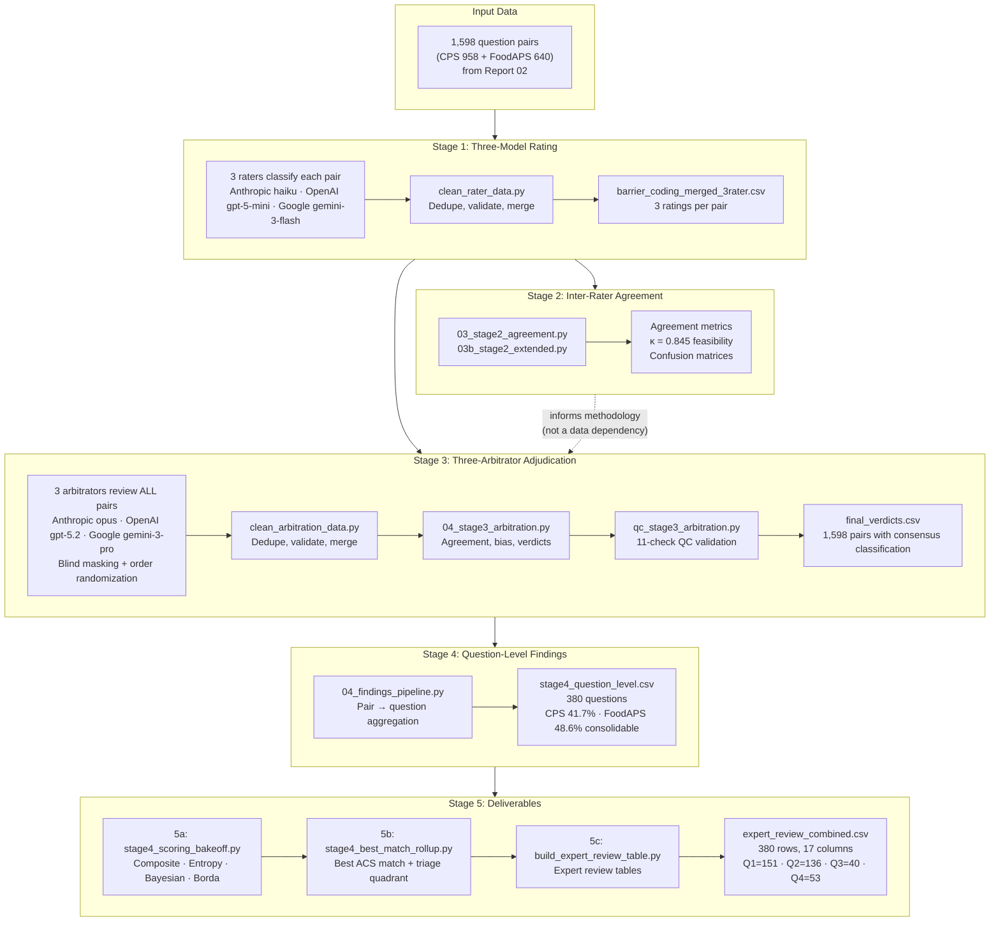
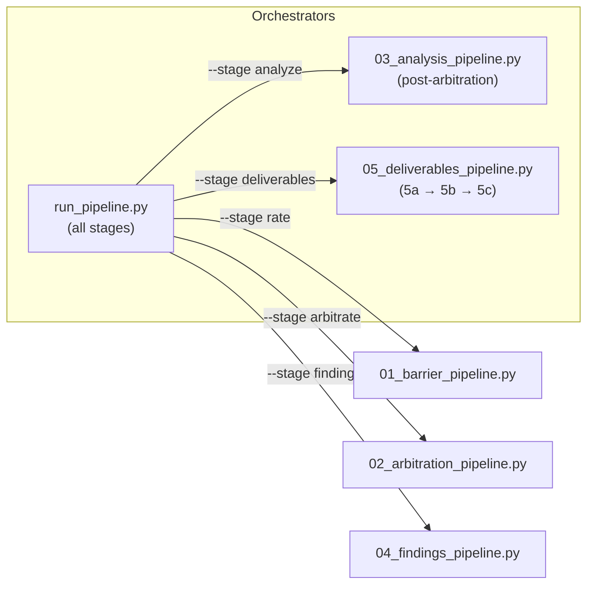

# Report 03: Analysis Pipeline Data Flow

*Updated: 2026-01-31 (v4.0)*

## Overview Diagram

## Pipeline Orchestration

## Stage Descriptions

### Stage 1: Three-Model Barrier Classification

**Script:** `01_barrier_pipeline.py`

**Input:** 1,598 question pairs from Report 02 (CPS-ACS and FoodAPS-ACS comparisons).

**Process:** Each pair is independently classified by three LLMs using identical prompts and the v1.1 barrier taxonomy (7 L1 categories, 22 L2 subcodes). Models assign:
- Primary harmonization barrier code (e.g., CC.1, TC.2, NHB.0)
- Feasibility rating (F1: directly consolidable, F2: with transformation, F3: not consolidable)
- Confidence score and reasoning

**Post-processing:** `clean_rater_data.py` deduplicates checkpoint restarts, validates schema, recodes null barriers to NHB.0, and merges into `barrier_coding_merged_3rater.csv`.

**Output:** Three independent ratings per pair.

---

### Stage 2: Inter-Rater Agreement Analysis

**Scripts:** `03_stage2_agreement.py`, `03b_stage2_extended.py`

**Input:** Merged rater results from Stage 1.

**Process:** Compute inter-rater reliability at multiple levels:
- Pairwise Cohen's Kappa (L1, full code, feasibility)
- Three-way Fleiss' Kappa
- Confusion matrices for systematic disagreement patterns
- Per-rater distribution analysis

**Output:** `stage2_agreement_metrics.json`, `stage2_agreement_report.md`, confusion matrices. Key result: feasibility κ = 0.845.

**Supporting scripts:** `analyze_barrier_results.py`, `confusion_matrix_analysis.py`, `analyze_agreement.py`

---

### Stage 3: Three-Arbitrator Adjudication

**Script:** `02_arbitration_pipeline.py`

**Input:** Three rater outputs from Stage 1. All 1,598 pairs are arbitrated (not just disagreements).

**Process:**
1. Blind masking: Raters shown as "Rater A/B/C" (identity hidden from arbitrators)
2. Order randomization: 50% fixed order, 50% randomized (position bias detection)
3. Three arbitrators independently review each pair with full question text and all rater reasoning
4. Post-processing: `clean_arbitration_data.py` deduplicates and merges
5. Analysis: `04_stage3_arbitration.py` computes agreement, bias, and constructs final verdicts via majority vote
6. QC: `qc_stage3_arbitration.py` runs 11 validation checks

**Output:** `final_verdicts.csv` — 1,598 pairs with consensus feasibility, barrier code, and confidence level.

**Supporting scripts:** `analyze_arbitration_agreement.py`, `compare_arbitrators.py`, `extract_low_confidence_pairs.py`

---

### Stage 4: Question-Level Consolidability Findings

**Script:** `04_findings_pipeline.py`

**Input:** `final_verdicts.csv` + question mappings from `data/`.

**Process:**
1. Join verdicts with question metadata (source survey, topic, question text)
2. Aggregate pairs → questions: "Does this source question have ANY consolidable ACS match?"
3. Compute per-survey consolidability rates
4. Analyze by topic and barrier category
5. Inventory F2 pairs needing statistical transformation

**Output:**
- `stage4_question_level.csv` — 380 questions (240 CPS + 140 FoodAPS) with consolidability flags
- `stage4_survey_summary.json` — CPS 41.7%, FoodAPS 48.6% consolidable
- `stage4_findings_report.md`, `stage4_topic_breakdown.csv`, `stage4_f2_transformations.csv`, `stage4_barrier_patterns.csv`

---

### Stage 5: Deliverables

**Orchestrator:** `05_deliverables_pipeline.py`

#### 5a: Scoring Bake-Off
**Script:** `scripts/stage4_scoring_bakeoff.py`

Compares 4 scoring methods for ranking consolidability confidence:
- **Composite:** Feasibility × confidence weighted score
- **Entropy:** Shannon entropy (inverted — low entropy = stable agreement)
- **Bayesian:** Beta-Binomial posterior (calibrated prior = 0.197)
- **Borda:** Normalized point sum from vote rankings

Key finding: Entropy is orthogonal to vote-count methods (ρ ≈ 0.08), providing an independent axis.

#### 5b: Best-Match Rollup
**Script:** `scripts/stage4_best_match_rollup.py`

Per source question, identifies the best ACS match (F1 > F2 > F3, then highest Borda). Assigns triage quadrant using two-axis framework:

| Quadrant | Borda | Entropy | Count | Action |
|----------|-------|---------|-------|--------|
| Q1 | High | High | 151 | Auto-accept (confident consolidable) |
| Q2 | Low | High | 136 | Auto-reject (confident non-consolidable) |
| Q3 | High | Low | 40 | Expert review (edge case) |
| Q4 | Low | Low | 53 | Expert review (ambiguous) |

93 questions (24.5%) flagged for expert review.

#### 5c: Expert Review Tables
**Script:** `scripts/build_expert_review_table.py`

Generates stakeholder-ready tables with 17 columns including question text, classifications, scores, triage quadrant, and combined arbitrator reasoning. Sorted with Q3/Q4 first.

**Output:** `expert_review_combined.csv`, `expert_review_cps.csv`, `expert_review_foodaps.csv`, `taxonomy_reference.md`, `classification_distribution.md`
