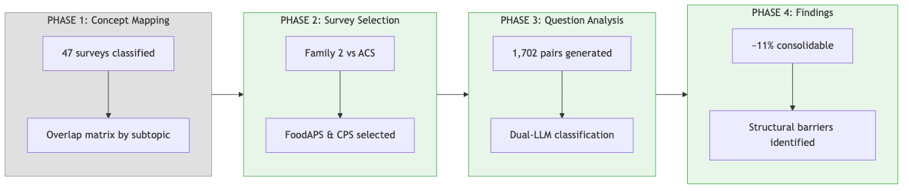
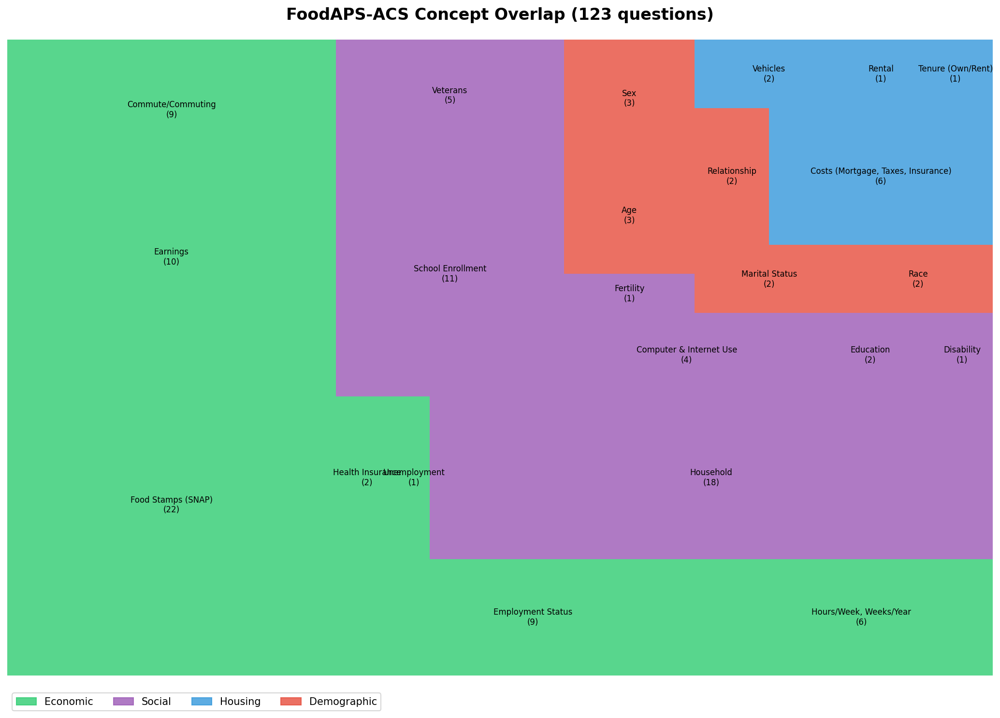
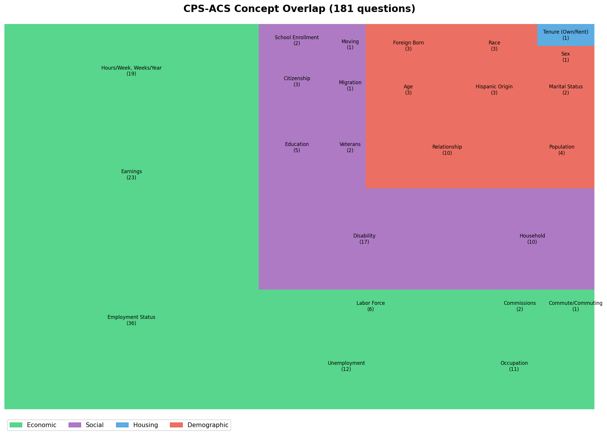
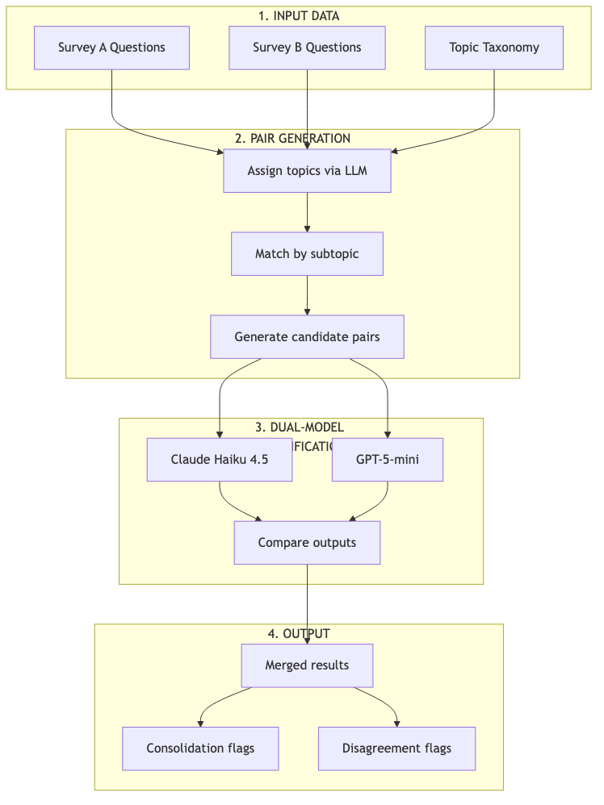
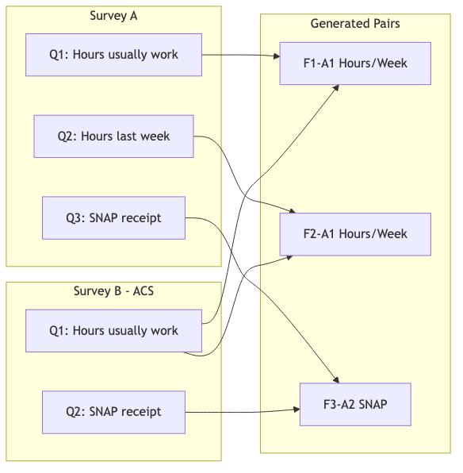
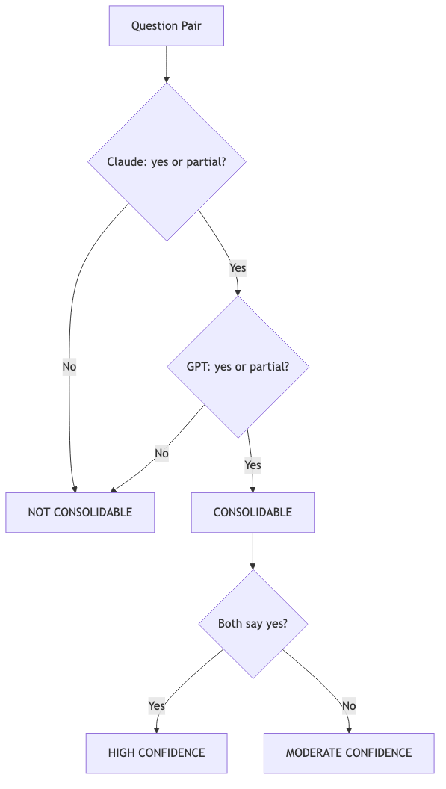

# Question-Level Survey Consolidation Analysis

**Federal Survey Concept Mapper Project**

*Generated: 2026-01-28 07:12*

---

**Table of Contents**

1. Overview
2. Survey Selection: Family 2 Economic Household Surveys
3. Concept-Level Overlap Visualization
4. Classification Methodology
5. Results
6. Case Study: CPS-ACS
7. Case Study: FoodAPS-ACS
8. Synthesis and Conclusions
9. Future Work

---

# Overview

## Project Context

This report documents the methodology and findings from a question-level consolidation analysis comparing federal surveys with the American Community Survey (ACS). The goal is to determine realistic consolidation potential through record linkage by examining actual question pairs rather than relying solely on concept-level overlap.

## Analysis Process

The analysis follows a four-phase approach:



**Phase 1: Concept Mapping** (Prior Work)
- Classified 47 federal surveys using Census Bureau topic taxonomy
- Generated overlap matrices by subtopic
- Identified survey "families" with shared conceptual domains

**Phase 2: Survey Selection** (This Analysis Begins)
- Focused on "Family 2" - Economic Household Surveys
- Compared 5 surveys against ACS: SIPP, CE, AHS, CPS, FoodAPS
- Selected FoodAPS (123 overlap) and CPS (181 overlap) as pilot cases due to manageable question counts

**Phase 3: Question Analysis**
- Generated 1,702 question pairs within shared subtopics
- Applied dual-model LLM classification (Claude Haiku 4.5 + GPT-5-mini)
- Classified pairs as consolidable, partially consolidable, or not consolidable

**Phase 4: Findings**
- ~11% overall consolidation potential (structural ceiling)
- Identified three primary barriers: construct mismatch, reference period incompatibility, screener vs. battery design
- Validated methodology through case studies (SNAP, Disability, Employment Status)

## Key Finding

**Concept overlap is a ceiling, not an estimate.**

The 123 FoodAPS questions sharing subtopics with ACS yielded only 74 consolidable pairs (12.1%). The 181 CPS questions yielded 118 consolidable pairs (10.8%). The ~90% gap between concept overlap and actual consolidation potential reflects real methodological differences in how surveys operationalize the same constructs.

## Report Structure

| Section | Content |
|---------|---------|
| 1. Survey Selection | Why Family 2, why FoodAPS & CPS |
| 2. Concept Overlap | Treemap visualization of subtopic distribution |
| 3. Methodology | Classification workflow, prompts, decision logic |
| 4. Results | Consolidation rates, agreement metrics, data tables |
| 5. Case Studies | Deep-dives: SNAP, Race, Disability, Employment |
| 6. Synthesis | Cross-survey patterns, barrier taxonomy, recommendations |
| 7. Future Work | Next surveys, extensions, limitations |


---

# Survey Selection: Family 2 Economic Household Surveys

## The ACS as a Linkage Backbone

The American Community Survey (ACS) is the largest household survey in the federal statistical system, collecting data continuously from approximately 3.5 million households annually. Its comprehensive coverage of demographics, economics, housing, and social characteristics makes it a natural candidate for record linkage with specialized surveys.

The key insight: rather than each survey independently collecting the same demographic information, surveys could potentially sample from ACS respondents and link records, collecting only the specialized content unique to their mission.

## Family 2: Economic Household Surveys

From the broader concept mapping analysis (Phase 1), we identified "Family 2" as surveys sharing substantial conceptual overlap with ACS in economic and household domains:

| Survey | Full Name | Total Shared Questions | Subtopics Covered | Dominant Domain |
|--------|-----------|------------------------|-------------------|-----------------|
| SIPP | Survey of Income and Program Participation | 577 | 38 | Economic (304) |
| AHS | American Housing Survey | 460 | 34 | Housing (343) |
| CE | Consumer Expenditure Survey | 283 | 30 | Housing/Economic |
| CPS | Current Population Survey | 181 | 25 | Economic (110) |
| FoodAPS | Food Acquisition and Purchase Survey | 123 | 23 | Economic (59) |

**Total across Family 2: 1,624 shared questions with ACS**

## Why FoodAPS and CPS?

We selected FoodAPS and CPS as pilot cases for question-level analysis:

**Practical considerations:**
- Lowest question counts (123 and 181) → tractable for methodology development
- Combined: 1,702 question pairs to classify
- Estimated API cost: ~$1.50 total

**Analytical considerations:**
- Different overlap profiles: FoodAPS is SNAP-heavy, CPS is employment-heavy
- Different survey designs: FoodAPS is a specialized supplement, CPS is a core labor force survey
- Testing generalizability across survey types

**What we deferred:**
- SIPP (577 questions) - largest, save for scaled analysis
- AHS (460 questions) - housing-dominated, different domain
- CE (283 questions) - moderate size, future candidate

## Domain Distribution

### FoodAPS (123 questions)

| Domain | Count | Top Subtopics |
|--------|-------|---------------|
| Economic | 59 | Food Stamps/SNAP (22), Earnings (10), Employment (9) |
| Social | 42 | Household (18), School Enrollment (11), Veterans (5) |
| Demographic | 12 | Age (3), Sex (3), Race (2), Relationship (2) |
| Housing | 10 | Costs (6), Vehicles (2), Tenure (1) |

### CPS (181 questions)

| Domain | Count | Top Subtopics |
|--------|-------|---------------|
| Economic | 110 | Employment Status (36), Earnings (23), Hours/Week (19) |
| Social | 41 | Disability (17), Household (10), Education (5) |
| Demographic | 29 | Relationship (10), Age (3), Race (3), Hispanic (3) |
| Housing | 1 | Tenure (1) |

## Implications for Pair Generation

Questions are paired **within shared subtopics only**. This means:
- FoodAPS's 22 SNAP questions pair with ACS's 1 SNAP question → 22 pairs
- CPS's 36 Employment Status questions pair with ACS's 6 Employment questions → 216 pairs
- Cross-subtopic comparisons are excluded (reduces noise)

The total pair counts:
- **FoodAPS × ACS**: 610 pairs
- **CPS × ACS**: 1,092 pairs
- **Combined**: 1,702 pairs

This many-to-many pairing within subtopics is why pair counts exceed question counts.


---

# Concept-Level Overlap Visualization

## Understanding the Treemaps

Before examining individual question pairs, we visualize where each survey's overlap with ACS concentrates. These treemaps show:

- **Box size**: Number of questions in that subtopic sharing conceptual overlap with ACS
- **Box color**: Domain category (Economic, Social, Housing, Demographic)
- **Labels**: Subtopic name and question count

## FoodAPS-ACS Concept Overlap



**Key observations:**

1. **SNAP dominates Economic domain** (22 of 59 economic questions)
   - FoodAPS was designed specifically for food assistance research
   - This concentration creates many pairs but most are screener-vs-battery mismatches

2. **Household structure is significant** (18 questions in Social)
   - Understanding who lives together matters for food acquisition patterns
   - These tend to consolidate well with ACS

3. **Demographics are sparse but important** (12 questions)
   - Basic demographics (age, sex, race) for each household member
   - High consolidation potential - stable characteristics

4. **Housing is peripheral** (10 questions)
   - Mostly costs and vehicle access (relevant for food access)
   - Not FoodAPS's primary focus

## CPS-ACS Concept Overlap



**Key observations:**

1. **Employment dominates** (36 questions)
   - Core CPS mission: monthly labor force statistics
   - Many reference period mismatches with ACS's "last week" framing

2. **Disability is substantial** (17 questions in Social)
   - CPS includes both work-limiting disability (Type A) and ACS6 functional questions (Type B)
   - Construct mismatch is significant - same topic, different operationalization

3. **Demographics are richer than FoodAPS** (29 questions)
   - More detailed relationship, nativity, and migration questions
   - Better consolidation potential

4. **Housing is minimal** (1 question - tenure)
   - CPS is not a housing survey
   - Almost no housing overlap with ACS

## What These Treemaps Tell Us

**Concept overlap is necessary but not sufficient for consolidation.**

The treemaps show WHERE overlap exists, but not WHETHER questions can substitute for each other. Consider:

| Subtopic | Concept Overlap | Consolidation Reality |
|----------|-----------------|----------------------|
| SNAP (FoodAPS) | 22 questions | Only 2 consolidable (8.7%) - different reference periods, depths |
| Employment (CPS) | 36 questions | ~4 consolidable (11%) - reference period mismatches |
| Race (FoodAPS) | 2 questions | 2 consolidable (100%) - stable demographic |
| Disability (CPS) | 17 questions | 6 consolidable (35%) - only ACS6-compatible subset |

**The gap between treemap area and consolidation potential IS the finding.**

This gap reflects:
1. Reference period incompatibility
2. Construct differences (same concept, different operationalization)
3. Screener vs. battery design (breadth vs. depth)

The question-level analysis quantifies this gap precisely.

## Interpreting Domain Colors

| Domain | Color | Typical Consolidation | Why |
|--------|-------|----------------------|-----|
| Economic | Green | 10-15% | Reference periods rarely align; surveys need different temporal granularity |
| Social | Purple | 20-40% | Mixed - household composition consolidates, disability depends on construct |
| Housing | Blue | 5-15% | Specialized needs; surveys focus on different housing aspects |
| Demographic | Red | 60-100% | Stable characteristics; standardized across surveys |

The demographic domain consistently shows highest consolidation potential because:
- Characteristics don't change between survey administrations
- Constructs are standardized (OMB definitions for race/ethnicity)
- No reference period complications (age, sex are point-in-time facts)

Economic and employment questions face the steepest barriers because:
- Labor force status requires specific temporal windows
- Different surveys need different windows for their analytical purposes
- "Last week" ≠ "last 4 weeks" ≠ "last 12 months" - these serve different uses


---

# Classification Methodology

## Workflow Overview

This methodology uses dual-LLM classification to assess whether question pairs from different surveys measure the same construct with compatible reference periods and response formats.



## Stage 1: Input Data

### Source Questions

Questions are extracted from official survey instruments:

| Survey | Source | Questions Extracted |
|--------|--------|---------------------|
| FoodAPS | USDA FoodAPS questionnaire PDFs | 610 unique questions |
| CPS | Census Bureau CPS instrument | ~400 unique questions |
| ACS | Census Bureau ACS instrument | ~150 unique questions |

### Topic Taxonomy

We use the Census Bureau's official topic taxonomy with standardized categories:

**Top-level topics:** Demographics, Economics, Housing, Social

**Subtopics** (examples):
- Demographics → Age, Sex, Race, Hispanic Origin, Citizenship
- Economics → Employment Status, Hours/Week, Earnings, Unemployment
- Social → Disability, Veterans, School Enrollment

## Stage 2: Pair Generation

### Topic Assignment

Each question is classified into the taxonomy using LLM:

```
INPUT:  "How many hours do you usually work per week at your main job?"
OUTPUT: Topic: Economics
        Subtopic: Hours/Week, Weeks/Year
        Confidence: 0.95
```

### Pair Matching Logic



Questions are paired **within shared subtopics only**:
- Only questions with **matching subtopics** are paired
- This is a **many-to-many** relationship within subtopics
- Cross-subtopic pairs are not generated (reduces noise)

**Example pair counts:**

| Subtopic | FoodAPS Qs | ACS Qs | Pairs Generated |
|----------|------------|--------|-----------------|
| Hours/Week | 8 | 7 | 56 (8 × 7) |
| SNAP | 23 | 1 | 23 (23 × 1) |
| Disability | 2 | 6 | 12 (2 × 6) |
| Sex | 27 | 1 | 27 (27 × 1) |

## Stage 3: Dual-Model Classification

### Classification Schema

Each model assigns one of six classifications:

| Classification | Definition | Consolidation Potential |
|----------------|------------|------------------------|
| `exact_duplicate` | Identical wording, format, reference period | **Yes** |
| `near_duplicate` | Minor wording differences, same construct | **Yes** |
| `related_but_distinct` | Same topic, different specifics | No |
| `reference_period_mismatch` | Same construct, incompatible time windows | No |
| `response_format_mismatch` | Same construct, incompatible response types | No |
| `not_comparable` | Different constructs or topics | No |

### Classification Prompt

Each question pair is sent to both models with identical prompts:

```
You are analyzing two survey questions to determine if they measure 
the same construct and could potentially be consolidated through 
record linkage.

QUESTION A (from {Survey A}):
"{question_a_text}"

QUESTION B (from {Survey B}):
"{question_b_text}"

Analyze these questions and provide:

1. CLASSIFICATION: Choose exactly one from the schema above
2. CONFIDENCE: high, medium, or low
3. REASONING: 2-3 sentences explaining your classification
4. CONSOLIDATION_POTENTIAL: yes, partial, or no
5. REFERENCE_PERIOD_A: Extract the time frame from Question A
6. REFERENCE_PERIOD_B: Extract the time frame from Question B

Respond in JSON format.
```

### Model Configuration

| Parameter | Claude Haiku 4.5 | GPT-5-mini |
|-----------|------------------|------------|
| Temperature | 0.0 | 0.0 |
| Max tokens | 500 | 500 |
| Batch size | 10 questions | 10 questions |
| Parallel workers | 6 | 6 |
| Rate limiting | Exponential backoff | Exponential backoff |

**Why two models?**
- Reduces single-model bias
- Disagreements flag ambiguous cases
- Agreement increases confidence
- Different training data → different blind spots

## Stage 4: Output and Analysis

### Consolidation Determination



A pair is flagged as **consolidable** when:

**Decision rules:**
- **Both models say YES** → High confidence, likely droppable
- **Both models say PARTIAL** → Moderate confidence, partial overlap
- **One YES, one PARTIAL** → Moderate confidence, needs review
- **Any NO** → Not consolidable (conservative approach)

### Disagreement Handling

| Disagreement Type | Action |
|-------------------|--------|
| Classification differs, consolidation same | Use consolidation consensus |
| Consolidation differs | Flag for human review |
| One high confidence, one low | Weight toward high confidence |

## Classification Criteria

### Exact Duplicate Criteria

All must be true:
- Same core construct (what is being measured)
- Same or equivalent wording
- Same response format (binary, numeric, categorical)
- Same reference period (or both unspecified)
- Same unit of analysis (person, household)

### Near Duplicate Criteria

Most must be true:
- Same core construct
- Similar but not identical wording
- Compatible response format
- Same or compatible reference period
- Same unit of analysis

### Reference Period Mismatch Criteria

- Same core construct
- Compatible wording
- **Different reference periods that serve different purposes**

### Construct Mismatch (Not Comparable) Criteria

- **Different constructs despite same topic domain**

## Quality Assurance

### Automated Checks

| Check | Purpose | Action if Failed |
|-------|---------|------------------|
| JSON parse | Valid model output | Retry with backoff |
| Required fields | Complete response | Retry or flag |
| Enum validation | Valid classification | Reject and retry |
| Confidence present | Quality signal | Default to "medium" |

### Checkpoint/Resume

Long runs use checkpoint files. If interrupted, processing resumes from last checkpoint.

## Interpreting Results

### Consolidation Rate Calculation

```
Consolidation Rate = (Pairs where BOTH models say yes/partial) / Total Pairs
```

### What "Consolidable" Means

**It means:** If you had perfect person-linkage between surveys, this question could potentially be dropped from Survey A because Survey B already collects equivalent data.

**It does NOT mean:**
- The questions are identical
- Linkage is feasible
- Data quality would be equivalent
- Skip logic permits removal

### Model Agreement Interpretation

| Agreement Rate | Interpretation |
|----------------|----------------|
| >90% | Clear cases, high confidence in results |
| 70-90% | Normal range, some genuine ambiguity |
| <70% | Many borderline cases, interpret cautiously |

## Reproducibility

### Parameters

```python
MODELS = ["claude-haiku-4.5", "gpt-5-mini"]
TEMPERATURE = 0.0
MAX_TOKENS = 500
BATCH_SIZE = 10
PARALLEL_WORKERS = 6
REQUIRE_BOTH_MODELS = True
CONSOLIDATION_VALUES = ["yes", "partial"]
```

### Cost Tracking

| Survey Pair | Pairs | Total Cost |
|-------------|-------|------------|
| FoodAPS-ACS | 610 | ~$0.50 |
| CPS-ACS | 1,092 | ~$1.00 |
| **Total** | **1,702** | **~$1.50** |

## Limitations

### What LLMs Can't Assess

1. **Skip logic dependencies** - Whether removing a question breaks survey flow
2. **Analytical continuity** - Impact on time series if source changes
3. **Response quality** - Whether linked data has same error properties
4. **Linkage feasibility** - Whether person-matching is actually possible

### When Human Review Is Required

- Model disagreement on consolidation potential
- High-stakes consolidation decisions
- Unusual or domain-specific constructs
- Questions with complex skip logic


---

# Results

## Executive Summary

### Key Finding: ~11% Consolidation Potential, Structurally Bounded

| Survey Pair | Total Pairs | Both Models Agree Consolidable | Rate |
|-------------|-------------|-------------------------------|------|
| FoodAPS-ACS | 610 | 74 | 12.1% |
| CPS-ACS | 1,092 | 118 | 10.8% |
| **Combined** | **1,702** | **192** | **11.3%** |

Both surveys converge on ~11% regardless of their different missions (food behavior vs labor force). This convergence suggests a **structural ceiling** rather than survey-specific limitations.

### Why Only 11%?

1. **Demographics consolidate well** (60-100%): Sex, age, race are stable characteristics with standardized constructs
2. **Habitual measures partially consolidate** (~26%): "Usually/normally" framing aligns across surveys  
3. **Point-in-time measures rarely consolidate** (~4-12%): Reference period mismatches block substitution
4. **Construct mismatches block consolidation entirely** (0-2%): Same topic, different operationalization

### LLM Validation: High Accuracy on Clear Cases

The CPS Disability analysis provides strong validation:
- **6/6 ACS6 standardized question matches identified** (perfect diagonal)
- **336/336 non-matching pairs correctly rejected**
- Model agreement: 94.7% on Disability subtopic

---

## Detailed Results

### FoodAPS-ACS (610 pairs)

#### Classification Distribution

| Classification | Claude Haiku 4.5 | GPT-5-mini |
|----------------|------------------|------------|
| related_but_distinct | 283 (46%) | 419 (69%) |
| not_comparable | 179 (29%) | 53 (9%) |
| near_duplicate | 44 (7%) | 28 (5%) |
| response_format_mismatch | 38 (6%) | 32 (5%) |
| reference_period_mismatch | 36 (6%) | 39 (6%) |
| exact_duplicate | 30 (5%) | 39 (6%) |

#### Consolidation by Subtopic

| Subtopic | Consolidable/Total | Rate | Pattern |
|----------|-------------------|------|---------|
| Education | 2/2 | 100% | Demographic |
| Tenure (Own/Rent) | 1/1 | 100% | Demographic |
| Sex | 24/27 | 89% | Demographic |
| **Race** | **5/6** | **83%** | Demographic |
| Age | 6/9 | 67% | Demographic |
| Relationship | 3/6 | 50% | Demographic |
| Hours/Week, Weeks/Year | 16/56 | 29% | Habitual framing |
| Marital Status | 2/8 | 25% | Demographic |
| Veterans | 5/36 | 14% | Mixed |
| Employment Status | 6/60 | 10% | Point-in-time |
| **SNAP** | **2/23** | **8.7%** | Screener vs battery |
| Earnings | 3/90 | 3% | Reference period |
| School Enrollment | 2/65 | 3% | Reference period |
| Costs | 1/54 | 2% | Construct mismatch |
| Household | 1/72 | 1% | Construct mismatch |
| Disability | 0/12 | 0% | Construct mismatch |
| Commute | 0/55 | 0% | Reference period |
| Computer/Internet | 0/12 | 0% | Construct mismatch |
| Health Insurance | 0/6 | 0% | Construct mismatch |

---

### CPS-ACS (1,092 pairs)

#### Classification Distribution

| Classification | Claude Haiku 4.5 | GPT-5-mini |
|----------------|------------------|------------|
| related_but_distinct | 693 (63%) | 781 (72%) |
| not_comparable | 141 (13%) | 19 (2%) |
| near_duplicate | 83 (8%) | 54 (5%) |
| reference_period_mismatch | 77 (7%) | 71 (7%) |
| response_format_mismatch | 63 (6%) | 103 (9%) |
| exact_duplicate | 35 (3%) | 64 (6%) |

#### Consolidation by Subtopic

| Subtopic | Consolidable/Total | Rate | Pattern |
|----------|-------------------|------|---------|
| Sex | 3/3 | 100% | Demographic |
| Hispanic Origin | 6/9 | 67% | Demographic |
| Occupation | 10/17 | 59% | Standardized codes |
| Commissions | 1/2 | 50% | Small N |
| Education | 2/5 | 40% | Demographic |
| Age | 3/9 | 33% | Demographic |
| Citizenship | 1/3 | 33% | Demographic |
| Relationship | 8/30 | 27% | Demographic |
| Hours/Week, Weeks/Year | 44/168 | 26% | Habitual framing |
| Veterans | 2/8 | 25% | Demographic |
| Race | 2/9 | 22% | Demographic |
| Foreign Born | 1/6 | 17% | Demographic |
| Earnings | 17/138 | 12% | Reference period |
| Marital Status | 1/8 | 12% | Demographic |
| Population | 1/8 | 12% | Response format |
| School Enrollment | 1/10 | 10% | Reference period |
| **Employment Status** | **25/215** | **11.6%** | Reference period |
| Unemployment | 1/26 | 4% | Reference period |
| **Disability** | **6/342** | **1.8%** | Construct mismatch |
| Household | 0/52 | 0% | Construct mismatch |
| Labor Force | 0/16 | 0% | Reference period |
| Commute | 0/5 | 0% | Reference period |

---

## Structural Barriers to Consolidation

### 1. Construct Mismatch

**Definition:** Questions address the same topic but operationalize different constructs serving different analytical purposes.

| Topic | Survey A Construct | Survey B Construct | Substitutable? |
|-------|-------------------|-------------------|----------------|
| Disability | Work-limiting | Functional limitation | No |
| SNAP | Program mechanics | Program prevalence | No |
| Employment | Labor force flows | Point-in-time status | Partial |

**Implication:** Topic-level overlap analysis dramatically overestimates consolidation potential.

### 2. Reference Period Incompatibility

| Reference Type | Consolidation Potential |
|----------------|------------------------|
| Habitual ("usually/normally") | High - no temporal anchor |
| Same specific window | High - direct comparison |
| Overlapping windows | Partial - subset relationship |
| Non-overlapping windows | Low - different statistics |

### 3. Screener vs. Battery Design

Surveys collect the "same thing" at different depths:
- **Screener:** "Did anyone receive SNAP?" (yes/no)
- **Battery:** "How much? When? Which cards? Who's covered?"

ACS optimizes for breadth (many topics, shallow). Specialized surveys optimize for depth (few topics, detailed). These are complementary designs.

### 4. Response Format Differences

Even identical constructs may use incompatible formats:
- Count vs binary ("How many?" vs "Any?")
- Roster vs aggregate ("Who specifically?" vs "Anyone?")
- Continuous vs categorical ("Exact amount?" vs "Range?")

---

## Methodological Findings

### LLM Classification Performance

| Metric | FoodAPS-ACS | CPS-ACS |
|--------|-------------|---------|
| Model agreement | 68.2% | 75.4% |
| Agreement on consolidable | 74/74 (100%) | 118/118 (100%) |
| Disability diagonal accuracy | N/A | 6/6 (100%) |

**Interpretation:** When both models agree on consolidation, confidence is high. Disagreements indicate genuine ambiguity warranting human review.

### Model Generation Effects

Newer models (Claude Haiku 4.5, GPT-5-mini) showed **lower consolidation rates** than earlier models tested during development. This pattern is consistent with improved nuance handling:
- Better detection of reference period mismatches
- Better discrimination of construct differences
- More conservative on borderline cases

### Sampling vs. Full Population

| Approach | CPS Consolidation Rate | Model Agreement |
|----------|----------------------|-----------------|
| 300-pair stratified sample | 15% | 66% |
| Full 1,092-pair run | 10.8% | 75.4% |

Stratified sampling overestimated consolidation by 4 percentage points due to demographic over-representation. Full runs cost ~$0.50-1.00 per survey - sampling offers no meaningful savings.

---

## Consolidation Patterns by Content Type

| Content Type | Typical Consolidation Rate | Rationale |
|--------------|---------------------------|-----------|
| Core demographics (sex, age, race) | 60-100% | Stable characteristics, standardized constructs |
| Habitual measures (hours/week) | 25-30% | "Usually/normally" framing aligns |
| Point-in-time status | 10-15% | Reference period mismatches |
| Program-specific content | 0-10% | Specialized needs require specialized questions |

---

## Data Sources

| File | Contents | Pairs |
|------|----------|-------|
| `data/foodaps_comparison_merged.csv` | FoodAPS-ACS classifications | 610 |
| `data/cps_comparison_merged.csv` | CPS-ACS classifications | 1,092 |

### Classification Schema

- **exact_duplicate:** Identical wording, format, reference period
- **near_duplicate:** Minor wording differences, same construct
- **related_but_distinct:** Same topic, different specifics
- **reference_period_mismatch:** Same construct, incompatible time windows
- **response_format_mismatch:** Same construct, incompatible response types
- **not_comparable:** Different topics or constructs

### Consolidation Definition

A pair is "consolidable" if **both models** classify it as exact_duplicate, near_duplicate, or assign consolidation_potential = "yes" or "partial".


---

# Case Study: CPS-ACS

## Overview

This case study analyzes CPS-ACS question pairs, focusing on two subtopics that reveal fundamental barriers to survey consolidation:

1. **Disability (1.8% consolidable)**: A textbook case of construct mismatch - CPS measures work-limiting disability while ACS measures functional limitations. The 6 consolidable pairs are exactly the ACS6 standardized questions, validating LLM accuracy.

2. **Employment Status (11.6% consolidable)**: Reference period incompatibility - CPS uses multiple temporal windows for labor force dynamics while ACS uses fixed "last week" snapshots.

---

## Disability - 6/342 Consolidable (1.8%)

### The Structure

The Disability subtopic contains 342 pairs formed from:
- **57 unique CPS disability questions** × **6 unique ACS disability questions**

CPS has two fundamentally different types of disability questions.

### CPS Disability Question Types

**Type A: Work-Limiting Disability (51 questions)**
```
"Does your disability prevent you from accepting any kind of work 
 during the next 6 months?"
```
**Purpose:** Labor force participation measurement for BLS employment statistics

**Type B: Functional Limitations - ACS6 Compatible (6 questions)**
```
CPS_294: "Are you deaf or do you have serious difficulty hearing?"
CPS_295: "Are you blind or do you have serious difficulty seeing?"
CPS_296: "Do you have serious difficulty concentrating, remembering, or making decisions?"
CPS_297: "Do you have serious difficulty walking or climbing stairs?"
CPS_298: "Do you have difficulty dressing or bathing?"
CPS_299: "Do you have difficulty doing errands alone?"
```
**Purpose:** ADA compliance, accessibility planning (matches ACS purpose)

### LLM Validation: Perfect Diagonal Match

The 6 consolidable pairs form a **perfect 1:1 diagonal** between CPS Type B and ACS questions:

| CPS Question | ACS Question | Construct | Result |
|--------------|--------------|-----------|--------|
| CPS_294 | ACS_84 | Hearing | ✓ CONSOLIDABLE |
| CPS_295 | ACS_85 | Vision | ✓ CONSOLIDABLE |
| CPS_296 | ACS_86 | Cognition | ✓ CONSOLIDABLE |
| CPS_297 | ACS_87 | Walking | ✓ CONSOLIDABLE |
| CPS_298 | ACS_88 | Dressing | ✓ CONSOLIDABLE |
| CPS_299 | ACS_89 | Errands | ✓ CONSOLIDABLE |

**Accuracy:**
- 6/6 true positive diagonal matches (100%)
- 336/336 true negatives - off-diagonal and Type A correctly rejected
- Model agreement: 94.7%

**This is the strongest validation of LLM classification accuracy in the dataset.**

### Why Work-Limiting ≠ Functional Limitations

| Dimension | Work-Limiting | Functional |
|-----------|---------------|------------|
| Question | "Can you work?" | "Can you walk?" |
| Use case | BLS unemployment stats | ADA compliance |
| Reference | Forward (next 6 months) | Current/ongoing |
| Derivability | Not related | Not related |

---

## Employment Status - 25/215 Consolidable (11.6%)

### The Reference Period Problem

| Metric | Value |
|--------|-------|
| Total pairs | 215 |
| Both agree consolidable | 25 (11.6%) |
| Reference period mismatches | 37 (17.2%) |
| **Model disagreements** | **60 (27.9%)** |

The 28% disagreement rate is the **highest of any subtopic**.

### Reference Period Distribution

**CPS uses multiple windows:**
- Last week / week before last
- Last 4 weeks
- Last month
- Last 12 months
- Currently/ongoing

**ACS uses one window:**
- Last week (74%)

**The mismatch is structural:** CPS needs multiple temporal windows for labor force dynamics.

### What Consolidates: Overlapping Windows

```
CPS: "LAST WEEK, did you do ANY work for pay?"
ACS: "LAST WEEK, did this person work for pay at a job?"
```

Same reference period → consolidable.

### What Doesn't Consolidate: Incompatible Windows

```
CPS: "Did you do any work for pay in the LAST 4 WEEKS?"
ACS: "LAST WEEK, did this person work for pay?"
```

Different time periods, different statistics → not consolidable.

### Model Disagreement Analysis

| Disagreement Type | Count | Pattern |
|-------------------|-------|---------|
| Claude YES, GPT NO | 13 | Claude more lenient on overlapping windows |
| Claude NO, GPT YES | 27 | GPT more lenient on construct similarity |
| Same consolidation, different reasoning | 20 | Agree on bottom line |

**Example of legitimate disagreement:**

```
CPS: "Do you currently want a job, either full or part time?"
ACS: "LAST WEEK, was this person on layoff from a job?"
```

Job-seeking intention vs layoff status - both models defensible.

---

## Consolidation Rate by Content Type

| Content Type | CPS Rate | Driver |
|--------------|----------|--------|
| Demographics (sex, age, race) | 40-100% | Stable, standardized |
| Habitual measures (hours/week) | 26% | "Usually" framing aligns |
| Point-in-time status (employment) | 11.6% | Reference period mismatch |
| Construct-specific (disability) | 1.8% | Different definitions |

---

## Summary: What CPS-ACS Teaches Us

1. **LLMs Correctly Identify Standardized Matches** - Perfect ACS6 diagonal validates methodology

2. **Multi-Purpose Surveys Resist Consolidation** - CPS's multi-window design serves BLS needs incompatible with ACS's single window

3. **Construct Mismatch Is Invisible at Topic Level** - "Disability" appears in both surveys but measures different things

4. **High Model Disagreement = Genuine Ambiguity** - 28% disagreement in Employment reflects real uncertainty, not model failure

5. **Consolidation Is Structurally Bounded** - 10.8% is an accurate measurement of design-constrained overlap


---

# Case Study: FoodAPS-ACS

## Overview

This case study provides detailed analysis of specific FoodAPS-ACS question pairs to illustrate the structural barriers to survey consolidation. Through examination of actual question text and LLM reasoning, we demonstrate that low consolidation rates in specialized content areas are not analytical failures but **expected outcomes of survey design differences**.

Key findings:
- **SNAP (8.7% consolidable)**: ACS screener vs. FoodAPS program battery - fundamentally different analytical purposes
- **Race (83-100% consolidable)**: Demographics work well - stable characteristics with no temporal scope issues
- **Reference periods drive consolidation**: Habitual framing ("usually/normally") enables consolidation; point-in-time framing blocks it

---

## SNAP (Food Stamps) - 2/23 Consolidable (8.7%)

### The Paradox

FoodAPS is explicitly designed to study food acquisition behavior among SNAP participants. Yet only 2 of 23 SNAP-related question pairs show consolidation potential with ACS. This appears anomalous - shouldn't the survey's core mission area show *more* overlap with ACS, not less?

### The Data

| Metric | Value |
|--------|-------|
| Total SNAP pairs | 23 |
| Claude consolidable | 6 (26%) |
| GPT consolidable | 5 (22%) |
| **Both agree consolidable** | **2 (8.7%)** |
| Model agreement rate | 48% |

### What Consolidates: Identical Constructs

**Pair FOODAPS_0594** (Both models: YES)
```
FoodAPS: "Did (you/anyone at this address) receive benefits from SNAP in the last 12 months?"
ACS:     "IN THE PAST 12 MONTHS, did you or any member of this household receive benefits 
          from the Food Stamp Program or SNAP (the Supplemental Nutrition Assistance Program)?"
```

**Why it works:**
- Identical reference period (12 months)
- Same unit of analysis (household-level)
- Same construct (binary SNAP receipt)

### What Doesn't Consolidate: Screener vs. Battery

**Problem Type 1: Reference Period Mismatch**

```
FoodAPS: "Have you received benefits from SNAP in the past 30 days?"
ACS:     "IN THE PAST 12 MONTHS, did you receive SNAP benefits?"
```

30 days ≠ 12 months. FoodAPS needs **current participation status** to interpret food acquisition diaries.

**Problem Type 2: Response Format Mismatch**

```
FoodAPS: "How many EBT cards are issued to people at this address?"
ACS:     "Did you receive SNAP benefits?" (yes/no)
```

Count vs binary - ACS provides no information about enrollment intensity.

**Problem Type 3: Administrative Detail vs. Prevalence**

```
FoodAPS: "Select the names of the people that receive SNAP benefits on this card."
ACS:     "Did you receive SNAP benefits?" (yes/no)
```

Roster identification vs prevalence - entirely different analytical purposes.

### The Structural Pattern

| FoodAPS Question Type | Count | ACS Substitutable? |
|-----------------------|-------|-------------------|
| 12-month receipt screener | 1 | ✓ Yes |
| Last receipt date | 1 | ∼ Partial |
| 30-day receipt | 2 | ✗ No |
| Number of EBT cards | 1 | ✗ No |
| Card assignment roster | ~15 | ✗ No |
| Benefit amount/timing | ~3 | ✗ No |

**Conclusion:** The 8.7% consolidation rate is structurally determined. FoodAPS needs program *mechanics*; ACS measures program *reach*. These are complementary, not redundant.

---

## Race/Ethnicity - 5/6 Consolidable (83%)

### Why Race Works

**The pattern:**
```
FoodAPS: "What is your race and/or ethnicity? Select all that apply."
ACS:     "What is Person 1's race?"
```

**Why consolidation works:**
1. **No temporal scope** - Race is a stable characteristic
2. **Same construct** - Both measure racial/ethnic self-identification
3. **Similar response format** - Both allow multiple selections

**Why "partial" instead of "yes":**
- FoodAPS combines race AND ethnicity in one question
- ACS asks race and Hispanic origin separately (standard federal practice)

### Demographics: The Reliable Consolidation Target

| Demographic Item | FoodAPS Rate | CPS Rate |
|------------------|--------------|----------|
| Sex | 89% (24/27) | 100% (3/3) |
| Age | 67% (6/9) | 33% (3/9) |
| Race | 83% (5/6) | 22% (2/9) |
| Relationship | 50% (3/6) | 27% (8/30) |

---

## Hours/Week - 16/56 Consolidable (29%)

### Why This Works Better Than Employment Status

The key is **habitual framing**.

**Consolidable pairs use habitual language:**
```
FoodAPS: "How many hours do you NORMALLY work for pay?"
ACS:     "How many hours do you USUALLY work per week?"
```

No specific reference period → direct comparison possible.

**Non-consolidable pairs use point-in-time language:**
```
FoodAPS: "How many hours did you work LAST WEEK?"
ACS:     "During the PAST 12 MONTHS, did this person usually work 35+ hours?"
```

Weekly snapshot ≠ annual typical hours.

### Reference Period Alignment Drives Consolidation

| Framing Type | Consolidation Rate |
|--------------|-------------------|
| Habitual ("usually/normally") | ~40-50% |
| Point-in-time ("last week") | ~10% |
| Annual retrospective ("past 12 months") | ~15% |

---

## Summary: What FoodAPS-ACS Teaches Us

1. **Specialized Surveys Have Specialized Needs** - FoodAPS can't use ACS SNAP data because ACS doesn't collect program mechanics

2. **Demographics Are the Reliable Target** - Race, sex, age work because they're time-invariant and federally standardized

3. **Habitual Framing Enables Cross-Survey Comparison** - "Usually work" is comparable; "worked last week" is not

4. **Low Consolidation Rates Are Features, Not Bugs** - The 8.7% SNAP rate reflects correct survey design


---

# Synthesis and Conclusions

## The Central Finding

After analyzing 1,702 question pairs across two major federal surveys, we find that **survey consolidation through ACS record linkage has real but structurally limited potential**. The convergence of both survey pairs on ~11% consolidation—despite serving vastly different purposes (food acquisition behavior vs. labor force statistics)—suggests this is a **fundamental ceiling** imposed by how federal surveys are designed.

This ceiling is not a failure. It reflects the reality that surveys optimize for different analytical needs, and those differences are encoded in question design.

---

## What We Learned

### 1. Topic Overlap ≠ Question Substitutability

| Level of Analysis | Apparent Overlap | Actual Substitutability |
|-------------------|------------------|------------------------|
| Domain ("both measure employment") | ~80-90% | — |
| Topic ("both ask about work hours") | ~40-60% | — |
| **Question (actual text comparison)** | — | **~11%** |

Concept-level analysis dramatically overestimates consolidation potential.

### 2. Three Structural Barriers Explain Most Non-Consolidation

| Barrier | Description | Example |
|---------|-------------|---------|
| **Construct mismatch** | Same topic, different operationalization | CPS work-limiting disability vs ACS functional limitations |
| **Reference period incompatibility** | Same construct, different time windows | CPS "last 4 weeks" vs ACS "last week" |
| **Screener vs battery** | Same topic, different depth | ACS "received SNAP?" vs FoodAPS "how many cards?" |

These barriers are **features, not bugs**.

### 3. Content Type Predicts Consolidation Rate

| Content Type | Consolidation Rate | Why |
|--------------|-------------------|-----|
| Core demographics | 60-100% | Stable characteristics, standardized |
| Habitual measures | 25-30% | "Usually/normally" has no temporal anchor |
| Point-in-time status | 10-15% | Reference periods rarely align |
| Program-specific | 0-10% | Specialized needs require specialized questions |

### 4. LLMs Can Reliably Identify Consolidation Opportunities

The Disability case study provides validation:

| Test | Result |
|------|--------|
| True positive: ACS6 diagonal | 6/6 (100%) |
| True negative: Off-diagonal | 336/336 (100%) |

When constructs genuinely align, LLMs find them.

---

## Policy Implications

### The Optimistic View

11% is not nothing. For a 100-question survey:
- ~11 questions could potentially be dropped with ACS linkage
- Demographics (5-10 questions typically) are nearly fully consolidable

### The Realistic View

11% is a ceiling, not a floor. Actual consolidation will be lower because:
- Linkage isn't free (consent, matching error, privacy)
- Skip logic creates dependencies
- Analytical continuity matters
- High-burden questions rarely consolidate

### The Strategic View

Target high-value opportunities:

| Opportunity | Value | Feasibility |
|-------------|-------|-------------|
| Demographic battery consolidation | High | High |
| Habitual framing coordination | Medium | Medium |
| Full survey consolidation | Low | Low |

---

## Recommendations

### For Statistical Agencies

1. **Target demographics first** - Near-certain wins with minimal risk

2. **Coordinate framing conventions** - Habitual framing consolidates; point-in-time doesn't

3. **Don't expect specialized content to consolidate** - SNAP mechanics, disability work-limitations, monthly employment flows require specialized questions by design

4. **Use question-level analysis for planning** - Concept-level studies overestimate by 5-10x

### For Survey Design

1. **Consolidation potential is a design choice** - Surveys needing ACS-linkable data should adopt ACS constructs

2. **Standardization has tradeoffs** - ACS6 disability consolidates perfectly but doesn't measure work-limitation

3. **Reference periods are load-bearing** - "Last week" vs "last 4 weeks" vs "past 12 months" aren't interchangeable

---

## Methodological Contributions

### Question-Level Analysis Framework

We demonstrate that question-level comparison using LLM classification is:
- **Feasible:** 1,702 pairs classified for ~$1.50
- **Scalable:** Full-population runs preferred over sampling
- **Validated:** ACS6 diagonal provides ground truth

### Proposed Taxonomy Addition: Construct Mismatch

Current categories don't capture the Disability pattern. Proposed addition:

**construct_mismatch:** Questions address the same topic but operationalize different constructs serving different analytical purposes. Cannot be substituted regardless of linkage quality.

### Dual-Model Validation

Using two independent LLMs provides:
- Confidence scoring (both agree = high confidence)
- Ambiguity detection (disagreement = needs review)
- Bias mitigation

---

## Limitations

1. **No human validation** - LLM classifications need expert review
2. **Assumed contemporaneous collection** - Real linkage has temporal gaps
3. **Skip logic not evaluated** - Survey flow dependencies exist
4. **Perfect linkage assumed** - Real matching has error

---

## Final Thoughts

Survey consolidation has real but limited potential. The ~11% ceiling allows agencies to:
- Set realistic expectations
- Target high-value opportunities
- Avoid costly efforts on incompatible content
- Design new surveys with linkage in mind

**Survey design encodes analytical purpose at the question level.** Two surveys can "measure employment" while asking fundamentally different questions because they serve fundamentally different needs. This is good survey design, not wasteful duplication.

The goal is not to maximize consolidation but to **identify the subset where consolidation genuinely serves both surveys' analytical purposes**—and our analysis shows that subset is real, identifiable, and worth pursuing.


---

# Future Work

## Immediate Extensions

### Additional Survey Pairs

The methodology developed here can be applied to additional Family 2 surveys:

| Survey Pair | Estimated Pairs | Expected Pattern |
|-------------|-----------------|------------------|
| SIPP-ACS | ~1,500-2,000 | Similar ~10-12% (income/program focus) |
| CE-ACS | ~800-1,200 | Lower ~5-8% (expenditure detail) |
| AHS-ACS | ~1,200-1,600 | Variable (housing construct differences) |

**Estimated cost:** ~$2-5 total for all three additional surveys

### Methodological Improvements

1. **Human validation sample**
   - 100-200 pairs with expert adjudication
   - Calibrate LLM accuracy against ground truth
   - Identify systematic bias patterns

2. **Construct mismatch classifier**
   - Train model to specifically detect this barrier type
   - Distinguish from reference_period_mismatch and related_but_distinct

3. **Cross-survey framing analysis**
   - Systematic comparison of reference period conventions
   - Identify coordination opportunities

---

## Research Questions

### Does Consolidation Potential Vary by Survey Domain?

We analyzed economic household surveys. Other domains may show different patterns:

| Domain | Hypothesis |
|--------|------------|
| Health surveys (NHIS, MEPS) | Higher - more demographic content |
| Education surveys (NCES) | Moderate - standardized constructs exist |
| Business surveys | Lower - specialized definitional needs |

### Can Reference Period Coordination Increase Consolidation?

The Hours/Week finding (26-29% consolidation due to habitual framing) suggests deliberate coordination could help. Research questions:

- Which surveys could adopt habitual framing without analytical loss?
- What's the cost-benefit of survey redesign vs. accepting current ceilings?

### What's the Actual Linkage Error Rate?

Our analysis assumes perfect linkage. Real implementation faces:
- Person-matching error
- Temporal misalignment (ACS from different month)
- Consent refusal
- Coverage gaps

A simulation study could model realistic consolidation under imperfect linkage.

---

## Technical Extensions

### Alternative Classification Approaches

- Fine-tuned models on survey question pairs
- Embedding-based similarity (failed for topic classification but might work for direct question comparison)
- Hybrid LLM + rule-based systems

### Visualization and Reporting

- Interactive consolidation explorer
- Survey-specific consolidation reports
- Policy briefing documents

### Integration with Survey Metadata

- Link to question skip logic
- Incorporate temporal collection windows
- Connect to survey purpose documentation

---

## Resource Summary

| Item | Cost |
|------|------|
| Completed analysis (FoodAPS + CPS) | ~$1.50 |
| Future surveys (SIPP + CE + AHS) | ~$3-5 |
| Human validation sample | TBD (analyst time) |
| Total API costs | <$10 |

---

*The question-level analysis framework is ready for extension. The primary constraint is analyst time for interpretation, not computational cost.*


---

