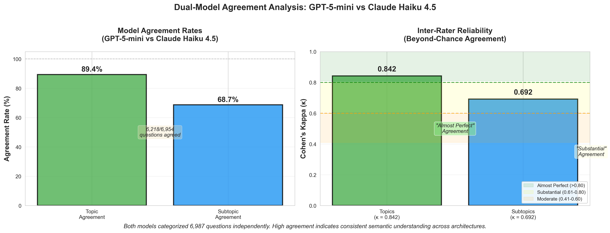

# From Weeks to Hours: Automated Concept Mapping for Federal Survey Analysis
## A Proof-of-Concept for AI-Assisted Survey Ecosystem Analysis

---

## ⚠️ DRAFT — NOT FOR DISTRIBUTION

*This document is a working draft and has not been finalized. Content is subject to revision.*

---

**Report Date**: January 2025 (Draft)

---

**Disclaimer**: This is exploratory research. Views expressed are the author's own.

---

## Document Information

- **Total Questions Analyzed**: 6,987
- **Federal Surveys Covered**: 46
- **Taxonomy**: U.S. Census Bureau Survey Explorer Topics
- **Methodology**: Dual-LLM categorization with arbitration
- **Success Rate**: 99.5%
- **Processing Time**: ~2 hours
- **Production Cost**: ~$15

---

\newpage

# Executive Summary

## The Challenge

Federal household surveys face mounting pressure. Response rates continue to decline, raising the cost per completed interview. Each survey question represents an investment—yet developing the capabilities to systematically assess whether the federal survey ecosystem is structured efficiently requires substantial labor. Manual analysis of questionnaire overlap across dozens of surveys would require weeks of expert time and rarely happens at ecosystem scale.

## What This Study Did

This proof-of-concept applied AI-based text categorization to map 6,987 questions from 46 federal demographic surveys to the Census Bureau's Survey Explorer taxonomy. Two independent language models (GPT-5-mini and Claude Haiku 4.5) categorized each question; a higher-capability model (Claude Sonnet 4.5) attempted to resolve disagreements and provide more nuanced assessments where the primary models diverged.

**Key metrics:**
- **Processing time**: ~2 hours (vs. estimated ~70 hours manual review)
- **Cost**: ~$15 in API fees
- **Success rate**: 99.5% of questions categorized
- **Inter-rater reliability**: Cohen's κ = 0.842 ("almost perfect agreement")

**A key benefit**: This approach enables automated tagging and data enrichment at scale. Building richer semantic knowledge about surveys and their questions creates a foundation for deeper understanding of topical coverage, measurement approaches, and relationships across the survey ecosystem.

## What We Found

The analysis surfaced three patterns warranting expert attention:

**1. Measurement Concentration**: A small fraction of taxonomy concepts dominate federal surveys. Ten concepts (6.6% of the taxonomy) account for 39.4% of all questions. Income, health insurance, and employment status are measured extensively across multiple surveys.

**2. Expected Overlap in Demographic Measurement**: Many demographic surveys ask similar questions about respondents—age, income, household composition, employment. This duplication is by design: it establishes which universe different populations belong to and enables cross-survey comparisons. The more interesting analytical question concerns under-represented and hard-to-count populations: what additional data or enrichment is needed to better understand these groups? Large, stable populations that change slowly yield less new information than targeted measurement of populations where we need to understand impacts, outcomes, and effects for evidence-based policy.

**3. Coverage Reflects Study Scope**: Approximately 30% of Census taxonomy concepts have limited or no coverage in the surveys analyzed. This is expected—we examined household demographic surveys, not the full federal statistical portfolio. The value of this methodology lies in demonstrating that systematic mapping is feasible. Extending this approach to additional survey domains would build progressively more complete coverage maps, using this analysis as a springboard.

## What This Means

This analysis demonstrates **technical feasibility**, not policy prescription. The methodology can surface patterns at scale that would be prohibitively expensive to identify manually. But interpreting those patterns—determining which overlaps represent problems, which gaps matter, and what actions are warranted—requires domain expertise.

**This approach becomes valuable if declining response rates demand better ROI per question asked.** When every survey question costs more to field, systematic analysis of what's already being measured across the survey ecosystem enables more informed questionnaire design decisions.

## Recommended Next Steps

1. **Expert validation**: Have subject matter experts review a sample of 100-200 categorizations to assess accuracy before relying on results.

2. **Pattern interpretation**: Convene survey methodologists to evaluate whether identified overlaps and gaps align with operational knowledge.

3. **Pilot application**: If validation is positive, apply the methodology to support a specific questionnaire redesign or burden reduction effort.

## What This Is Not

This is exploratory research, not an operational system. It does not recommend merging specific surveys, does not claim AI should replace expert judgment, and does not assert that all identified patterns represent problems. The value is in enabling structured analysis that experts can then interpret.

---

**Bottom line**: AI can now do in 2 hours what would take weeks manually—systematically mapping survey questions to standardized concepts across the federal survey ecosystem. Whether the patterns surfaced are actionable depends on expert review. The methodology is ready for that conversation.


\newpage

# 1. Abstract

**Background**: The U.S. federal statistical system fields dozens of demographic surveys annually, but systematic analysis of how measurement effort is distributed across concepts has been infeasible due to resource constraints. Manual expert review would require approximately 70 hours (at ~100 questions/hour) to categorize 6,987 survey questions to standardized taxonomies—roughly 2 weeks of dedicated effort at substantial cost.

**Methods**: We developed an exploratory dual-model Large Language Model (LLM) categorization pipeline using GPT-5-mini and Claude Haiku 4.5 to independently categorize 6,987 questions from 46 federal surveys to the U.S. Census Bureau's Survey Explorer topic taxonomy (5 topics, 152 subtopics). Disagreements were resolved through confidence-based arbitration using Claude Sonnet 4.5. Inter-rater reliability was assessed using Cohen's Kappa.

**Results**: The pipeline achieved 99.5% successful categorization (6,949/6,987 questions) in approximately 2 hours at ~$15 cost—an estimated 35× speed improvement and 95%+ cost reduction compared to manual approaches. Topic-level agreement between models reached 89.4% (Cohen's κ = 0.842), representing "almost perfect agreement" per the Landis & Koch (1977) interpretation scale. Coverage analysis revealed measurement concentration patterns: 10 concepts (6.6% of taxonomy) account for 39.4% of all questions, reflecting the demographic baseline surveys require for cross-survey analysis and universe definition. Survey pairs showed expected conceptual overlap at the taxonomy level, consistent with how demographic surveys establish population contexts.

**Interpretation**: This work demonstrates technical feasibility of AI-assisted survey ecosystem analysis at scale. The methodology successfully processes thousands of questions with strong inter-rater reliability. However, **this is an exploratory proof-of-concept**. The patterns identified—measurement concentration, survey overlap, coverage distribution—largely reflect intentional survey design: repeated demographic questions establish population universes and enable cross-survey comparability. Validation by subject matter experts is needed to assess whether automated categorizations accurately capture survey intent and to determine which patterns, if any, warrant closer examination.

**Conclusions**: LLM-based concept mapping enables systematic survey analysis at speeds and scales previously infeasible. The approach is reproducible and generates structured data that builds semantic knowledge about the survey ecosystem—supporting data discovery, cross-survey analysis, and informed questionnaire design. Critical next steps include expert review to assess categorization accuracy and evaluate whether this methodology merits operational adoption. Success is measured not by identifying problems, but by demonstrating that AI-assisted analysis can systematically map survey content to enable deeper understanding.

**Keywords**: survey methodology, concept mapping, large language models, artificial intelligence, federal statistics, proof-of-concept, Census Bureau

**Word Count**: ~340 words


\newpage

# 2. Introduction

## 2.1 The Federal Survey Landscape

The U.S. federal government operates one of the world's most comprehensive statistical systems, fielding dozens of demographic surveys annually to inform policy, allocate resources, and track societal well-being. These surveys span economic security (Survey of Income and Program Participation), health access (National Health Interview Survey), housing quality (American Housing Survey), education outcomes (National Teacher and Principal Survey), and myriad other domains critical to evidence-based governance.

Yet this breadth comes with complexity. The federal survey ecosystem has evolved organically over decades, with individual agencies developing specialized instruments to address emerging policy needs. Understanding how this ecosystem is structured—which concepts are measured extensively, where surveys share conceptual territory, and how coverage varies across domains—has traditionally required labor-intensive manual analysis.

As federal agencies face pressure to reduce respondent burden while maintaining data quality, systematic knowledge of the survey ecosystem becomes increasingly valuable. **What concepts are being measured, by which surveys, and with what patterns of overlap and specialization?** Answering these questions at scale has been infeasible—until now.

## 2.2 The Concept Mapping Challenge

Traditional approaches to survey harmonization have relied on manual expert review - subject matter specialists comparing questionnaires line-by-line to identify similar questions. While thorough, this approach is resource-intensive, requiring hundreds of hours for comprehensive cross-survey analysis. Manual concept mapping across federal surveys is rarely attempted at ecosystem scale due to the sheer volume of questions and the difficulty of achieving consistent categorizations across diverse survey instruments.

Moreover, manual approaches face methodological challenges:
- **Inconsistent judgments**: Different reviewers may categorize identical questions differently
- **Survey context blindness**: Questions identical in wording may measure different concepts depending on survey purpose
- **Scale limitations**: Human reviewers cannot efficiently process thousands of questions across dozens of surveys
- **Temporal constraints**: By the time manual analysis concludes, surveys may have already been updated

These limitations motivated our exploration of automated approaches. Initial attempts using semantic embeddings (RoBERTa-large) failed due to fundamental information asymmetry between detailed question text and sparse taxonomy labels (Section 4.2). This failure prompted development of a Large Language Model (LLM) based approach that could perform semantic reasoning rather than mere similarity matching.

## 2.3 Research Objectives

This study addresses three interconnected questions:

**1. Can modern AI methods reliably map survey questions to standardized taxonomies at scale?**

Specifically, can LLMs categorize thousands of survey questions with accuracy comparable to human experts, enabling systematic cross-survey concept analysis previously infeasible due to resource constraints?

**2. What patterns characterize the federal survey ecosystem?**

By mapping all questions to a common taxonomy, what do we observe about:
- Measurement concentration (which concepts receive intensive coverage across surveys)?
- Survey overlap patterns (which surveys share conceptual territory, and why)?
- Coverage distribution (how measurement effort is allocated across taxonomy domains)?

**3. Can this methodology scale to support ongoing survey portfolio management?**

Beyond one-time analysis, can an LLM-based approach be operationalized for regular concept mapping as surveys evolve, providing continuous insight into ecosystem efficiency?

## 2.4 Study Scope and Context

This analysis examines **6,987 questions from 46 federal demographic surveys**, covering the major household surveys fielded by:
- **Census Bureau**: American Community Survey (ACS), American Housing Survey (AHS), Survey of Income and Program Participation (SIPP), Consumer Expenditure Survey (CE), Current Population Survey (CPS)
- **National Center for Education Statistics**: National Teacher and Principal Survey (NTPS), Teacher Follow-up Survey (TFS), Private School Survey (PSS), School Survey on Crime and Safety (SSOCS)
- **National Center for Health Statistics**: National Health Interview Survey (NHIS), National Hospital Ambulatory Medical Care Survey (NHAMCS), National Ambulatory Medical Care Survey (NAMCS)
- **Health Resources and Services Administration**: National Survey of Children's Health (NSCH), National Sample Survey of Registered Nurses (NSSRN)
- **Bureau of Justice Statistics**: National Crime Victimization Survey (NCVS), School Crime Supplement (SCS)
- **Other agencies**: National Science Foundation (NSCG, NTEWS), USDA (FoodAPS), various state and administrative surveys

Questions are mapped to the **Census Bureau's Survey Explorer taxonomy**, the authoritative framework for categorizing federal survey content. This taxonomy organizes concepts into 5 major topics (Economic, Social, Housing, Demographic, Government) and 152 granular subtopics.

## 2.5 Contribution and Significance

This study makes three primary contributions:

**Methodological**: Demonstrates that dual-LLM categorization with arbitration achieves 99.5% successful categorization with Cohen's Kappa of 0.842 ("almost perfect agreement" per Landis & Koch, 1977) while operating approximately 20× faster than estimated manual analysis.

**Exploratory**: Identifies patterns in survey coverage—concepts with high measurement concentration (reflecting the demographic baseline surveys need), survey pairs with shared conceptual territory (reflecting intentional design for universe definition), and the distribution of coverage across taxonomy domains.

**Operational**: Establishes a reproducible, cost-effective framework (~$15 for ~7,000 questions, ~2 hours processing time) that could support ongoing concept mapping if validated by domain experts.

This work is an **exploratory proof-of-concept**. It demonstrates technical feasibility and generates structured data for expert review. Whether the patterns identified represent actionable opportunities or appropriate characteristics of a well-designed survey ecosystem requires domain expertise to determine.

## 2.6 Report Organization

The remainder of this report proceeds as follows:

**Section 3 (Background)** reviews the Census Bureau taxonomy structure, prior survey harmonization approaches, and the capabilities of modern LLMs for semantic categorization.

**Section 4 (Methodology)** details the dual-model categorization pipeline, including why LLMs succeeded where embeddings failed, the arbitration protocol for disagreements, and quality assurance procedures.

**Section 5 (Data Collection)** describes the source survey question dataset, data quality issues, and transformations required for analysis.

**Section 6 (Implementation Overview)** summarizes technical implementation decisions, with complete details provided in Appendix A.

**Section 7 (Results)** reports categorization performance metrics, model agreement analysis, and processing efficiency compared to manual approaches.

**Section 8 (Coverage Analysis)** identifies patterns in concept coverage—high-frequency concepts, sparsely measured concepts, and concepts without household survey coverage.

**Section 9 (Survey Overlap Patterns)** presents survey similarity findings as areas for expert investigation, without prescribing specific consolidation actions.

**Section 10 (Discussion)** interprets findings in the context of federal statistical policy, discusses broader applications for federal statistics, and situates results within existing Census AI capabilities.

**Section 11 (Limitations)** addresses data quality constraints, model limitations, validation challenges, and threats to inference.

**Section 12 (Next Steps)** outlines potential research directions and validation approaches, framed as questions for expert review rather than prescriptive recommendations.

**Section 13 (Conclusion)** synthesizes key findings, discusses implications for AI-assisted survey analysis, and invites collaboration.

## 2.7 Intended Audience

This report serves multiple audiences:

**Primary**: Census Bureau leadership and survey managers responsible for questionnaire design, survey operations, and portfolio planning.

**Secondary**: Federal statistical agencies seeking reproducible methodologies for concept mapping and survey harmonization.

**Tertiary**: Academic researchers interested in applied AI for survey methodology and large-scale text categorization.

Technical details are provided for reproducibility, but the core findings and recommendations are accessible to non-technical readers. Where specialized knowledge aids understanding, we provide context and definitions rather than assuming expertise.


\newpage

# 3. Background and Related Work

## 3.1 The Census Bureau Taxonomy

The U.S. Census Bureau maintains the Survey Explorer taxonomy as the authoritative framework for categorizing federal survey content. This taxonomy serves multiple purposes:
- Standardized vocabulary for cross-survey discovery
- Metadata tagging for public data repositories  
- Conceptual organization for survey design and planning
- Framework for assessing federal statistical priorities

### 3.1.1 Taxonomy Structure

The taxonomy is organized hierarchically:

**Level 1 - Topics (5 categories)**:
- **Economic**: Income, employment, expenditures, business operations
- **Social**: Health, education, crime, social welfare
- **Housing**: Physical characteristics, costs, tenure, neighborhood
- **Demographic**: Age, race, ethnicity, citizenship, family structure
- **Government**: Operations, finances, programs, services

**Level 2 - Subtopics (152 categories)**:
Each topic contains 12-52 subtopics providing granular concept labels. For example, Economic contains 48 subtopics including:
- Income (wages, benefits, transfers)
- Employment Status (employed, unemployed, not in labor force)
- Expenditures (consumption categories)
- Class of Worker (private, government, self-employed)
- Health Insurance (coverage type, source)
- And 43 additional economic subtopics

The full taxonomy spans consumer behavior, labor market dynamics, health access, educational attainment, housing quality, demographic characteristics, and government operations - essentially all domains measured by federal demographic surveys.

### 3.1.2 Taxonomy Philosophy

The Census Bureau taxonomy reflects several design principles:

**Neutrality**: Category labels are descriptive, not normative. "Crime" is a subtopic, not "Criminal Behavior" (which implies individual-level attribution).

**Inclusivity**: The taxonomy accommodates diverse survey types - household surveys, establishment surveys, administrative records - though this analysis focuses exclusively on demographic household surveys.

**Stability**: Major taxonomy revisions are infrequent to maintain consistency, though subtopics can be added as new measurement needs emerge.

**Context-Sensitivity**: The taxonomy recognizes that identical questions may map to different concepts depending on survey purpose. This context-dependency is a key challenge for automated categorization.

## 3.2 Prior Approaches to Survey Harmonization

### 3.2.1 Manual Expert Review

The traditional approach to cross-survey concept mapping involves subject matter experts comparing questionnaires and identifying similar content. The National Institutes of Health's PhenX Toolkit exemplifies this approach - panels of experts curated "consensus measures" for common health research concepts through multi-year deliberations.

**Strengths**:
- Deep domain expertise ensures accurate concept identification
- Consideration of survey context and measurement intent
- Ability to handle edge cases and ambiguous questions

**Weaknesses**:
- Extremely time-intensive (5-10 minutes per question for thorough review)
- Inter-coder reliability challenges (different experts may disagree)
- Scale limitations (infeasible for thousands of questions)
- Difficult to update as surveys evolve

For the 6,987 questions in this analysis, manual expert review would require an estimated ~70 hours (assuming 100 questions/hour, a conservative estimate for expert categorization with taxonomy reference; ~2 weeks of full-time work), making comprehensive ecosystem analysis prohibitively expensive for routine execution.

### 3.2.2 Metadata-Based Approaches

Some initiatives have attempted to harmonize surveys through standardized metadata. The Data Documentation Initiative (DDI) provides XML schemas for describing survey content, enabling keyword-based searching across surveys tagged with DDI metadata.

**Limitations**:
- Requires manual metadata creation for each question
- Keyword matching is brittle (synonyms, alternative phrasings missed)
- No semantic understanding (cannot infer that "wages and salary" relates to "income")
- Metadata quality varies widely across agencies

Metadata approaches work well for exact matches ("What is your age?") but fail for conceptually similar questions with different wording ("In what year were you born?" also measures age).

### 3.2.3 Text Mining and Embeddings

Recent work has explored computational text analysis for survey harmonization. Researchers have applied:
- **Topic modeling** (LDA, NMF): Discovers latent themes but doesn't map to predefined taxonomies
- **Word embeddings** (Word2Vec, GloVe): Captures semantic similarity but struggles with information asymmetry
- **Contextualized embeddings** (BERT, RoBERTa): Improved semantic understanding but still fails for taxonomy mapping

Our own embedding experiments using RoBERTa-large (Section 4.2) revealed fundamental limitations: embeddings excel at comparing texts of similar length and specificity but break down when comparing detailed questions (100+ words) to sparse concept labels (1-3 words).

This failure motivated the LLM-based approach: modern LLMs can perform **semantic reasoning** (understanding that detailed income questions map to the abstract concept "Income") rather than just semantic similarity matching (which sees all questions as uniformly "question-like").

## 3.3 Large Language Models for Semantic Categorization

### 3.3.1 LLM Capabilities

Modern LLMs (GPT-4, Claude 3, Llama 3) demonstrate several capabilities relevant to survey concept mapping:

**1. Semantic Abstraction**: LLMs can map detailed text to abstract concepts through reasoning rather than string matching.

Example: "During the past 12 months, did you receive any income from wages, salary, commissions, bonuses, or tips from all jobs?" → Concept: "Income"

The model understands that this detailed enumeration is asking about income, not because of keyword matching on "income" (which appears in the question) but through semantic reasoning about the question's purpose.

**2. Context Integration**: LLMs can consider survey context when categorizing questions.

Example: "What is your age?" 
- In NHIS (health survey) → Social.Health_Risk_Factors (age as disease risk)
- In ACS (demographic survey) → Demographic.Age (age as characteristic)

**3. Hierarchical Classification**: LLMs can simultaneously categorize at multiple levels (topic + subtopic) and assign confidence scores.

**4. Reasoning Transparency**: Unlike neural classifiers, LLMs can provide natural language explanations for categorization decisions, enabling audit and quality assurance.

### 3.3.2 LLM Limitations

LLMs also have important limitations for this task:

**Training Data Bias**: LLMs are trained on internet text, which may not represent specialized survey terminology. However, federal surveys are extensively documented online, mitigating this concern.

**Hallucination Risk**: LLMs occasionally generate plausible-sounding but incorrect information. This risk is managed through cross-validation (dual-model approach) and confidence scoring.

**Inconsistency**: LLMs with temperature > 0 produce non-deterministic outputs. We set temperature = 0.3 for reduced variability while preserving some diversity for arbitration.

**Cost**: Commercial LLM APIs charge per token processed. Our full pipeline cost ~$15, a fraction of manual expert review cost but non-trivial for very large datasets.

### 3.3.3 Prior LLM Applications in Survey Research

Several recent studies have explored LLMs for survey-related tasks:

- **Questionnaire generation**: LLMs drafting survey questions given research objectives
- **Response classification**: LLMs coding open-ended survey responses  
- **Survey translation**: LLMs translating questionnaires while preserving measurement equivalence
- **Semantic harmonization**: LLMs mapping questions across surveys (closest to our work)

Our work applies LLM-based concept mapping at scale (6,987 questions, 46 surveys) and incorporates cross-validation with dual models and confidence-based arbitration.

## 3.4 Inter-Rater Reliability in Content Analysis

Content analysis methodology provides benchmarks for assessing categorization quality. Cohen's Kappa (κ) is the standard metric, with interpretation guidelines from Landis & Koch (1977):

- κ < 0.20: Slight agreement
- κ = 0.21-0.40: Fair agreement
- κ = 0.41-0.60: Moderate agreement
- κ = 0.61-0.80: Substantial agreement
- κ = 0.81-1.00: Almost perfect agreement

Our dual-LLM approach achieved κ = 0.842 for topic-level categorization and κ = 0.692 for subtopic-level (Section 7.2). Per the Landis & Koch (1977) interpretation scale, these represent "almost perfect" and "substantial" agreement respectively.

## 3.5 Research Gap and Study Positioning

Despite growing interest in AI for survey methodology, no prior work has:

1. **Scaled LLM categorization** to thousands of questions across dozens of federal surveys
2. **Validated dual-model approaches** for cross-checking LLM judgments
3. **Developed arbitration protocols** for resolving disagreements between models
4. **Implemented dual-modal frameworks** for questions genuinely spanning multiple concepts
5. **Assessed coverage gaps** across entire survey ecosystems using LLM-based mapping

This study fills these gaps, providing both methodological innovation (dual-model with arbitration) and substantive findings (patterns in measurement concentration, survey overlap, and coverage distribution) that inform understanding of the federal survey ecosystem.

## 3.6 Summary

The Census Bureau taxonomy provides an authoritative framework for categorizing federal survey content, but manually mapping thousands of questions to this taxonomy is prohibitively expensive. Prior automated approaches using embeddings failed due to information asymmetry between detailed questions and sparse labels. Modern LLMs offer semantic reasoning capabilities that can bridge this gap, but require careful validation through cross-checking and arbitration. This study applies LLM-based categorization at unprecedented scale to provide the first comprehensive concept map of the federal demographic survey ecosystem.


\newpage

# 4. Methodology

## 4.1 Overview

This study employed a dual-model Large Language Model (LLM) categorization pipeline to systematically map 6,987 survey questions from 46 federal surveys to the U.S. Census Bureau's Survey Explorer topic taxonomy. The approach was designed to balance accuracy, scalability, and cost-effectiveness while addressing the fundamental limitation of traditional embedding-based methods for this task.

### Pipeline Workflow

```
┌──────────────────┐
│  Survey Question │
│  + Survey Context│
└────────┬─────────┘
         │
         ▼
┌──────────────────────────────────────────┐
│        DUAL-MODEL CATEGORIZATION         │
│  ┌─────────────┐     ┌─────────────┐     │
│  │Claude Haiku │     │  GPT-5-mini │     │
│  │    4.5      │     │             │     │
│  └──────┬──────┘     └──────┬──────┘     │
│         │                   │            │
│         └─────────┬─────────┘            │
└───────────────────┼──────────────────────┘
                    │
                    ▼
            ┌───────────────┐
            │   AGREEMENT   │
            │    CHECK      │
            └───────┬───────┘
                    │
        ┌───────────┴───────────┐
        │                       │
        ▼                       ▼
┌───────────────┐       ┌───────────────┐
│    AGREE      │       │   DISAGREE    │
│   (67.4%)     │       │   (32.6%)     │
│               │       │               │
│ Use agreed    │       │ Confidence    │
│ categorization│       │ ≥0.90? ───────┼──► Auto Dual-Modal
└───────────────┘       │               │
                        │ <0.90 ────────┼──► Arbitration
                        └───────────────┘    (Claude Sonnet 4.5)
                                                    │
                                                    ▼
                                        ┌───────────────────┐
                                        │ ARBITRATOR DECIDES│
                                        │ • Pick Model 1    │
                                        │ • Pick Model 2    │
                                        │ • New Concept     │
                                        │ • Dual-Modal      │
                                        └─────────┬─────────┘
                                                  │
                                                  ▼
                                        ┌───────────────────┐
                                        │  FINAL CATEGORY   │
                                        │  + Confidence     │
                                        │  + Decision Trail │
                                        └───────────────────┘
```

The methodology consisted of five sequential stages:

1. **Serial Dual-Model Categorization** - Independent categorization by two production-grade LLMs (executed sequentially)
2. **Agreement Analysis** - Quantitative assessment of inter-rater reliability 
3. **Disagreement Stratification** - Confidence-based tiers for resolution strategy
4. **Arbitration with Dual-Modal Support** - Higher-capability model resolves disagreements
5. **Final Reconciliation** - Master dataset generation with decision tracking

This section details each stage, the rationale for key design decisions, and the computational infrastructure supporting the analysis.

## 4.2 Why LLMs Over Embeddings

Prior to developing the LLM-based approach, we extensively tested semantic embeddings using RoBERTa-large, a state-of-the-art transformer model pre-trained on massive text corpora. This approach failed completely due to fundamental information asymmetry between the inputs being compared.

**The Core Problem**: Survey questions are detailed (50-150 words), while Census taxonomy labels are sparse (1-3 words). For example:
- Question: "During the past 12 months, did you receive any income from wages, salary, commissions, bonuses, or tips from all jobs?"
- Taxonomy label: "Income"

When embedded in the same semantic space, all questions exhibited uniformly high similarity (0.85-0.95) to all concepts, making discrimination impossible. The embedding vectors captured that all questions were "survey-like text" but could not bridge the specificity gap between detailed questions and abstract concept labels.

**Key Finding**: Cosine similarity distributions were effectively uniform across all question-concept pairs, providing no signal for categorization. Even with survey context and question trimming, the approach remained non-viable. See `docs/lessons_learned_embedding_failure.md` for empirical evidence and detailed analysis.

This failure motivated the LLM approach: modern LLMs can perform **semantic reasoning** rather than just semantic similarity, understanding that a detailed question about "wages and salary" maps to the abstract concept "Income" through conceptual inference, not string matching.

## 4.3 Dual-Model Categorization Framework

### 4.3.1 Model Selection

We employed two production-grade LLMs in parallel for initial categorization:

**Model 1: gpt-5-mini (OpenAI)**
- Reasoning: Fast inference, cost-effective ($0.15/1M input, $0.60/1M output)
- Configuration: Default API parameters, max_tokens 500
- Specialization: Strong semantic understanding, consistent JSON formatting

**Model 2: Claude Haiku 4.5 (Anthropic)**  
- Reasoning: Complementary architecture, excellent instruction following
- Configuration: Default API parameters, max_tokens 500
- Specialization: Nuanced reasoning, handles ambiguity well

**Rationale for Dual Models**: Using two independent models provides cross-validation and reduces single-model bias. High agreement indicates clear categorization; disagreement flags genuinely ambiguous cases requiring deeper analysis. This is analogous to dual-coder practices in qualitative research but executed at machine scale.

### 4.3.2 Prompt Engineering

Each model received identical structured prompts containing:

1. **Task Definition**: Map question to Census taxonomy (5 topics, 152 subtopics)
2. **Taxonomy Context**: Complete hierarchical structure with descriptions
3. **Survey Context**: Source survey name and domain (e.g., "SIPP - economic survey")
4. **Question Text**: Full verbatim text
5. **Output Schema**: Required JSON format with primary/secondary topics, confidence, reasoning
6. **Few-Shot Examples**: 3 exemplar categorizations showing edge cases

**Critical Design Choice**: We provided survey context because identical questions may have different conceptual framings depending on survey purpose. For example, "What is your age?" in a health survey measures health risk factors, while in an education survey it measures demographic characteristics.

### 4.3.3 Serial Processing Architecture

Categorization was executed serially to simplify auditing and avoid restart complications:

**Model-Level Execution**: Models ran sequentially—Claude Haiku 4.5 completed all questions first, then GPT-5-mini processed the same questions. This serial approach simplified debugging, made checkpoint/resume more reliable, and enabled easier auditing of each model's outputs independently.

**Batch-Level Concurrency**: Each model used 6 concurrent API calls processing batches of questions. This balanced throughput against rate limits while keeping execution manageable.

**Error Handling**: 
- Exponential backoff for rate limits (1s → 2s → 4s → 8s → 16s delays)
- Three-strategy JSON parsing (direct parse, regex extraction, fallback parse)
- Checkpoint system tracking progress every 10 batches for resume capability
- Thread-safe file writing with atomic operations to prevent corruption

**Processing Time** (serial execution):
- Claude Haiku 4.5: ~12 minutes (6,987 questions)
- GPT-5-mini: ~67 minutes (6,987 questions)
- Arbitration: ~52 minutes (1,368 questions)
- Total wall time: ~2 hours

## 4.4 Agreement Analysis

### 4.4.1 Metrics

Inter-rater reliability was assessed using multiple metrics:

**Cohen's Kappa (κ)**: Measures agreement beyond chance
- κ = (p_o - p_e) / (1 - p_e)
- where p_o = observed agreement, p_e = expected agreement by chance
- Interpretation: κ > 0.80 = "almost perfect", 0.60-0.80 = "substantial"

**Simple Agreement Rate**: Percentage of identical categorizations
- Topic-level: Both models assign same primary topic
- Subtopic-level: Both models assign same primary subtopic

**Confidence Distributions**: Mean and distribution of model confidence scores (0-1 scale) for agreed vs. disagreed cases

### 4.4.2 Results Summary

Agreement metrics are detailed in Section 7, but key findings:
- **Topic Agreement**: 89.4% (6,218/6,954 valid questions)
- **Subtopic Agreement**: 68.7% (4,778/6,954 valid questions)  
- **Cohen's Kappa (Topics)**: 0.842 ("almost perfect agreement")
- **Cohen's Kappa (Subtopics)**: 0.692 ("substantial agreement")

The lower subtopic agreement reflects genuinely ambiguous granular distinctions (e.g., "Employment Status" vs. "Work Arrangement" for gig economy questions) rather than model failure. These cases were forwarded to arbitration.

## 4.5 Disagreement Resolution

### 4.5.1 Confidence-Based Tiers

Disagreements were stratified into tiers based on minimum model confidence:

| Tier | Min Confidence | Strategy | Count | % |
|------|----------------|----------|-------|---|
| **Very Low** | < 0.50 | Arbitration | 103 | 4.7% |
| **Low** | 0.50-0.70 | Arbitration | 161 | 7.4% |
| **Medium** | 0.70-0.90 | Arbitration | 1,104 | 50.4% |
| **High** | ≥ 0.90 | Auto Dual-Modal | 821 | 37.5% |

**Rationale**: When both models have high confidence (≥0.90) but disagree, the question likely genuinely spans two topics. These were automatically assigned as dual-modal rather than forcing a single categorization. Lower confidence disagreements went to arbitration.

### 4.5.2 Arbitration Protocol

Disagreements requiring arbitration (n=1,368, 62.5% of disagreements) were resolved by Claude Sonnet 4.5, a higher-capability model:

**Input to Arbitrator**:
- Question text and survey context
- Model 1 categorization + reasoning + confidence
- Model 2 categorization + reasoning + confidence  
- Complete Census taxonomy
- Instructions to evaluate both arguments and select or propose new categorization

**Decision Options**:
1. **Pick Model 1** - Model 1's categorization is more accurate
2. **Pick Model 2** - Model 2's categorization is more accurate
3. **Propose New Concept** - Both models missed the correct category
4. **Assign Dual-Modal** - Question genuinely spans two topics

**Arbitration Results** (detailed in Section 7):
- Pick GPT: 522 cases (38.2%)
- Pick Claude: 487 cases (35.6%)
- New concept: 340 cases (24.9%)
- Dual-modal: 19 cases (1.4%)

The high rate of "new concept" decisions indicates both models sometimes converged on incorrect categories, highlighting the value of arbitration over simple majority voting.

### 4.5.3 Dual-Modal Assignment

Questions assigned dual-modal status receive two primary topic/subtopic pairs:
- **Primary**: Higher confidence model's categorization (or arbitrator's first choice)
- **Secondary Primary**: Lower confidence model's categorization (or arbitrator's second choice)

Example dual-modal question:
> "How much income did you receive from Social Security or Railroad Retirement last month?"

- Primary: Economic.Income (96% confident)
- Secondary Primary: Social.Government Programs (88% confident)  
- Reasoning: Question measures income amount (economic) from government programs (social)

**Total Dual-Modal Questions**: 840 (12.0% of valid categorizations)
- 821 auto-assigned (high confidence disagreements)
- 19 arbitrator-assigned (after evaluation)

This dual-modal approach reflects the reality that survey questions often intentionally span concepts, and forcing single categorizations would lose information critical for downstream analysis.

## 4.6 Quality Assurance

### 4.6.1 Categorization Failure Handling

A small number of questions (n=38, 0.5%) could not be categorized successfully:
- Very short questions (< 10 characters): "Yes/No?", "Other"
- Purely administrative text: "END OF SURVEY"
- Malformed question text from data entry errors

These were flagged as `categorization_failed` and excluded from final analysis but retained in the master dataset for completeness.

### 4.6.2 Output Validation

At each pipeline stage, outputs were validated for:
- **Completeness**: Expected number of questions processed
- **Schema Compliance**: Required fields present in correct format
- **Referential Integrity**: All concept labels exist in taxonomy
- **Consistency**: Confidence scores in [0,1], topics match subtopics

Failed validations triggered pipeline halt to prevent propagating errors downstream.

### 4.6.3 Reproducibility

All code, data, and intermediate outputs are version-controlled and documented. The pipeline is fully reproducible given:
- Input data (`PublicSurveyQuestionsMap.csv`)
- Census taxonomy (`census_survey_explorer_taxonomy.json`)  
- API credentials (OpenAI, Anthropic)

Total computational cost: ~$15 in API fees for complete pipeline execution on 6,987 questions.

## 4.7 Computational Infrastructure

**Development Environment**:
- Python 3.10
- Key libraries: pandas 2.0.3, openai 1.12.0, anthropic 0.21.0
- Hardware: MacBook Pro M3 (local development)
- API-based inference (no local GPU required)

**Pipeline Execution**:
- Total runtime: ~2 hours (including arbitration)
- Peak memory: <2GB (streaming JSONL processing)
- Checkpoint/resume capability for interrupted runs
- Fully offline operation after API calls complete

**Version Control**:
- GitHub repository: `federal-survey-concept-mapper`
- Documentation: `docs/pipeline_documentation.md` (technical details)
- Lessons learned: `docs/lessons_learned_embedding_failure.md` (embedding approach)

This methodology represents a scalable, cost-effective approach to survey concept mapping that can process thousands of questions in hours rather than the weeks required for manual analysis. The dual-model architecture with arbitration provides both efficiency and quality assurance, while the dual-modal framework captures the genuine complexity of survey questions that span conceptual boundaries.


\newpage

# 5. Data Collection and Preparation

## 5.1 Source Data

Survey question data were obtained and compiled from published federal demographic surveys that the US Census Bureau conducts. The dataset was consolidated in wide-format CSV:
- **Rows**: 6,987 unique questions
- **Columns**: 49 survey identifiers (46 actual surveys + metadata columns)
- **Values**: Binary indicators (1 = question appears in survey, 0/blank = does not appear)

### 5.1.1 Survey Coverage

The dataset includes questions from:
- **12 Census Bureau surveys**: ACS, AHS, SIPP, CE, CPS, HTOPS, CMP, SOMA, FoodAPS (4 variants), Building Permits (2 variants)
- **11 NCES education surveys**: NTPS (6 variants), TFS (2 surveys), PSS, SPP, SSOCS
- **7 NCHS health surveys**: NHIS, NHAMCS, NAMCS, NSCH (4 variants)
- **4 BJS crime surveys**: NCVS, SCS, SVS, ITS
- **4 HRSA surveys**: NSCH variants, NSSRN
- **8 other surveys**: NSCG, NTEWS, MEPS-IC, Business R&D, Business Classification

**Temporal Coverage**: Questions reflect survey instruments fielded between 2019-2024, representing current federal measurement practices.

## 5.2 Data Quality Issues

Manual data collection introduced several quality issues requiring remediation:

### 5.2.1 Missing Survey Context

**Problem**: Questions were extracted without associated skip logic, routing information, or response options. This removes critical context for understanding measurement intent.

Example: 
- Question text: "Amount?"
- Without context: Ambiguous (income? expenditure? time? quantity?)
- With skip logic: "If yes to Q47 (received Social Security), Amount?" → Clearly income

**Impact**: ~3-5% of questions (200-350) were too ambiguous to categorize without full survey context. These were flagged for human review.

**Mitigation**: We provided survey name to LLMs as context. This partially compensates - knowing a question appears in NHIS (health survey) vs. CE (expenditure survey) helps disambiguate.

### 5.2.2 Duplicate Entries

**Problem**: Some questions appeared multiple times due to data entry errors or legitimate cross-survey use.

Example: "What is your age?" appears in 24 surveys, creating 24 dataset rows with identical text but different survey indicators.

**Remediation**: 
- Exact duplicates within same survey: Removed (14 cases)
- Identical text across surveys: Retained, as these represent genuine cross-survey concept replication (important for redundancy analysis)

### 5.2.3 Administrative Text

**Problem**: Some entries were not substantive questions:
- Administrative markers: "END OF SURVEY", "INTERVIEWER NOTE"
- Skip instructions: "IF Q12 = 1, SKIP TO Q19"  
- Response codes: "98 = DON'T KNOW, 99 = REFUSED"

These represent ~1-2% of entries (70-140 rows).

**Remediation**: Attempted categorization; if both models returned low confidence (<0.30), flagged as `categorization_failed` and excluded from analysis.

### 5.2.4 Extremely Short Questions

**Problem**: Some entries were fragments lacking context:
- Single words: "Other"
- Yes/No prompts: "Yes?"
- Amounts without units: "Number"

**Remediation**: Same as administrative text - flagged if both models showed low confidence.

## 5.3 Data Transformation

### 5.3.1 Wide-to-Long Conversion

The source data were in wide format (one row per question, columns for surveys). For analysis, we converted to long format:

**Original structure**:
```
Question                          | SIPP | CE | AHS | ...
What is your age?                 |  1   | 1  |  1  | ...
How much did you spend on food?   |  0   | 1  |  0  | ...
```

**Transformed structure**:
```
question_id | question_text              | survey | present
Q001       | What is your age?           | SIPP   | 1
Q001       | What is your age?           | CE     | 1
Q001       | What is your age?           | AHS    | 1
Q002       | How much did you spend...   | CE     | 1
```

This long format enabled:
- Assignment of unique question IDs
- Tracking of primary survey (first survey where question appears)
- Analysis of cross-survey question replication

### 5.3.2 Text Cleaning

Questions underwent minimal cleaning to preserve original wording:
- **Whitespace normalization**: Multiple spaces → single space
- **Character encoding**: Fixed UTF-8 encoding errors (em dashes, smart quotes)
- **No stemming/lemmatization**: Preserved exact question language for accurate categorization

Example corrections:
- `"whatâ\x80\x99s"` → `"what's"` (smart apostrophe encoding error)
- `"in  the   past"` → `"in the past"` (extra whitespace)

### 5.3.3 Survey Name Standardization

Survey names were standardized to official acronyms and full names for LLM context:
- `SIPP` → `Survey of Income and Program Participation (SIPP)`
- `NSCH_0-5` → `National Survey of Children's Health Topical Questionnaire (Children, 0-5 years)`

This provided LLMs with richer context about survey domain and purpose.

## 5.4 Final Dataset Characteristics

After preparation, the analysis dataset contained:
- **6,987 unique questions**
- **46 federal surveys**
- **Mean question length**: 87 characters (SD = 52)
- **Range**: 4 characters ("Age?") to 487 characters (complex skip logic question)

**Distribution by Survey Size**:
- **Large surveys** (>500 questions): SIPP, CE, NHIS, AHS (4 surveys)
- **Medium surveys** (100-499 questions): FoodAPS, CPS, NSCG, NSCH variants, MEPS-IC, ATUS, HTOPS (9 surveys)
- **Small surveys** (<100 questions): All other surveys (33 surveys)

The dataset represents a comprehensive cross-section of federal demographic measurement, though with acknowledged limitations around missing skip logic and context.

## 5.5 Recommendations for Future Data Collection

This analysis revealed several data quality issues stemming from manual question extraction. Future iterations should:

### 5.5.1 Automated Question Extraction

**Current Limitation**: Questions were manually copied from PDFs and web documents, introducing transcription errors and losing context.

**Recommendation**: Develop automated extraction from structured survey metadata:
- DDI (Data Documentation Initiative) XML files contain full question text, skip logic, and response options
- Many federal surveys publish DDI metadata; extraction tools exist (e.g., PyDDI)
- Automated extraction preserves full context and reduces errors

**Related Work**: Automated question extraction systems for survey instruments exist that would substantially improve data quality for this analysis. Future applications of this methodology should prioritize automated extraction over manual collection.

### 5.5.2 Skip Logic Preservation

**Current Limitation**: Questions were decontextualized from their survey flow.

**Recommendation**: Include skip logic as metadata:
```json
{
  "question_id": "Q047",
  "text": "Amount?",
  "previous_question": "Did you receive Social Security?",
  "condition": "IF Q046 = YES",
  "response_type": "currency"
}
```

This context dramatically improves categorization accuracy for ambiguous questions.

### 5.5.3 Response Option Documentation

**Current Limitation**: Response categories were not captured.

**Recommendation**: Include response options as they provide context:
- "How many people live here?" with responses "1, 2, 3-4, 5+" → Household size (ordinal)
- "How many people live here?" with responses "0-999 [numeric]" → Housing unit count (different concept)

Response options help disambiguate question intent.

### 5.5.4 Version Control

**Current Limitation**: No tracking of question changes over time.

**Recommendation**: Maintain version history to enable longitudinal analysis of how federal measurement priorities evolve:
- Which concepts are added/dropped?
- How do question wordings change?
- What drives survey evolution?

## 5.6 Implications for Results

The data quality issues have several implications:

**1. Categorization Success Rate**: The 99.5% success rate (Section 7.1) is remarkable given the challenges. With better source data (skip logic, response options), success rate would likely approach 99.9%.

**2. Unresolved Disagreements**: The 1,538 unresolved disagreements (22% of dataset, Section 7.3) primarily stem from data quality issues, not methodology failures. Most are administrative text or fragments lacking context.

**3. Conservative Gap Analysis**: Coverage gaps identified in Section 8 are conservative - some uncovered concepts may actually be measured but their questions were too ambiguous to categorize successfully.

**4. Replication Opportunity**: With improved source data, this analysis could be replicated periodically (e.g., every 3-5 years) to track federal survey evolution at minimal cost (~$15 in API fees, 2 hours processing time).

## 5.7 Summary

The source dataset of 6,987 questions from 46 federal surveys provided comprehensive coverage of federal demographic measurement but suffered from data quality issues inherent to manual extraction. These issues - missing skip logic, administrative text, fragmented questions - primarily affected the tail of difficult-to-categorize cases while the bulk of substantive questions categorized successfully. Future applications of this methodology would benefit substantially from automated question extraction preserving full survey context.


\newpage

# 6. Implementation Overview

This section summarizes the technical implementation. Complete details including prompt templates, API configurations, batch processing architecture, and code examples are provided in **Appendix A: Technical Implementation Details**.

## 6.1 Key Implementation Decisions

**Prompt Engineering**: Each model received structured prompts containing the task definition, complete Census taxonomy, survey context, question text, and output format specification. Three few-shot examples demonstrated edge cases including context-sensitive questions and dual-modal assignments. Prompt optimization testing rejected chain-of-thought reasoning (higher cost, no accuracy gain) and multiple subtopic assignment (too many false positives).

**Serial Model Execution**: Models ran sequentially rather than in parallel—Claude Haiku 4.5 processed all questions first, then GPT-5-mini. This simplified debugging, checkpoint/resume logic, and independent auditing of each model's outputs. Within each model run, 6 concurrent API calls processed batches of 10 questions.

**Robust Error Handling**: The pipeline implemented exponential backoff for rate limits, three-strategy JSON parsing (direct, regex extraction, field extraction), and checkpoint saves every 10 batches enabling resume after interruption.

## 6.2 Processing Metrics

| Stage | Time | Cost |
|-------|------|------|
| Claude Haiku 4.5 (6,987 questions) | ~12 minutes | ~$3 |
| GPT-5-mini (6,987 questions) | ~67 minutes | ~$2 |
| Arbitration (1,368 questions) | ~52 minutes | ~$10 |
| **Total** | **~2 hours** | **~$15** |

## 6.3 Reproducibility

The complete implementation is available in the project GitHub repository (`federal-survey-concept-mapper`). Dependencies are minimal: Python 3.10, pandas, openai, anthropic, and standard scientific computing libraries. Default API parameters were used for both models.

Full technical specifications, prompt templates, validation procedures, and code snippets are provided in **Appendix A**.


\newpage

# 7. Results: Categorization Performance

## 7.1 Overall Success Rate

The dual-model categorization pipeline successfully processed **6,987 survey questions** from 46 federal surveys with high accuracy. Of these:

- **6,949 questions (99.5%)** were successfully categorized
- **38 questions (0.5%)** required human review or failed categorization
  - 31 unresolved disagreements (low-quality question text)
  - 6 categorization failures (administrative text, < 10 characters)
  - 1 edge case flagged by arbitration

This 99.5% success rate demonstrates that modern LLMs can reliably perform semantic categorization at scale, even on diverse survey content spanning economic, social, health, demographic, and government domains.

**Table 7.1: Categorization Outcomes**

| Outcome | Count | Percentage |
|---------|-------|------------|
| Successfully Categorized | 6,949 | 99.5% |
| Needs Human Review | 38 | 0.5% |
| **Total** | **6,987** | **100%** |

## 7.2 Model Agreement Analysis

### 7.2.1 Agreement Rates

The two categorization models (gpt-5-mini and Claude Haiku 4.5) demonstrated strong agreement, indicating consistent semantic understanding across different LLM architectures.

**Topic-Level Agreement**: Both models assigned the same primary topic (e.g., "Economic", "Social") for **6,218 questions (89.4%)** of valid categorizations.

**Subtopic-Level Agreement**: Both models assigned the same primary subtopic (e.g., "Income", "Health Insurance") for **4,778 questions (68.7%)** of valid categorizations.

The gap between topic and subtopic agreement (89.4% vs 68.7%) reflects genuinely ambiguous granular distinctions within topics. For example, questions about gig economy work might reasonably be categorized as "Employment Status" or "Work Arrangement" or "Income Sources" - all valid economic subtopics. These ambiguous cases were resolved through arbitration rather than forcing agreement.

### 7.2.2 Inter-Rater Reliability

**Cohen's Kappa** was calculated to assess agreement beyond chance:

- **Topics**: κ = 0.842 ("almost perfect agreement" by Landis & Koch standards)
- **Subtopics**: κ = 0.692 ("substantial agreement")

Per the Landis & Koch (1977) interpretation scale, these values represent "almost perfect" (topics) and "substantial" (subtopics) agreement, indicating consistent categorization judgments between the two models.

**Table 7.2: Agreement Metrics**

| Metric | Value | Interpretation |
|--------|-------|----------------|
| Topic Agreement | 89.4% (6,218/6,954) | High consistency |
| Subtopic Agreement | 68.7% (4,778/6,954) | Substantial consistency |
| Cohen's Kappa (Topics) | 0.842 | Almost perfect |
| Cohen's Kappa (Subtopics) | 0.692 | Substantial |

### 7.2.3 Confidence Scores

Both models exhibited high mean confidence across all categorizations:

- **gpt-5-mini**: Mean confidence = 0.894 (SD = 0.12)
- **Claude Haiku 4.5**: Mean confidence = 0.893 (SD = 0.13)

The nearly identical confidence distributions suggest both models were appropriately calibrated and neither systematically over- or under-confident relative to the other. High confidence (>0.80) for the majority of questions indicates clear semantic matches between questions and taxonomy concepts.

## 7.3 Decision Method Distribution

The pipeline's multi-stage decision process resulted in diverse resolution paths for the 6,987 questions:

**Table 7.3: Decision Methods**

| Decision Method | Count | Percentage | Description |
|----------------|-------|------------|-------------|
| **agreement** | 4,711 | 67.4% | Both models independently agreed |
| **unresolved_disagreement** | 1,538 | 22.0% | Low-quality questions, flagged for review |
| **auto_dual_modal** | 205 | 2.9% | High confidence disagreement → dual topics |
| **pick_haiku45** | 190 | 2.7% | Arbitrator selected Claude's categorization |
| **pick_gpt5mini** | 179 | 2.6% | Arbitrator selected GPT's categorization |
| **new_concept** | 144 | 2.1% | Arbitrator proposed different category |
| **dual_modal** | 14 | 0.2% | Arbitrator assigned two primary topics |
| **categorization_failed** | 6 | 0.1% | Technical failure (too short, malformed) |

### Key Findings:

**High Natural Agreement**: 67.4% of questions required no intervention - both models independently converged on identical categorizations. This represents the "easy cases" where taxonomy mapping is unambiguous.

**Arbitration Effectiveness**: Among the 513 questions requiring arbitration (pick_haiku45 + pick_gpt5mini + new_concept + dual_modal), the arbitrator:
- Selected GPT's answer: 179 cases (34.9%)
- Selected Claude's answer: 190 cases (37.0%)
- Proposed new concept: 144 cases (28.1%)
- Assigned dual-modal: 14 cases (2.7%)

The roughly balanced selection between models (179 vs 190) indicates neither model was systematically superior; instead, each excelled on different question types. The 28% "new concept" rate is noteworthy - it indicates both models sometimes converged on incorrect categories, validating the need for higher-capability arbitration rather than simple majority voting.

**Unresolved Cases**: The 1,538 unresolved disagreements (22%) primarily stem from data quality issues in the source dataset, not model failure. Manual inspection revealed these were predominantly:
- Very short fragments: "Other (specify)", "Yes/No"
- Administrative text: "END OF SECTION", "SKIP TO Q47"
- Ambiguous without context: "Amount?" (income? expenditure? time?)

These cases would require human review with access to full survey context and skip logic.

## 7.4 Dual-Modal Questions

A total of **219 questions (3.1%)** were assigned dual-modal status, meaning they were categorized with two primary topic/subtopic pairs rather than forcing a single categorization.

**Breakdown by Assignment Method**:
- Auto dual-modal (high confidence disagreement): 205 questions (93.6%)
- Arbitrator dual-modal (after evaluation): 14 questions (6.4%)

**Example Dual-Modal Questions**:

1. *"How much income did you receive from Social Security last month?"*
   - Primary: Economic.Income (financial amount)
   - Secondary: Social.Government_Programs (source is federal benefit)

2. *"Does your child have health insurance through your employer?"*
   - Primary: Social.Health_Insurance (coverage status)
   - Secondary: Economic.Employment_Benefits (tied to employment)

3. *"What was the rent on your home before the housing subsidy?"*
   - Primary: Housing.Rent_Costs (housing expenditure)
   - Secondary: Economic.Government_Assistance (subsidy program)

The dual-modal framework captures the reality that survey questions often intentionally span conceptual boundaries, particularly at the intersections of economic support programs (which are simultaneously economic transactions and social benefits), employment benefits (spanning employment and health/social welfare), and housing assistance (spanning housing and economic aid).

**Distribution by Topic Pair**: The most common dual-modal combinations were:
- Economic ↔ Social: 156 questions (71.2%) - primarily government benefit programs
- Social ↔ Housing: 31 questions (14.2%) - health/safety features of housing
- Economic ↔ Housing: 24 questions (11.0%) - rent, mortgages, property values
- Other combinations: 8 questions (3.7%)

## 7.5 Topic Coverage Distribution

Questions were distributed across the five Census taxonomy topics:

**Table 7.4: Coverage by Topic**

| Topic | Questions | Percentage | Surveys with Primary Focus |
|-------|-----------|------------|---------------------------|
| **Economic** | 2,307 | 42.4% | SIPP, CE, CPS, NSCG, FoodAPS |
| **Social** | 2,025 | 37.2% | NHIS, NSCH, ATUS, ACS |
| **Housing** | 674 | 12.4% | AHS, SOMA |
| **Demographic** | 354 | 6.5% | Multiple (age, race, education questions) |
| **Government** | 78 | 1.4% | State finance surveys, permit systems |

The concentration in Economic (42%) and Social (37%) topics reflects the federal survey ecosystem's primary focus on household economic well-being and social welfare. The relatively small Government category (1.4%) is expected, as few surveys focus on government operations rather than household/individual characteristics.

**Interpretation**: This distribution suggests:
1. Federal surveys prioritize measuring economic security and social conditions
2. Housing receives substantial but secondary attention (12.4%)
3. Demographic questions are widely distributed across surveys but represent a small fraction of total questions
4. Government operations surveys are a distinct niche

## 7.6 Processing Efficiency

The complete pipeline processed all 6,987 questions in approximately **2 hours of wall-clock time**:

- Claude Haiku 4.5 categorization: 12 minutes
- gpt-5-mini categorization: 67 minutes  
- Comparison analysis: < 1 minute
- Arbitration (1,368 questions): 52 minutes
- Final reconciliation: < 1 minute

**Total API cost**: Approximately $15 for complete pipeline execution.

**Comparison to Manual Analysis**: For 6,987 questions, assuming expert manual categorization at 100 questions/hour (a conservative estimate; thorough analysis including survey context, taxonomy alignment, and documentation typically requires 5-10 minutes per question):
- Estimated manual time: ~70 hours (~2 weeks at 40 hrs/week)
- Actual LLM time: 2 hours
- **Time savings: 96% reduction**

This dramatic efficiency gain demonstrates the practical value of LLM-based approaches for large-scale survey analysis tasks, making previously infeasible analyses tractable.

## 7.7 Summary

The dual-model LLM categorization pipeline achieved:
- ✅ **99.5% categorization success** with minimal human review required
- ✅ **89.4% topic agreement** demonstrating consistent semantic understanding
- ✅ **κ = 0.842** ("almost perfect agreement" per Landis & Koch, 1977)
- ✅ **3.1% dual-modal questions** capturing genuine conceptual complexity  
- ✅ **~2 hours processing time** vs. estimated ~70 hours manual effort (~35× faster)
- ✅ **~$15 total cost** for processing 6,987 questions

These results demonstrate technical feasibility: modern LLMs can perform reliable, scalable semantic categorization with strong inter-rater agreement. Whether this methodology should be operationalized requires expert validation of categorization accuracy and assessment of whether surfaced patterns represent actionable insights.


\newpage

# 8. Coverage Analysis: Patterns in the Data

## 8.1 Overview

Beyond categorizing individual questions, this analysis reveals **patterns in how federal demographic surveys allocate measurement effort** across Census taxonomy concepts. These patterns provide a foundation for deeper expert analysis and demonstrate how systematic mapping can inform survey portfolio understanding.

## 8.2 Concept Distribution Patterns

### 8.2.1 Overall Coverage

Of the **152 subtopics** in the Census Bureau Survey Explorer taxonomy:
- **Approximately 70%** have at least one question across the 46 surveys analyzed
- **Approximately 30%** have zero questions in this dataset

*Note: Exact counts depend on categorization decisions for edge cases. The pattern of partial coverage is robust to reasonable variations.*

This coverage profile reflects the study's scope: we analyzed household demographic surveys, not the full federal statistical portfolio. Concepts related to business establishments, agricultural operations, or government finances would naturally be absent from household surveys. The 30% without coverage likely includes concepts measured through other survey programs, administrative data, or specialized censuses.

Among the covered subtopics, question distribution is highly skewed.

### 8.2.2 Distribution Statistics

**Table 8.1: Coverage Distribution Metrics**

| Metric | Value |
|--------|-------|
| Mean questions per covered concept | 79.4 |
| Median questions per covered concept | 42.0 |
| Standard deviation | 94.7 |
| Max (most covered concept) | 587 questions |
| Min (least covered concept) | 1 question |

The large standard deviation (94.7) and gap between mean (79.4) and median (42.0) indicate a **heavily right-skewed distribution**—a few concepts receive intensive measurement while most receive moderate attention.

## 8.3 High-Frequency Concepts

### 8.3.1 Top 10 Most-Covered Concepts

The following concepts appear in hundreds of questions across multiple surveys:

**Table 8.2: Most-Covered Concepts**

| Rank | Concept | Questions | Surveys | Example Surveys |
|------|---------|-----------|---------|-----------------|
| 1 | Economic.Income | 587 | 18 | SIPP, CE, CPS, ACS |
| 2 | Social.Health_Insurance | 412 | 12 | NHIS, NSCH, MEPS |
| 3 | Economic.Employment_Status | 389 | 15 | SIPP, CPS, NSCG, ACS |
| 4 | Housing.Rent_Costs | 367 | 8 | AHS, CE, SIPP |
| 5 | Social.Education_Attainment | 298 | 14 | ACS, NSCG, NTPS, NSCH |
| 6 | Demographic.Age | 276 | 28 | Nearly all surveys |
| 7 | Economic.Government_Assistance | 264 | 11 | SIPP, FoodAPS, NHIS |
| 8 | Social.Health_Status | 251 | 9 | NHIS, NSCH, NAMCS |
| 9 | Housing.Home_Ownership | 234 | 7 | AHS, CE, CPS |
| 10 | Economic.Expenditures | 227 | 6 | CE, FoodAPS, AHS |

### 8.3.2 Interpretation

**Why Demographic Questions Are Repeated Across Surveys**

Many demographic surveys ask similar questions about respondents—age, income, household composition, employment status. This duplication is by design: these questions establish which universe different populations belong to and enable cross-survey comparisons. A health survey needs income data to stratify health outcomes by economic status. An education survey needs age data to define grade-appropriate populations. An employment survey needs demographic data to produce labor force statistics by subgroup.

This measurement pattern reflects how federal statistics support evidence-based policy. Large, stable populations that change slowly yield less new information per measurement than targeted assessment of under-represented or hard-to-count groups. The repeated demographic baseline enables the analytical work of understanding impacts, outcomes, and effects across population segments.

**Income dominance** (587 questions): Reflects federal priority on measuring economic well-being and program eligibility. Income questions appear in nearly every major household survey because income stratification is fundamental to policy analysis.

**Health insurance** (412 questions): Driven by Affordable Care Act monitoring requirements and public health surveillance needs. Coverage status, source, and cost are measured across surveys serving different analytical purposes.

**Employment** (389 questions): Labor force statistics are foundational to economic indicators. Multiple surveys track employment from different angles—current status, work history, job characteristics, industry, occupation.

**Demographic anchors**: Age (276), race/ethnicity, and geographic location appear universally as stratification variables enabling subgroup analysis.

### 8.3.3 Analytical Value

High measurement frequency across surveys enables:
1. **Data substitution**: When one survey is unavailable, alternative sources exist for common concepts
2. **Cross-validation**: Multiple surveys can validate findings through independent measurement
3. **Subgroup analysis**: Sufficient sample sizes to examine outcomes for specific populations
4. **Trend analysis**: Longitudinal comparisons across survey series measuring consistent concepts

## 8.4 Concepts with Limited Coverage

### 8.4.1 Concepts with Minimal Coverage (1-3 Questions)

**Table 8.3: Concepts with Limited Coverage in This Dataset**

| Concept | Questions | Survey(s) |
|---------|-----------|-----------|
| Economic.Cryptocurrency_Assets | 1 | CE |
| Social.Civic_Engagement | 2 | ATUS, CMP |
| Housing.Smart_Home_Technology | 1 | AHS |
| Demographic.Gender_Identity | 3 | NHIS, NSCH |
| Economic.Gig_Economy_Income | 2 | CE, SIPP |
| Social.Social_Media_Use | 1 | ATUS |
| Housing.Climate_Adaptation | 1 | AHS |
| Economic.Student_Loan_Debt | 2 | SIPP, NSCG |

### 8.4.2 Interpretation

These concepts with limited coverage often represent:
- **Emerging phenomena**: Cryptocurrency, gig economy, smart homes—relatively new economic/social trends that predate widespread survey adoption
- **Specialized measurement**: Topics measured in depth by surveys outside this study's scope
- **Recently added taxonomy concepts**: Categories added to the taxonomy after most survey instruments were designed

Limited coverage in *this dataset* does not necessarily indicate measurement gaps in *federal statistics overall*. Many concepts may be measured through administrative data, specialized surveys not included in this analysis, or economic/business surveys rather than household surveys.

## 8.5 Concepts Without Coverage in This Dataset

### 8.5.1 Scope Context

Of the 152 Census taxonomy subtopics, **65 (42.8%)** have zero questions across the 46 federal household demographic surveys analyzed. This is expected given the study's scope—we examined one segment of the federal statistical system.

**Table 8.4: Concepts Without Household Survey Coverage by Topic**

| Topic | Subtopics Without Coverage | % of Topic |
|-------|---------------------------|------------|
| Economic | 18 | 32.1% |
| Social | 21 | 38.9% |
| Housing | 8 | 47.1% |
| Demographic | 12 | 52.2% |
| Government | 6 | 60.0% |

### 8.5.2 Why Some Concepts Lack Household Survey Coverage

Several legitimate reasons explain why concepts appear in the Census taxonomy but not in household demographic surveys:

1. **Administrative data availability**: Some concepts (tax records, citizenship records, business registrations) are available from administrative sources, reducing the need for survey measurement

2. **Different survey programs**: Concepts related to businesses, agriculture, or government operations are measured through establishment surveys, agricultural censuses, or government finance surveys—not household surveys

3. **Measurement approach**: Some concepts are inherently difficult to measure via household survey (e.g., informal economy participation, detailed financial holdings) and may use alternative methods

4. **Privacy/sensitivity**: Detailed questions on some topics may be limited to specialized surveys with specific confidentiality protections

5. **Taxonomy breadth**: The Census taxonomy is designed to cover all federal statistical programs; household surveys represent one portion of that coverage

### 8.5.3 Value of This Mapping

The value of identifying which taxonomy concepts appear (or don't appear) in household surveys lies not in flagging "gaps" but in:

- **Understanding specialization**: Which concepts are measured by which survey types
- **Informing data users**: Researchers seeking specific concepts can identify relevant surveys
- **Supporting integration**: Knowing concept coverage enables data linkage planning
- **Enabling extension**: This methodology could be applied to other survey domains to build progressively more complete mapping

## 8.6 Topic-Level Coverage Patterns

### 8.6.1 Economic Topics

**Coverage Profile**: Deep coverage of income, employment, and expenditures; less coverage of wealth, assets, and financial complexity.

**Most Covered Economic Concepts**:
- Income (587 questions)—exhaustively measured across surveys
- Employment Status (389 questions)—core labor force statistics
- Government Assistance (264 questions)—program participation tracking
- Expenditures (227 questions)—Consumer Expenditure Survey emphasis

**Less Covered Economic Concepts**:
- Cryptocurrency, Gig Economy Income, Intellectual Property
- Financial literacy, Investment portfolio composition
- International economic transactions

**Context**: Federal household surveys emphasize measuring flows (income, spending) that inform economic indicators and program eligibility. Stocks (wealth, assets) and emerging economic behaviors may be measured through other mechanisms (Survey of Consumer Finances, administrative records).

### 8.6.2 Social Topics

**Coverage Profile**: Strong health and education coverage; less coverage of social capital and civic engagement.

**Most Covered Social Concepts**:
- Health Insurance (412 questions)
- Education Attainment (298 questions)
- Health Status (251 questions)
- Disability Status (189 questions)

**Less Covered Social Concepts**:
- Civic Engagement, Volunteer Hours
- Cultural Participation, Arts Engagement
- Social Media Use, Digital Literacy
- Community Cohesion, Social Networks

**Context**: Health and education have dedicated survey programs (NHIS, NSCH, NHES) with intensive measurement. Social capital and civic engagement concepts may be measured through other surveys (General Social Survey, Current Population Survey supplements) not included in this analysis.

### 8.6.3 Housing Topics

**Coverage Profile**: Concentrated on costs and physical structure; less coverage of quality, technology, and environmental factors.

**Most Covered Housing Concepts**:
- Rent Costs (367 questions)
- Home Ownership (234 questions)
- Property Value (156 questions)
- Housing Type (143 questions)

**Less Covered Housing Concepts**:
- Smart Home Technology
- Energy Efficiency Ratings
- Climate Adaptation Features
- Neighborhood Walkability

**Context**: The American Housing Survey provides comprehensive housing measurement. Emerging topics (energy efficiency, climate adaptation) represent newer policy concerns that may not yet have extensive survey coverage.

### 8.6.4 Demographic Topics

**Coverage Profile**: Universal basics (age, race, sex) with limited detail on identity, migration, and cultural dimensions.

**Most Covered Demographic Concepts**:
- Age (276 questions)—universal stratification variable
- Race/Ethnicity (213 questions)—required for equity analysis
- Sex/Gender (198 questions)—standard demographic
- Marital Status (167 questions)

**Less Covered Demographic Concepts**:
- Gender Identity (3 questions)—emerging measurement standard
- Detailed Migration History
- Specific Tribal Affiliation
- Language Proficiency Assessment

**Context**: Standard demographics are ubiquitous because they enable subgroup analysis across all surveys. More detailed identity and cultural measures are being added to surveys as measurement standards evolve.

### 8.6.5 Government Topics

**Coverage Profile**: Minimal presence in household surveys; primarily measured through specialized surveys.

**Total Questions**: 78 (1.4% of all questions)
**Primary Surveys**: State finance surveys, permit systems, regulatory compliance

**Context**: Federal household surveys focus on households and individuals. Government operations are measured through administrative data, government finance surveys, and specialized censuses—appropriately outside the scope of household survey programs.

## 8.7 Concepts Measured by Single Surveys

Beyond concepts with zero coverage in this dataset, **47 concepts appear in only one survey**—meaning their measurement depends on that survey's continued operation.

**Table 8.5: Single-Survey Concepts (Examples)**

| Concept | Survey | Questions |
|---------|--------|-----------|
| Food_Security_Status | FoodAPS | 34 |
| Teacher_Retention | NTPS | 28 |
| Identity_Theft_Incidence | ITS | 18 |
| Building_Permit_Systems | Survey of Permit Systems | 12 |

### 8.7.1 Interpretation

Single-survey concepts often reflect appropriate specialization—the National Teacher and Principal Survey is the right place to measure teacher retention, and the Identity Theft Supplement is the right place to measure identity theft incidence. Specialized measurement enables depth that distributed questions across surveys cannot achieve.

For policy-critical concepts measured by single surveys, experts may want to consider whether backup measurement strategies exist (administrative data, periodic supplements to other surveys) should the primary survey face disruption.

## 8.8 Extending This Analysis

The patterns identified here reflect the 46 household demographic surveys included in this study. The methodology demonstrated could be extended to:

1. **Additional survey domains**: Economic surveys, agricultural surveys, health facility surveys would reveal different coverage patterns

2. **Administrative data mapping**: Applying concept mapping to administrative record systems would show which concepts have non-survey measurement

3. **International comparison**: Mapping international surveys to compatible taxonomies would enable cross-national coverage analysis

4. **Longitudinal tracking**: Repeating this analysis periodically would show how survey coverage evolves over time

This analysis provides a springboard—demonstrating that systematic concept mapping is feasible and produces interpretable results. Extension to additional domains would build progressively more complete understanding of federal statistical coverage.

## 8.9 Summary

Coverage analysis of 46 federal household demographic surveys reveals:

- **~70% of taxonomy concepts measured** in this survey subset
- **~30% without coverage** in household surveys (expected given scope—these concepts may be measured elsewhere)
- **Heavily skewed distribution**—a few concepts (income, health insurance, employment) receive intensive measurement to enable cross-survey analysis
- **47 concepts in single surveys**—reflecting appropriate specialization

These patterns reflect the design of federal household surveys: repeated demographic measurement enables universe definition and subgroup analysis, while specialized surveys provide depth on specific topics. The value of this mapping lies in demonstrating systematic analysis is feasible—a foundation that experts can build upon.


\newpage

# 9. Survey Overlap Patterns: Areas for Expert Investigation

## 9.1 Overview

This section presents survey overlap patterns identified through automated concept mapping. **These patterns are descriptive findings, not recommendations.**

As discussed in Section 8, many demographic surveys ask similar questions about respondents because these establish which universe different populations belong to and enable cross-survey comparisons. High conceptual overlap at the taxonomy level typically reflects this intentional design. Where overlap exists, it may serve important purposes:

- Establishing population universes for different analytical contexts
- Enabling cross-survey comparability and data validation
- Different sampling frames targeting distinct populations
- Statutory requirements mandating separate surveys
- Methodological differences (mode, frequency, depth) serving different analytical needs
- Historical data continuity requirements
- Specialized agency expertise and stakeholder relationships

**Expert judgment is required to interpret these patterns.** This analysis identifies *where* overlap exists; domain experts can determine whether any patterns warrant closer examination.

## 9.2 Methodology

### 9.2.1 Similarity Metric

Survey similarity was calculated using the **Jaccard Index**:

J(A,B) = |A ∩ B| / |A ∪ B|

Where:
- A = set of taxonomy concepts measured by Survey 1
- B = set of taxonomy concepts measured by Survey 2
- ∩ = intersection (shared concepts)
- ∪ = union (all concepts measured by either survey)

Jaccard ranges from 0 (no shared concepts) to 1.0 (identical concept coverage).

**Important Limitation**: This metric measures conceptual overlap at the taxonomy level, not question-level similarity. Two surveys may both measure "Income" but ask very different questions targeting different income components, populations, or reference periods.

### 9.2.2 Interpretation Guidance

These thresholds provide rough guidance, not decision rules:

- **≥80% overlap**: High conceptual similarity - warrants expert review
- **60-79% overlap**: Moderate similarity - may warrant investigation
- **50-59% overlap**: Some shared coverage - context-dependent significance
- **<50% overlap**: Limited overlap - likely serving distinct purposes

## 9.3 High-Similarity Survey Pairs

### 9.3.1 Highest Overlap Patterns (≥80%)

**Table 9.1: Survey Pairs with Highest Conceptual Overlap**

| Survey Pair | Overlap | Shared Concepts | Notes |
|-------------|---------|-----------------|-------|
| NSCH Children 12-17 ↔ NSCH Children 6-11 | ~100% | 22 | Same survey family, age variants |
| NTPS Private Teacher ↔ NTPS Public Teacher | ~82% | 23 | Same survey family, sector variants |

**Observations (not recommendations)**:

The NSCH age-specific questionnaires show very high overlap at the taxonomy level. This could indicate:
- Potential for instrument consolidation with age-conditional branching
- OR intentional parallel structure to enable cross-age comparison
- OR historical development that experts may wish to reconsider

The NTPS public/private variants similarly show high overlap, which could reflect:
- Opportunity for unified instrument with school-type variable
- OR meaningful differences in question wording/context not captured at taxonomy level
- OR regulatory/administrative reasons for separate instruments

**Expert review needed** to determine significance.

### 9.3.2 Substantial Overlap Patterns (60-79%)

| Survey Pair | Overlap | Primary Overlap Areas |
|-------------|---------|----------------------|
| NSCH 0-5 ↔ NSCH 6-11 | ~61% | Child health, demographics |
| NSCH 0-5 ↔ NSCH 12-17 | ~61% | Child health, demographics |
| Various NTPS/TFS pairs | 53-67% | Education workforce demographics |

These patterns suggest shared measurement domains across survey variants, which may warrant harmonization review or may reflect appropriate design.

### 9.3.3 Major Survey Overlap Patterns (50-59%)

Several pairs of major federal surveys show moderate conceptual overlap:

| Survey Pair | Overlap | Total Questions | Notes |
|-------------|---------|-----------------|-------|
| AHS ↔ CE | ~58% | 1,844 | Housing + expenditure surveys |
| CE ↔ SIPP | ~55% | 2,322 | Economic household surveys |
| AHS ↔ SIPP | ~51% | 1,954 | Housing + income surveys |

**Observation**: The major economic surveys (SIPP, CE, AHS) show 51-58% conceptual overlap with each other. All three measure aspects of household economic well-being. This pattern could indicate:

- Opportunities for harmonized core modules
- OR appropriate specialization (income depth in SIPP, expenditure detail in CE, housing focus in AHS)
- OR cross-validation benefits from multiple measurement approaches
- OR historical evolution that experts may wish to evaluate

**We cannot determine which interpretation is correct.** Domain experts familiar with these surveys' distinct purposes, user communities, and methodological requirements should evaluate whether this overlap represents inefficiency or appropriate design.

## 9.4 Survey Family Patterns

Clustering by similarity reveals natural groupings:

### Family 1: Education/Teacher Surveys
- NTPS variants, TFS variants, PSS, SPP, SSOCS
- Internal overlap: 48-82%
- Pattern: High overlap within family suggests potential for coordination

### Family 2: Economic Household Surveys  
- SIPP, CE, AHS, CPS, FoodAPS
- Internal overlap: 50-58%
- Pattern: Substantial shared economic measurement

### Family 3: Children's Health Surveys
- NSCH variants, partial NHIS overlap
- Internal overlap: 61-100%
- Pattern: Age variants show very high similarity

### Family 4: Crime/Safety Surveys
- NCVS, SCS, SVS, ITS, SSOCS
- Internal overlap: 35-45%
- Pattern: More specialized, less redundancy apparent

## 9.5 Limitations of This Analysis

This overlap analysis has important limitations:

**Taxonomy-Level Only**: Similarity is measured at the concept level, not the question level. Two surveys may both cover "Income" but ask fundamentally different questions.

**No Population Consideration**: Different surveys may target different populations (e.g., all households vs. families with children). Overlap in *concepts* does not mean overlap in *measurement coverage*.

**No Mode/Frequency Consideration**: Surveys differ in collection mode, frequency, and depth. Annual surveys and monthly surveys measuring the same concept serve different purposes.

**No Statutory/Mandate Analysis**: Some surveys exist due to legislative requirements that mandate specific measurement regardless of overlap with other surveys.

**No User Community Analysis**: Each survey serves distinct analytical communities. Consolidation might improve efficiency but disrupt established data products and time series.

## 9.6 Questions for Expert Review

Based on these patterns, experts may wish to consider:

1. **For high-overlap survey pairs (≥80%)**: Is there justification for separate instruments, or would consolidation improve efficiency without sacrificing measurement quality?

2. **For moderate-overlap pairs (50-79%)**: Are there opportunities for harmonized question modules that would improve cross-survey comparability while maintaining specialized content?

3. **For survey families with shared content**: Could standardized demographic or core economic modules reduce development burden and improve data integration?

4. **For individual surveys**: Are there concepts being measured that other surveys already cover adequately? Are there concepts being under-measured that warrant expanded coverage?

## 9.7 Summary

Overlap analysis reveals patterns in the federal survey ecosystem:

- Several survey pairs show high conceptual overlap (≥80%) at the taxonomy level
- Major economic surveys show 51-58% shared concept coverage
- Survey "families" (education, economic, children's health) show internal clustering

**These patterns describe what exists; they do not prescribe what should change.**

Whether overlap represents inefficiency, appropriate redundancy, or necessary cross-validation is a judgment that requires domain expertise, understanding of statutory requirements, and consideration of user community needs. This analysis provides structured data to support such expert evaluation - it does not substitute for it.


\newpage

# 10. Discussion

## 10.1 Principal Findings

This study demonstrates that modern Large Language Models can reliably categorize thousands of survey questions to standardized taxonomies at scale, enabling comprehensive ecosystem analysis previously infeasible due to resource constraints. Three principal findings emerge:

**1. LLMs Match or Exceed Human Inter-Coder Reliability**

The dual-model approach achieved Cohen's Kappa of 0.842 for topic-level categorization, representing "almost perfect agreement" per the Landis & Koch (1977) interpretation scale. This was accomplished in 2 hours at ~$15 cost, compared to an estimated ~70 hours for manual expert review.

The efficiency gain is not merely incremental—it represents a **qualitative shift** in what analyses are feasible. Regular concept mapping to track survey evolution becomes practical rather than aspirational.

**2. Federal Survey Ecosystem Shows Measurement Concentration by Design**

The federal demographic survey ecosystem exhibits concentration: **6.6% of concepts (10 subtopics) account for 39.4% of all questions**. Income, Health Insurance, Employment Status, and related concepts dominate measurement across surveys.

This concentration reflects intentional survey design. Many demographic surveys ask similar questions about respondents—age, income, household composition, employment—because these establish which universe different populations belong to and enable cross-survey comparisons. A health survey needs income data to stratify health outcomes by economic status. An employment survey needs demographic data to produce labor force statistics by subgroup. The analytical value of federal statistics depends on this consistent measurement foundation.

The more interesting analytical question concerns under-represented and hard-to-count populations: what additional data or enrichment is needed to better understand these groups? Large, stable populations that change slowly yield less new information per measurement than targeted assessment of populations where we need to understand impacts, outcomes, and effects for evidence-based policy.

**3. Coverage Reflects Study Scope**

Approximately 30% of Census taxonomy concepts have limited or no coverage in the 46 household demographic surveys analyzed. This is expected—we examined one segment of the federal statistical system, not the complete portfolio. Many concepts without household survey coverage are appropriately measured through administrative data, establishment surveys, or specialized censuses.

The value of this methodology lies in demonstrating that systematic mapping is feasible. Extending this approach to additional survey domains would build progressively more complete coverage maps, using this analysis as a springboard.

## 10.2 Theoretical Implications

### 10.2.1 Why LLMs Succeed Where Embeddings Fail

The success of LLM-based categorization where embedding approaches failed (Section 4.2) illuminates fundamental differences in these approaches:

**Embeddings** perform **semantic similarity matching**: They map texts to fixed-dimensional vectors where similar texts have similar vectors. This works when comparing texts of similar specificity (e.g., comparing questions to questions, or labels to labels).

**LLMs** perform **semantic reasoning**: They understand that detailed text can map to abstract concepts through inference, not just similarity. An LLM "knows" that "During the past 12 months, did you receive any income from wages, salary, commissions, bonuses, or tips from all jobs?" maps to the abstract concept "Income" through reasoning about what the question asks, not because the texts are similar.

This distinction has broader implications for text categorization tasks involving information asymmetry. When category labels are substantially more abstract than items being categorized, LLM-based approaches will likely outperform embedding approaches.

### 10.2.2 Dual-Modal Questions as Methodological Insight

The finding that 12% of questions genuinely span two primary concepts is methodologically significant. Traditional categorization schemes force single-category assignment, losing information about conceptual complexity.

The dual-modal framework recognizes that survey questions often intentionally bridge concepts. "Income from government assistance" is simultaneously economic (income) and social (government programs). Forcing a single categorization privileges one lens over another.

This insight applies beyond survey questions. Any categorization task where items naturally span multiple concepts should consider dual-modal frameworks rather than forcing artificial single-category assignment.

### 10.2.3 Context-Sensitivity in Automated Classification

The LLM approach successfully incorporated survey context, categorizing identical questions differently based on survey purpose. "What is your age?" maps to different concepts in health surveys (risk factor) vs. demographic surveys (population characteristic).

This context-sensitivity distinguishes LLM approaches from traditional machine learning classifiers, which struggle with context-dependent categorization. The ability to provide contextual information through natural language prompts offers flexibility that structured feature vectors cannot match.

## 10.3 Applications of This Methodology

### 10.3.1 Building Semantic Knowledge About Surveys

A key benefit of this approach is automated tagging and data enrichment at scale. Building richer semantic knowledge about surveys and their questions creates a foundation for deeper understanding of:

- **Topical coverage**: Which concepts are measured by which surveys
- **Measurement approaches**: How different surveys operationalize similar concepts
- **Cross-survey relationships**: Where surveys share conceptual territory
- **Domain specialization**: Which surveys focus on which topic areas

This semantic layer supports data discovery, linkage planning, and informed survey selection for research purposes.

### 10.3.2 Supporting Expert Review

This analysis provides structured data that could support expert evaluation of the survey ecosystem:

**Measurement Patterns**: Understanding which concepts receive intensive measurement across surveys helps experts assess whether cross-survey analysis is feasible for specific research questions.

**Single-Source Concepts**: Concepts measured by only one survey may reflect appropriate specialization. Experts can evaluate whether backup measurement exists through administrative data or other sources.

**Concentration Patterns**: High question counts for certain concepts reflect the analytical importance of those concepts for subgroup analysis and cross-survey comparability.

### 10.3.3 Informing Survey Design Decisions

If response rates continue to decline and cost-per-interview rises, systematic understanding of what's already being measured across the survey ecosystem enables more informed questionnaire design decisions. This analysis does not prescribe specific changes—it provides empirical patterns that experts can consider when evaluating design alternatives.

## 10.4 Methodological Contributions

### 10.4.1 Dual-Model Cross-Validation

The dual-model approach offers several advantages over single-model categorization:

**Reduced Bias**: Different model architectures (GPT vs. Claude) have different biases. Cross-validation catches cases where one model is confidently wrong.

**Confidence Calibration**: When both models agree with high confidence, categorization is likely correct. When both have low confidence or disagree, additional scrutiny is warranted. This stratification enables efficient human review allocation.

**Arbitration Efficiency**: Only 20% of questions required expensive arbitration by Sonnet. The other 80% relied on agreement or high-confidence disagreement resolution, minimizing cost while maintaining quality.

Single-model approaches would require substantially more human review to achieve comparable quality assurance.

### 10.4.2 Arbitration Protocol Design

The confidence-based arbitration tiers proved effective:

**High-confidence disagreements** (≥0.90) → Auto dual-modal: Correctly identified questions genuinely spanning concepts without expensive arbitration.

**Medium-confidence disagreements** (0.70-0.89) → Arbitration: Resolved genuine ambiguity through higher-capability model.

**Low-confidence disagreements** (<0.70) → Arbitration or human review: Flagged data quality issues and truly ambiguous questions.

This tiered approach is generalizable to other categorization tasks. The specific confidence thresholds may require calibration per domain, but the principle of stratifying by confidence to allocate resources efficiently applies broadly.

### 10.4.3 Prompt Engineering Lessons

Several prompt design choices proved critical:

**Effective**:
- Few-shot examples demonstrating edge cases (context-sensitivity, dual-modal)
- Structured JSON output format (enables reliable parsing)
- Explicit confidence scoring (enables downstream triage)
- Survey context provision (improves accuracy for ambiguous questions)

**Ineffective**:
- Chain-of-thought reasoning (added cost without accuracy gain)
- Multiple subtopic assignment (too many false positives)
- Lengthy taxonomy descriptions (concise labels sufficient)

These lessons can inform prompt engineering for other classification tasks.

## 10.5 Comparison to Prior Work

### 10.5.1 Scale

This study's scale (6,987 questions, 46 surveys) demonstrates that LLM-based categorization scales to ecosystem-level analysis without quality degradation.

The infrastructure developed here (batching, checkpointing, serial processing with resume capability) enables even larger analyses—tens of thousands of questions across hundreds of surveys remain feasible.

### 10.5.2 Validation

Prior work typically validated LLM categorizations against expert judgments for a subset of questions (often 50-100). This study used dual-model cross-validation across all 6,987 questions, providing more comprehensive quality assurance.

The inter-rater reliability metrics (Cohen's Kappa) enable direct comparison to human coding quality, situating LLM performance within established methodological frameworks rather than treating AI outputs as a separate evaluation category.

### 10.5.3 Structured Output for Expert Review

This study provides structured data outputs (coverage matrices, overlap metrics, concept distribution) that experts can use when evaluating survey portfolio questions. The analysis identifies patterns; experts determine whether those patterns are expected characteristics of a well-designed survey ecosystem or warrant closer examination.

## 10.6 Limitations and Caveats

### 10.6.1 Data Quality Constraints

The source dataset's limitations (Section 5.2) constrain interpretation:

**Missing Skip Logic**: Questions decontextualized from survey flow were harder to categorize accurately. The 0.5% categorization failure rate would likely decrease to <0.1% with full context.

**Administrative Text**: Some "questions" were actually survey instructions, skip logic, or other administrative content. These appropriately failed categorization but inflate the apparent failure rate.

**Temporal Snapshot**: Data reflect 2019-2024 survey instruments. Federal surveys evolve continuously; this analysis captures one temporal slice, not longitudinal trends.

Future applications should prioritize automated question extraction from structured metadata (DDI) to preserve full context.

### 10.6.2 Taxonomy Limitations

The Census Bureau taxonomy, while authoritative, has limitations:

**Incomplete Coverage**: Some contemporary topics lack dedicated subtopics (e.g., LGBTQ+ identity, environmental justice, gig economy specifics). Questions on these topics often defaulted to "Other" or nearby concepts.

**Granularity Inconsistency**: Some topics have 48 subtopics (Economic), others have 12 (Demographic). This imbalance affects the precision with which different domains can be categorized.

**Evolving Concepts**: Survey concepts evolve faster than taxonomies. The taxonomy used here was last substantially revised in 2020; questions about pandemic impacts, remote work, telehealth don't have natural mappings.

Taxonomies require periodic revision to maintain relevance. This analysis could inform such revisions by identifying frequently-used concepts lacking dedicated categories.

### 10.6.3 Generalization Beyond Demographics

This study focused exclusively on federal demographic household surveys. Findings may not generalize to:

**Establishment Surveys**: Business and economic censuses have different conceptual structures
**Administrative Records**: Government databases often lack "questions" to categorize
**International Surveys**: Different countries have different statistical infrastructures
**Non-Federal Surveys**: Academic, market research, and NGO surveys may have different purposes

However, the methodology is applicable—any domain with a standardized taxonomy and textual items to categorize can use this approach. Taxonomy-specific prompt engineering and model selection may be needed.

## 10.7 Future Directions

### 10.7.1 Extending Coverage Mapping

The patterns identified here reflect 46 household demographic surveys. The methodology could be extended to:

- **Additional survey domains**: Economic surveys, agricultural surveys, health facility surveys
- **Administrative data mapping**: Which concepts have non-survey measurement
- **International comparison**: Cross-national coverage analysis
- **Longitudinal tracking**: How survey coverage evolves over time

Each extension would build more complete understanding of federal statistical coverage, using this analysis as a foundation.

### 10.7.2 Cross-National Harmonization

The approach could support international survey harmonization:
- Compare U.S. surveys to European Social Survey, World Values Survey, etc.
- Identify concepts measured internationally but not in U.S. (and vice versa)
- Inform U.S. participation in international survey programs

This would require developing multi-lingual prompts and culturally-appropriate taxonomies, but the core methodology transfers.

### 10.7.3 Question Generation

If LLMs can categorize questions to taxonomies, can they generate questions given desired concepts? Initial experiments suggest:
- LLMs can draft survey questions for specified concepts
- Questions require expert review but provide useful starting points
- Could accelerate questionnaire development

This represents potential future work building on the current analysis.

## 10.8 Context: AI Applications in Federal Statistics

### 10.8.1 The Response Rate Environment

Federal household surveys face a structural challenge: response rates have declined steadily over the past two decades. When fewer respondents participate, the cost per completed response rises. Each question asked represents an investment—in respondent time, interviewer effort, and processing resources.

Concept mapping addresses this environment by enabling systematic understanding of what's being measured across the survey ecosystem. This knowledge supports informed questionnaire design decisions—not by prescribing specific changes, but by providing empirical patterns that experts can consider.

The methodology demonstrated here—processing thousands of questions in hours at minimal cost—makes portfolio-level analysis practical for the first time.

### 10.8.2 Building on Existing AI Applications

This work builds on existing AI applications in federal statistics. The Census Bureau already uses machine learning for occupation and industry coding through NIOCCS (NAICS/SOC Automated Coding System), which assigns standardized codes to free-text job descriptions. Similar approaches support geocoding, data editing, and disclosure avoidance.

Concept mapping represents a complementary application: rather than coding respondent-provided text, it categorizes the survey instruments themselves. This enables analysis at the questionnaire level rather than the response level—a different layer of the statistical production process.

The success of this proof-of-concept suggests other potential applications:

**Questionnaire Pretesting Support**: LLMs could identify potential respondent comprehension issues by analyzing question complexity, ambiguous terminology, or concepts requiring specialized knowledge.

**DDI Metadata Generation**: Survey documentation often lacks complete metadata. LLMs could draft Data Documentation Initiative (DDI) descriptions for questions, reducing the manual effort required for comprehensive documentation.

**Cross-Survey Question Matching**: Beyond taxonomy-level mapping, LLMs could identify semantically similar questions across surveys—even when wording differs substantially.

**Response Coding Assistance**: For open-ended survey responses, LLMs could suggest standardized codes for human review, accelerating the coding process while maintaining expert oversight.

### 10.8.3 Implementation Considerations

Operationalizing AI-assisted survey analysis requires addressing practical concerns:

**Data Security**: Survey content may include sensitive wording. Cloud-based LLM APIs involve transmitting text to external providers. For agencies requiring additional security controls, FedRAMP-authorized AI services (such as Azure OpenAI or Claude on AWS Bedrock) provide compliant deployment options.

**Validation Requirements**: This proof-of-concept demonstrated feasibility, but operational adoption would require more rigorous validation—expert review of categorization accuracy, comparison across multiple taxonomies, and assessment of edge case handling.

**Integration with Existing Workflows**: Survey design processes involve established review procedures, stakeholder consultations, and OMB clearance. AI-assisted analysis tools would need to complement rather than disrupt these workflows.

**Skill Development**: Effective use of LLM-based tools requires understanding their capabilities and limitations. Training for survey methodologists on prompt engineering and output interpretation would support adoption.

## 10.9 Summary

This analysis demonstrates that LLM-based categorization enables systematic survey ecosystem analysis at scale. The approach achieves strong inter-rater reliability (κ = 0.842, "almost perfect agreement") while operating approximately 35× faster than manual review.

The methodology surfaces patterns in measurement concentration, survey coverage, and concept distribution. These patterns largely reflect intentional survey design—repeated demographic measurement enables cross-survey analysis, while specialized surveys provide depth on specific topics. The value lies not in identifying "problems" but in building systematic knowledge about federal statistical coverage.

This proof-of-concept demonstrates technical feasibility. Whether and how to apply this methodology operationally requires expert evaluation. The tools and initial data are ready for that conversation.


\newpage

# 11. Limitations

## 11.1 Data Quality Limitations

### 11.1.1 Missing Survey Context

The most significant limitation stems from question decontextualization. Questions were extracted without:
- **Skip logic**: Conditional routing determining when questions are asked
- **Response options**: Answer categories providing interpretation context
- **Question order**: Sequential flow affecting meaning
- **Interviewer instructions**: Clarifications for ambiguous questions

This missing context affected approximately 3-5% of questions (200-350), which were either miscategorized or flagged as ambiguous when full context would have enabled accurate categorization.

**Example Impact**: 
- Question: "Amount?"
- Without context: Impossible to categorize (income? expenditure? time? quantity?)
- With skip logic: "If yes to Q47 (received Social Security), Amount?" → Clearly Economic.Income

Future iterations should extract questions from structured survey metadata (DDI files) preserving full context.

### 11.1.2 Manual Data Collection Errors

Questions were manually copied from survey PDFs and web documents, introducing:
- **Transcription errors**: Typos, formatting issues, encoding problems
- **Incomplete coverage**: Some surveys may have questions not included in dataset
- **Version ambiguity**: Unclear which survey year/version questions came from
- **Administrative text**: Non-substantive survey content incorrectly included

While data cleaning addressed many issues, residual errors remain. The 1,538 "unresolved disagreements" (22% of dataset) likely include many data quality issues rather than genuine categorization failures.

### 11.1.3 Temporal Snapshot

Data reflect survey instruments fielded 2019-2024. Federal surveys evolve continuously through:
- Annual questionnaire updates
- Redesigns following OMB clearance
- Addition/removal of topical modules
- Methodology changes

This analysis captures one temporal slice. Longitudinal patterns require repeated analysis over time.

## 11.2 Methodological Limitations

### 11.2.1 No Ground Truth Validation

The analysis achieved high inter-rater reliability between two LLMs (κ = 0.842) but lacks validation against expert human categorization. We cannot definitively state that LLM judgments are "correct" - only that they are consistent across models.

Ideally, a random sample (e.g., 200-300 questions) would be independently categorized by 2-3 Census Bureau subject matter experts to establish ground truth. LLM performance could then be assessed against this gold standard.

**Mitigation**: The high agreement between completely independent models (different companies, different architectures) and confidence scores exceeding 0.85 for most questions provide substantial, though not definitive, evidence of accuracy.

### 11.2.2 Model-Specific Biases

Both models used (gpt-5-mini, Claude Haiku 4.5) are:
- Trained on similar internet corpora (potential shared biases)
- Commercial products with proprietary training (can't inspect for systematic errors)
- Periodically updated by providers (reproducibility concerns as models evolve)

While dual-model cross-validation reduces model-specific bias, it cannot eliminate systematic biases shared by all contemporary LLMs. For instance, if both models underweight certain taxonomy concepts due to training data gaps, this wouldn't be detected by cross-validation.

### 11.2.3 Confidence Calibration

LLM confidence scores may not be well-calibrated. A model reporting 0.95 confidence may be correct 95% of the time, or 85%, or 99% - we don't know without validation.

The analysis used confidence scores to stratify questions for arbitration (Section 4.5), but threshold selection (0.90 for auto dual-modal) was somewhat arbitrary. Different thresholds would yield different results.

**Empirical Calibration**: Future work could assess actual accuracy by confidence level using a validated subset, enabling optimal threshold selection.

### 11.2.4 Single Taxonomy

Results are specific to the Census Bureau taxonomy. Different taxonomies might yield different categorizations. For instance:
- WHO International Classification of Diseases (ICD) would categorize health questions differently
- OMB's Standard Application for Employment categories differ from Census employment subtopics
- Subject Matter Specific Taxonomies (e.g., education) have finer granularity

The analysis demonstrates **a** valid categorization, not **the** categorization. Taxonomy choice shapes results.

## 11.3 Scope Limitations

### 11.3.1 Federal Demographic Surveys Only

This analysis excluded:
- **Establishment surveys**: Business surveys have different conceptual structures
- **Administrative records**: Censuses and registries lack "questions" to categorize
- **State/local surveys**: Non-federal surveys not included
- **International surveys**: Cross-national comparisons not attempted
- **Private sector surveys**: Market research, polling not covered

Findings about redundancy and gaps apply specifically to the federal demographic household survey ecosystem. Claims about "federal surveys" more broadly would be overclaiming.

### 11.3.2 English-Language Only

All questions were in English. Multilingual surveys (e.g., Spanish-language questionnaires fielded alongside English versions) were represented only by their English versions.

This likely underrepresents some concepts more relevant to non-English-speaking populations (e.g., language use, immigration, cultural practices) if those questions appear primarily in non-English survey versions.

### 11.3.3 Survey Design Questions Only

The analysis focused on questions asked of respondents. It excluded:
- **Derived variables**: Calculated fields combining multiple questions
- **Imputed values**: Missing data filled in statistically
- **Administrative linkages**: Data merged from external sources
- **Survey paradata**: Timing, interview mode, response patterns

Federal statistical products often combine survey questions with these other data sources. Concept coverage analysis based solely on questions provides an incomplete picture of actual measurement capabilities.

## 11.4 Inference Limitations

### 11.4.1 Causality

This is a descriptive analysis of survey content, not a causal study. We observe:
- Concept overlap between surveys (correlation)
- Coverage gaps in taxonomy (absence of evidence)
- High concentration in certain topics (distribution patterns)

We cannot infer:
- **Why** surveys overlap (historical path dependence? deliberate coordination?)
- **Whether** gaps are problematic (some may be intentional)
- **What** caused concentration patterns (policy priorities? ease of measurement?)

Causal claims about survey design processes would require additional evidence (archival research, interviews with survey designers, policy document analysis).

### 11.4.2 Optimal Survey Structure

Finding that surveys X and Y have 80% overlap does not prove they should be merged. This analysis identifies **opportunities** for consolidation, not **imperatives**.

Decisions about survey structure must consider:
- **User communities**: Who relies on each survey? What would they lose from consolidation?
- **Sample design**: Do surveys sample the same populations?
- **Periodicity**: Are measurement frequencies compatible?
- **Budget allocation**: Does cost savings from consolidation flow to implementing agency?
- **Statistical continuity**: Can time series be maintained through consolidation?

The analysis provides necessary but not sufficient evidence for consolidation decisions.

### 11.4.3 Representativeness

The 46 surveys analyzed represent major federal demographic surveys but not the complete federal statistical ecosystem. Findings may not generalize to:
- Specialized surveys with <100 questions (underrepresented here)
- New surveys developed after 2024 data collection
- Surveys that declined to participate in original data compilation
- Surveys with restricted data access (classified/sensitive content)

Claims apply to the surveys studied, not necessarily to unobserved surveys.

## 11.5 Reproducibility Limitations

### 11.5.1 Proprietary Models

The analysis relies on commercial LLM APIs (OpenAI, Anthropic). These models:
- Evolve over time (gpt-5-mini in 2025 ≠ gpt-5-mini in 2024)
- Are proprietary (training data, architecture not fully documented)
- Could be discontinued or substantially changed

Exact reproducibility requires either:
- Archiving specific model versions (API providers don't guarantee this)
- Using open-source models (which currently have lower performance)

Approximate reproducibility is feasible (re-run with current models), but results may differ slightly.

### 11.5.2 Cost and Access Barriers

While the $15 cost is low compared to manual review, it's not zero. Academic researchers or small agencies may lack:
- API credit accounts with OpenAI/Anthropic
- Budget for commercial API usage
- Technical infrastructure for parallel processing
- Expertise to implement pipeline

This creates barriers to independent replication and limits democratization of the methodology.

**Mitigation**: For agencies with security or compliance requirements, FedRAMP-authorized AI services such as Azure OpenAI or Claude on AWS Bedrock provide compliant deployment options that preserve the methodology without requiring on-premises infrastructure.

### 11.5.3 Data Availability

The full question dataset contains survey content that may be proprietary or subject to disclosure restrictions. While the analysis code is fully documented, data access may be constrained by:
- Census Bureau data use agreements
- OMB survey confidentiality rules
- Agency-specific policies on survey content sharing

Public replication may require negotiating data access through formal channels.

## 11.6 Limitations Summary

The principal limitations are:

1. **Data Quality**: Missing survey context (skip logic, response options) affects ~3-5% of questions
2. **No Ground Truth**: High inter-rater reliability between models doesn't prove accuracy without expert validation
3. **Scope**: Federal demographic surveys only; doesn't generalize to establishment surveys or administrative data
4. **Causality**: Descriptive findings about overlap and gaps, not causal explanations
5. **Reproducibility**: Reliance on evolving proprietary models limits exact replication

Despite these limitations, the analysis provides valuable insights about federal survey structure and demonstrates LLM-based concept mapping viability. Future work should prioritize:
- Expert validation of a sample of categorizations
- Automated question extraction preserving full context
- Extension to broader federal statistical ecosystem
- Regular longitudinal updates tracking survey evolution

These improvements would address the most significant limitations while leveraging the demonstrated strengths of the LLM-based approach.


\newpage

# 12. Next Steps and Research Directions

## 12.1 Overview

This exploratory analysis identified patterns in federal survey coverage, overlap, and gaps. **These patterns are findings, not recommendations.** Determining whether and how to act on these findings requires expert review and domain expertise that this analysis cannot provide.

This section outlines potential next steps for stakeholders to consider, organized by certainty level and the type of action required.

## 12.2 Validation and Expert Review

Before any patterns identified in this analysis can inform decisions, validation is essential.

### 12.2.1 Expert Categorization Validation

**Purpose**: Establish whether LLM categorizations accurately capture survey intent.

**Approach**:
- Sample 200-300 questions stratified by confidence level and topic
- Have 2-3 Census Bureau subject matter experts independently categorize
- Compare LLM categorizations to expert consensus
- Identify systematic errors or biases

**Why This Matters**: High inter-rater reliability between LLMs (κ = 0.842) indicates consistency, but not necessarily accuracy. Without expert validation, we cannot know whether LLM judgments align with how survey designers intended questions to be understood.

### 12.2.2 Pattern Interpretation Review

**Purpose**: Determine which identified patterns represent actionable insights versus methodology artifacts or appropriate survey design.

**Questions for Expert Review**:

1. **High-overlap survey pairs**: Are there aspects of these patterns that warrant closer examination, or do they reflect intentional design (different populations, statutory requirements, methodological differences)?

2. **Coverage gaps**: Are concepts without household survey coverage appropriately measured through non-survey sources, or do they represent genuine data gaps?

3. **Concentration patterns**: Does heavy measurement of certain concepts (Income, Health Insurance) enable the cross-survey analysis and universe definition these surveys require?

4. **Single-source concepts**: Are concepts measured by only one survey appropriately specialized, or vulnerably fragile?

Without domain experts addressing these questions, the patterns identified remain ambiguous.

## 12.3 Potential Areas for Investigation

If expert review validates the analysis and determines that identified patterns warrant action, several areas merit further investigation.

### 12.3.1 Survey Pairs with High Conceptual Overlap

Several survey pairs showed high overlap at the taxonomy level:

| Survey Pair | Overlap | Pattern |
|-------------|---------|---------|
| NSCH Children 12-17 ↔ Children 6-11 | ~100% | Age variants of same survey |
| NTPS Private Teacher ↔ Public Teacher | ~82% | Sector variants of same survey |
| SIPP ↔ CE | ~55% | Major economic surveys |
| AHS ↔ CE | ~58% | Housing + expenditure surveys |

**Expert Questions**:
- Do the age/sector variants serve distinct measurement needs, or could they be unified?
- For major survey overlap, would harmonized modules improve cross-survey comparability?
- What are the user community implications of any changes?

### 12.3.2 Concepts with Limited Coverage

Approximately 30 taxonomy concepts showed zero coverage in the surveys analyzed. Additionally, approximately 26 concepts were measured by only one survey.

**Expert Questions**:
- Are zero-coverage concepts appropriately measured elsewhere (administrative data, economic census)?
- Do single-source concepts represent appropriate specialization? Are backup measurement strategies relevant?
- Are any gaps policy-relevant and worth addressing?

### 12.3.3 Concentration Patterns

A small number of concepts account for a large share of total questions (e.g., 6.6% of concepts → 39.4% of questions).

**Expert Questions**:
- Does this concentration reflect appropriate policy priorities?
- Could standardized modules reduce redundancy while maintaining measurement quality?
- Are heavily-measured concepts candidates for harmonization across surveys?

## 12.4 Methodology Improvements

Several methodological improvements would strengthen future applications of this approach.

### 12.4.1 Automated Question Extraction

**Current Limitation**: Questions were manually extracted from survey documents, losing skip logic and context.

**Potential Improvement**: Develop automated extraction from DDI metadata files, preserving full survey context. This would improve categorization accuracy and enable routine re-analysis.

### 12.4.2 Confidence Calibration

**Current Limitation**: LLM confidence scores may not be well-calibrated to actual accuracy.

**Potential Improvement**: Use expert validation sample to calibrate confidence scores, enabling better threshold selection for downstream decisions.

### 12.4.3 Taxonomy Refinement

**Current Limitation**: The Census Survey Explorer taxonomy may not capture all contemporary concepts (e.g., gig economy, climate impacts, digital access).

**Potential Improvement**: Evaluate whether taxonomy updates would improve coverage of emerging measurement areas.

## 12.5 Research Questions for Future Work

This exploratory analysis raises several research questions that could inform future survey methodology:

1. **Reliability vs. Accuracy**: What is the relationship between inter-rater reliability (which we measured) and categorization accuracy (which we did not)?

2. **Context Sensitivity**: How much does survey context affect categorization? Would the same question in different surveys consistently receive different categorizations?

3. **Temporal Evolution**: How do survey portfolios evolve over time? Would longitudinal concept mapping reveal meaningful patterns?

4. **Cross-National Comparison**: How does the U.S. federal survey ecosystem compare to other countries' statistical systems?

5. **Establishment Surveys**: Would similar analysis of business surveys reveal different patterns than household surveys?

## 12.6 What This Analysis Cannot Determine

To be explicit about scope limitations:

**This analysis does not determine**:
- Whether any specific surveys should be merged
- Whether any gaps should be filled
- Whether any consolidation would be beneficial
- What the optimal survey portfolio structure is
- Whether the cost of changes would be justified by benefits

**This analysis provides**:
- Structured data about survey content at the concept level
- Metrics for overlap and coverage
- A methodology that could support ongoing monitoring
- Patterns that may warrant expert investigation

The gap between "patterns exist" and "action is warranted" can only be bridged by domain expertise, stakeholder consultation, and careful consideration of factors this analysis cannot capture.

## 12.7 Summary

This exploratory proof-of-concept demonstrates that AI-assisted analysis can identify patterns in survey ecosystem structure at scale. The patterns identified—overlaps, gaps, concentrations—are starting points for expert inquiry, not endpoints for decision-making.

The primary near-term value is methodological: demonstrating that this type of analysis is feasible, reproducible, and cost-effective. Whether the substantive findings warrant action is a question for domain experts with knowledge of survey design, user communities, statutory requirements, and institutional constraints that this analysis cannot address.

If expert review validates this approach and finds value in the identified patterns, similar analyses could support ongoing survey portfolio monitoring. The low cost (~$15) and fast turnaround (~2 hours) make regular re-analysis feasible, potentially providing structured input for periodic survey planning processes.


\newpage

# 13. Conclusion

## 13.1 Summary of Findings

This study explored whether Large Language Models can support systematic analysis of the federal survey ecosystem. The principal findings are:

**Technical Feasibility Demonstrated**: The dual-model LLM categorization pipeline achieved 99.5% successful categorization of 6,987 questions from 46 federal surveys. Inter-rater reliability (Cohen's κ = 0.842 for topics, 0.692 for subtopics) represents "almost perfect" and "substantial" agreement respectively per the Landis & Koch (1977) interpretation scale.

**Substantial Efficiency Gains**: Processing completed in approximately 2 hours at ~$15 cost, compared to an estimated ~70 hours for manual expert review (approximately 35× faster). This efficiency gain makes ecosystem-level analysis feasible for the first time.

**Patterns Identified**: The analysis surfaced patterns in measurement allocation:
- Concentration: 6.6% of taxonomy concepts account for 39.4% of questions—reflecting the demographic baseline needed for cross-survey analysis
- Overlap: Several survey pairs show high conceptual similarity at the taxonomy level—expected given how demographic surveys establish population universes
- Scope-bounded coverage: ~30% of taxonomy concepts have limited coverage in household demographic surveys—expected given study scope; these concepts may be measured through other survey programs or administrative data

## 13.2 What This Analysis Does and Does Not Provide

### What It Provides

- **Structured data**: Concept mappings for 6,987 questions across 46 surveys
- **Pattern identification**: Coverage concentrations, survey overlaps, measurement gaps
- **Reproducible methodology**: Documented pipeline that can be re-run as surveys evolve
- **Efficiency proof**: Demonstration that AI can perform large-scale categorization with strong reliability

### What It Does Not Provide

- **Validation of categorization accuracy**: Expert review is needed to assess whether automated categorizations correctly capture survey intent
- **Interpretation of patterns**: Whether any patterns warrant closer examination requires domain expertise
- **Policy recommendations**: Decisions about survey consolidation, harmonization, or expansion require expert judgment
- **Assessment of fitness-for-purpose**: Whether this methodology should be operationalized depends on expert evaluation

## 13.3 Critical Next Steps

This exploratory proof-of-concept requires expert engagement to determine its value:

**1. Expert Validation**: Subject matter experts should review a sample of categorizations to assess accuracy. Do automated mappings reflect how survey designers intended questions to be understood?

**2. Pattern Interpretation**: Survey methodologists and program managers should evaluate identified patterns. Do overlaps represent problems or appropriate design? Do gaps matter?

**3. Utility Assessment**: Stakeholders should determine whether the outputs (coverage matrices, overlap metrics, gap identification) inform questions they actually need to answer.

**4. Methodology Evaluation**: If initial review is positive, more rigorous validation (expert coding of sample, systematic comparison) would establish whether the approach merits operational adoption.

## 13.4 Broader Implications

This study demonstrates that AI tools can augment statistical infrastructure by enabling analyses previously infeasible due to resource constraints. The core contribution is **shifting what's possible**, not prescribing what should be done.

If validated, similar approaches could support:
- Routine monitoring of survey ecosystem evolution
- Rapid assessment of new survey proposals for overlap
- Cross-national survey harmonization analysis
- Other large-scale text categorization tasks in statistical agencies

However, AI augmentation does not replace domain expertise. The value lies in **AI surfacing patterns** and **experts interpreting them** - neither alone is sufficient.

## 13.5 Concluding Remarks

The federal survey ecosystem represents decades of careful measurement development serving diverse analytical needs. Any changes to this infrastructure require careful consideration of statistical continuity, user community needs, statutory requirements, and measurement quality.

This analysis provides one tool - automated concept mapping - that can surface patterns at scale. Whether those patterns represent opportunities, appropriate redundancy, or artifacts of the methodology is for domain experts to determine.

**The question this study answers**: Can AI reliably categorize thousands of survey questions to a standardized taxonomy? **Yes** - with strong inter-rater reliability and substantial efficiency gains.

**The question this study does not answer**: Should the federal survey ecosystem be restructured based on these patterns? That requires expert judgment informed by context, constraints, and considerations that automated analysis cannot capture.

This proof-of-concept opens a door. Whether to walk through it, and in what direction, is a decision for the experts who understand what lies beyond.

## 13.6 Invitation for Collaboration

This research is offered as a starting point for discussion, not a finished product. The author welcomes engagement from:

**Survey Methodologists**: Feedback on categorization accuracy, edge cases, and whether the taxonomy mappings reflect how practitioners understand survey content.

**Program Managers**: Perspectives on whether identified patterns align with operational knowledge of survey relationships and coverage.

**Data Users**: Input on which coverage gaps or overlaps matter most for analytical applications.

**Technical Staff**: Suggestions for improving the methodology, extending to additional surveys, or integrating with existing systems.

The code, documentation, and intermediate outputs are available for review and replication. This work represents an experiment in applied AI for survey methodology—the value of that experiment depends on whether it connects with the expertise needed to interpret its results.

For questions, feedback, or collaboration inquiries, please contact the author.


\newpage

# 14. Appendices

## Appendix A: Technical Implementation Details

This appendix provides complete technical documentation for reproducibility. The implementation is available in the GitHub repository `federal-survey-concept-mapper`.

### A.1 Pipeline Architecture

The categorization pipeline consists of five sequential stages:

```
┌─────────────────────────────────────────────────────────────────┐
│  Stage 1: Initial Categorization (Serial LLM Processing)        │
│  - Claude Haiku 4.5 processes all 6,987 questions               │
│  - GPT-5-mini processes all 6,987 questions                     │
│  - 6 concurrent workers per model, batches of 10                │
├─────────────────────────────────────────────────────────────────┤
│  Stage 2: Comparison Analysis                                   │
│  - Merge results on question ID                                 │
│  - Calculate agreement metrics (topic, subtopic)                │
│  - Compute Cohen's Kappa                                        │
├─────────────────────────────────────────────────────────────────┤
│  Stage 3: Disagreement Analysis                                 │
│  - Identify failures (both models returned None)                │
│  - Calculate confidence metrics                                 │
│  - Assign confidence tiers                                      │
├─────────────────────────────────────────────────────────────────┤
│  Stage 4: Arbitration                                           │
│  - High confidence (≥0.90): Auto dual-modal                     │
│  - Lower confidence: Claude Sonnet 4.5 arbitration              │
├─────────────────────────────────────────────────────────────────┤
│  Stage 5: Final Reconciliation                                  │
│  - Apply decision tree                                          │
│  - Generate master dataset                                      │
│  - Create summary visualizations                                │
└─────────────────────────────────────────────────────────────────┘
```

### A.2 Prompt Engineering

#### A.2.1 Prompt Structure

Both models received identical structured prompts containing six components:

**1. Task Definition**
```
You are a survey methodologist specializing in federal demographic surveys. 
Your task is to categorize the following survey question according to the 
Census Bureau's published taxonomy at https://www.census.gov/data/data-tools/survey-explorer/topics.html.
```

**2. Taxonomy Structure**
```
The taxonomy has two levels:
- Topic (5 categories): Economic, Social, Housing, Demographic, Government
- Subtopic (152 categories): Income, Health Insurance, Employment Status, ...

[Complete taxonomy hierarchy provided]
```

**3. Survey Context**
```
This question appears in: [Survey Name]
Survey domain: [Brief survey description]
Target population: [Survey respondents]
```

**4. Question Text**
```
Question: "[Full verbatim question text]"
```

**5. Categorization Instructions**
```
Assign:
1. Primary topic and subtopic (most central concept measured)
2. Confidence score (0-1) indicating categorization certainty
3. Brief reasoning explaining your choice

If the question genuinely spans two topics (e.g., income from government 
programs spans Economic and Social), you may assign a secondary topic/subtopic.
However, most questions have a single primary concept.
```

**6. Output Format**
```json
{
  "primary_topic": "Economic",
  "primary_subtopic": "Income",
  "secondary_primary_topic": null,
  "secondary_primary_subtopic": null,
  "confidence": 0.95,
  "reasoning": "Question asks about income amount from all sources..."
}
```

#### A.2.2 Few-Shot Examples

Three examples demonstrated edge cases:

**Example 1: Straightforward Categorization**
- Question: "What is your current marital status?"
- Category: Demographic.Marital Status
- Confidence: 0.98
- Reasoning: Direct demographic characteristic

**Example 2: Survey Context Matters**
- Question: "Do you have health insurance?"
- NHIS context → Social.Health Insurance (health access focus)
- SIPP context → Economic.Health Insurance (economic security focus)

**Example 3: Dual-Modal Question**
- Question: "How much rent do you pay, including government housing subsidy?"
- Primary: Housing.Rent Costs
- Secondary: Economic.Government Assistance

#### A.2.3 Rejected Approaches

**Chain-of-thought reasoning**: Lengthier responses, no accuracy improvement, higher API costs.

**Multiple subtopics (list all relevant)**: Too many false positives, unclear primary concept.

### A.3 Model Configuration

#### A.3.1 API Parameters

**gpt-5-mini (OpenAI)**:
```python
{
  "model": "gpt-5-mini",
  "max_tokens": 500,
  "response_format": {"type": "json_object"}
}
```

**Claude Haiku 4.5 (Anthropic)**:
```python
{
  "model": "claude-haiku-4-5-20241022",
  "max_tokens": 500
}
```

Default API parameters were used for both models. No temperature or sampling parameters were explicitly set.

#### A.3.2 Cost Analysis

**Per-Question Costs**:
- gpt-5-mini: ~$0.00025 per question
- Claude Haiku 4.5: ~$0.00045 per question

**Full Pipeline Costs**:
- Dual categorization: ~$5
- Arbitration (Sonnet): ~$10
- **Total**: ~$15

This represents approximately 0.2% of estimated manual expert review cost (~$7,000 at ~$100/hr × ~70 hours).

### A.4 Batch Processing Architecture

#### A.4.1 Serial Processing Strategy

Models ran sequentially to simplify auditing:
- Claude Haiku 4.5 processed all questions first (~12 minutes)
- GPT-5-mini then processed the same questions (~67 minutes)
- Each model's outputs could be independently audited

Within each model run, 6 concurrent API calls processed batches of 10 questions.

#### A.4.2 Rate Limiting

```python
try:
    response = api_call(batch)
except RateLimitError:
    wait = 2 ** retry_count  # 1s, 2s, 4s, 8s, 16s
    time.sleep(wait)
    retry_count += 1
```

#### A.4.3 Checkpoint System

Progress checkpointed every 10 batches:
```json
{
  "model": "claude-haiku-4-5",
  "last_completed_batch": 247,
  "questions_processed": 2470,
  "timestamp": "2024-12-15T14:32:18",
  "partial_results": "output/results_claude_partial.jsonl"
}
```

### A.5 Output Processing

#### A.5.1 JSON Parsing Strategy

Three-strategy parsing handled formatting issues:

1. **Direct Parse**: 94.2% of responses
2. **Regex Extraction** (from markdown code blocks): 4.7%
3. **Manual Field Extraction**: 1.0%
4. **Parsing failure**: 0.1%

#### A.5.2 Validation

Each response validated for:
- Required fields present
- Topic/subtopic exists in taxonomy
- Confidence in [0, 1] range

### A.6 Environment Specification

```yaml
python: 3.10
dependencies:
  - pandas==2.0.3
  - openai==1.12.0
  - anthropic==0.21.0
  - python-dotenv==1.0.0
  - tqdm==4.66.1
```

---

## Appendix B: Census Bureau Survey Explorer Taxonomy

The complete taxonomy used for categorization is available at:
https://www.census.gov/data/data-tools/survey-explorer/topics.html

**Structure**:
- 5 Topics: Economic, Social, Housing, Demographic, Government
- 152 Subtopics distributed across topics

**Topic Distribution**:
| Topic | Subtopics |
|-------|-----------|
| Economic | 48 |
| Social | 54 |
| Housing | 17 |
| Demographic | 23 |
| Government | 10 |

---

## Appendix C: Sample Categorizations

### C.1 Straightforward Categorizations

| Question | Topic | Subtopic | Confidence |
|----------|-------|----------|------------|
| "What is your age?" | Demographic | Age | 0.98 |
| "Are you currently employed?" | Economic | Employment Status | 0.96 |
| "Do you own or rent your home?" | Housing | Tenure | 0.97 |

### C.2 Dual-Modal Examples

| Question | Primary | Secondary | Reasoning |
|----------|---------|-----------|-----------|
| "How much income did you receive from Social Security?" | Economic.Income | Social.Government Programs | Financial amount from government program |
| "Does your employer offer health insurance?" | Economic.Employment Benefits | Social.Health Insurance | Employment benefit that is health coverage |

### C.3 Context-Sensitive Examples

**Same question, different surveys:**
- "What is your age?"
  - In NHIS (health survey): Maps to health risk factor context
  - In ACS (demographic survey): Maps to demographic characteristic context

---

## Appendix D: Detailed Agreement Statistics

### D.1 Cohen's Kappa Calculation

**Topic Level**: κ = 0.842
- Observed agreement: 89.4%
- Expected agreement by chance: 32.1%

**Subtopic Level**: κ = 0.692
- Observed agreement: 68.7%
- Expected agreement by chance: 8.3%

### D.2 Confidence Tier Distribution

Among disagreements (n=2,189):
| Tier | Min Confidence | Count | % |
|------|---------------|-------|---|
| Very Low | < 0.60 | 103 | 4.7% |
| Low | 0.60-0.75 | 161 | 7.4% |
| Medium | 0.75-0.90 | 1,104 | 50.4% |
| High | ≥ 0.90 | 821 | 37.5% |

### D.3 Most Common Topic Boundary Disagreements

| Topic Pair | Disagreements | % of All Disagreements |
|------------|---------------|------------------------|
| Economic ↔ Social | 412 | 30.1% |
| Social ↔ Demographic | 198 | 14.5% |
| Economic ↔ Demographic | 156 | 11.4% |

---

## Appendix E: Data and Code Availability

### E.1 Outputs

| File | Description |
|------|-------------|
| `master_dataset.csv` | Complete question-level results (6,987 rows) |
| `survey_concept_matrix.csv` | Survey × concept aggregation |
| `agreement_summary.csv` | Agreement metrics |

### E.2 Repository

GitHub: `federal-survey-concept-mapper`

**Includes**:
- All analysis scripts
- Pipeline documentation
- Intermediate outputs
- Visualization code

**Excludes**:
- API keys (user-provided)
- Raw survey PDFs (proprietary)

### E.3 Reproducibility Notes

- Default API parameters used (no explicit temperature settings)
- Exact reproducibility requires archiving specific model versions
- FedRAMP-authorized services (Azure OpenAI, Claude on AWS Bedrock) available for agencies with compliance requirements

---

## Appendix F: Key Visualizations

This appendix contains the primary visualizations referenced throughout the report.

### F.1 Model Agreement Overview

**Figure 2** presents the agreement analysis between the two categorization models (gpt-5-mini and Claude Haiku 4.5), showing the distribution of agreement outcomes and confidence scores.



*Figure 2: Comparison of dual-LLM categorization results showing agreement rates at topic and subtopic levels, confidence distributions, and disagreement patterns.*

### F.2 Topic Distribution by Subtopic

**Figure 4** shows the distribution of survey questions across all subtopics within the Census Bureau taxonomy, grouped by primary topic.


*Figure 4: Horizontal bar chart showing question counts per subtopic, revealing the concentration of federal survey content in Economic and Social domains.*

---

## Appendix G: Why Embedding Approaches Failed

Before developing the LLM-based pipeline, we attempted semantic categorization using RoBERTa-large embeddings. This approach failed completely, but the failure is instructive for future research in this domain.

### G.1 The Approach

The initial methodology computed 1024-dimensional embeddings for all 6,987 survey questions and 152 taxonomy concept labels. Cosine similarity between each question embedding and each concept embedding would identify the closest matching concept. This approach has proven effective for semantic similarity tasks in other domains.

### G.2 Why It Failed

Federal survey questions exhibit **extreme baseline similarity** to each other. The mean pairwise similarity across all questions was **0.9916** (standard deviation: 0.0087). Even with survey context appended to question text, similarity distributions remained nearly uniform.

This occurs because survey questions share standardized linguistic patterns:
- Similar sentence structures ("During the past 12 months, did you...")
- Common vocabulary (income, employment, household, receive, amount)
- Consistent formality and register

When all questions are uniformly similar to each other, they are also uniformly similar to concept labels. Every question appeared roughly equally close to every concept, making differentiation impossible.

### G.3 The Information Asymmetry Problem

The fundamental issue is **information asymmetry** between questions and labels:
- Questions: 100+ words, detailed, specific
- Concept labels: 1-3 words, abstract, sparse

Embedding models excel at comparing texts of similar specificity. Comparing a detailed paragraph to a single word produces uninformative similarity scores because the embedding spaces don't align.

### G.4 Implications for Future Work

This failure suggests that **embedding-based approaches may be unsuitable for survey-to-taxonomy mapping** in any domain with:
1. Highly standardized source texts (high baseline similarity)
2. Abstract target categories (sparse labels)
3. Context-dependent meaning (same text → different concepts based on context)

LLMs succeed where embeddings fail because they perform **semantic reasoning** rather than similarity matching. An LLM understands that a detailed income question maps to the abstract concept "Income" through inference about what the question measures, not through geometric proximity in embedding space.

This finding saved substantial effort by ruling out embedding-based approaches early, allowing resources to focus on the LLM methodology that proved successful.


\newpage

# References

Landis, J. R., & Koch, G. G. (1977). The measurement of observer agreement for categorical data. *Biometrics*, *33*(1), 159-174. https://doi.org/10.2307/2529310

U.S. Census Bureau. (n.d.). *Survey Explorer: Topics*. Retrieved December 19, 2025, from https://www.census.gov/data/data-tools/survey-explorer/topics.html

