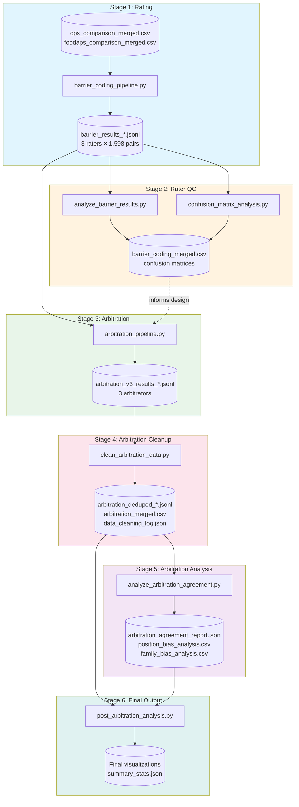
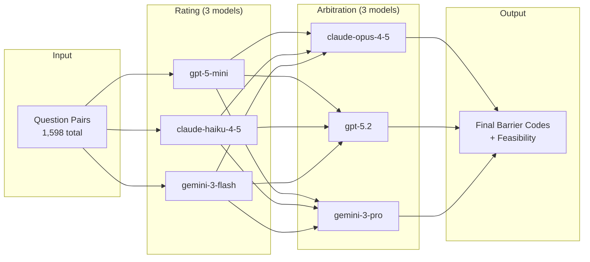

# Methodology Decision Log - Report 03: Harmonization Constraints

This document records methodological decisions, their rationale, alternatives considered, and outcomes. Purpose: traceability for reviewers, future-self, and reproducibility.

---

## Decision 001: Dual-Model Coding Approach

**Date:** 2026-01-29  
**Status:** Implemented  

**Decision:** Use parallel coding with gpt-4o-mini and claude-haiku-4-5 for barrier classification of non-consolidatable question pairs.

**Rationale:**
1. Precedent from Report 02 (topic/subtopic coding) showed strong inter-model agreement (89.2% topic, 69.7% subtopic)
2. Dual-model approach provides built-in reliability metric without human coding burden
3. Cost-effective: both models are economical tier (~$0.01-0.02 per 1K pairs)
4. Disagreements flag genuinely ambiguous cases rather than random error

**Alternatives Considered:**
- *Single model:* Faster/cheaper but no reliability check; can't distinguish model confidence from task difficulty
- *Human coding:* Gold standard but prohibitively expensive for 1,598 pairs; not feasible for proof-of-concept timeline
- *Human + model hybrid:* Human codes sample, model codes remainder; considered for validation but deferred

**Outcome:** 
- 1,598 pairs coded by both models
- Level 1 agreement: 82.4% (κ=0.530)
- Feasibility agreement: 89.9% (κ=0.678)
- Full barrier code agreement: 53.9%

---

## Decision 002: Arbitration Strategy for Model Disagreements

**Date:** 2026-01-29  
**Status:** Implemented  

**Context:**
- 281 pairs (17.6%) disagree on Level 1 barrier category
- 736 pairs (46.1%) disagree on full barrier code (includes subcategory)
- 161 pairs (10.1%) disagree on feasibility
- 455 pairs (28.5%) agree on L1 but disagree on subcategory

**Confusion Matrix Findings (2026-01-29):**

*L1 Barrier Disagreements - Systematic Patterns:*
| Pattern (OpenAI → Claude) | Count | % of L1 Disagreements |
|---------------------------|-------|----------------------|
| TC → CC | 109 | 38.8% |
| CC → RS | 38 | 13.5% |
| PC → CC | 31 | 11.0% |
| CC → MC | 31 | 11.0% |
| CC → TC | 30 | 10.7% |

Key insight: The dominant TC→CC pattern reflects genuine taxonomic ambiguity—whether temporal mismatches (e.g., 30-day vs 12-month recall) constitute temporal barriers or indicate deeper construct differences. This is not random noise.

*Subcategory Disagreements (within agreed L1):*
| L1 Category | Full Code Agreement | Key Pattern |
|-------------|---------------------|-------------|
| CC | 66.1% (735/1112) | CC.1↔CC.2: OpenAI codes 86% CC.1, Claude codes 68% CC.1 |
| TC | 53.2% (74/139) | TC.1↔TC.2 bidirectional |
| RS | 83.3% (50/60) | High agreement |

Key insight: Claude more often codes "different operationalization" (CC.2) where OpenAI codes "different core construct" (CC.1). This reflects substantive taxonomic judgment, not error.

*Feasibility Disagreements:*
- F3→F2: 68 cases (Claude more optimistic about harmonization)
- F2→F1: 41 cases (Claude more optimistic)
- F2→F3: 29 cases (OpenAI more optimistic)

Net pattern: Claude is generally more optimistic about harmonization feasibility.

**Decision:** Third-model arbitration using claude-opus-4-5 for ALL disagreements (~897 unique pairs).

**Rationale:**
1. **Methodological purity:** Consistent with Report 02 approach; most defensible for peer review
2. **Cost is trivial:** ~$3-5 for 897 calls is negligible for research quality
3. **Disagreements are substantive:** The TC→CC and CC.1→CC.2 patterns reflect genuine taxonomic ambiguity, not random error—worth adjudicating properly
4. **Avoids bias:** Conservative default would inflate CC from 79% to 87%, masking TC/RS distinctions the analysis aims to surface
5. **Opus quality:** Using highest-capability model for tiebreaker maximizes arbitration quality

**Alternatives Rejected:**
- *Conservative default (CC/F3):* Would artificially inflate dominant class, undermining taxonomy validity
- *Trust one model:* Arbitrary without empirical justification
- *Hybrid (third-model L1 only):* Subcategory distinctions matter for detailed barrier analysis; false economy to skip

**Implementation:** `arbitration_pipeline.py` - sends disagreement cases to opus-4-5 with both models' codings and reasoning, requests adjudication with justification.

**Outcome:** TBD after arbitration completes

---

## Decision 003: Pipeline Architecture Refactor - Config-Driven Design

**Date:** 2026-01-29
**Status:** Implemented

### Issue Discovered
Original pipeline had hardcoded model name (gpt-4o-mini) instead of intended model (gpt-5o-mini). This invalidated all prior runs. Root cause: hardcoded values in scripts.

### Architectural Decision: Config-Driven Pipeline

**Rationale:**

1. **Reproducible Research Standard**: Like saving random seed values in statistical processing, ML training, and simulation work, all critical parameters belong in a config file. Model names are critical parameters.

2. **Training Epoch Staleness**: LLMs have knowledge cutoffs. Even with workarounds like Context7 for documentation lookup, stale information and artifacts creep in. When Claude Code wrote the original pipeline, it used 'gpt-4o-mini' - likely from training data patterns. The correct model (gpt-5o-mini) wasn't reliably known. Config files eliminate this failure mode.

3. **Complexity Control**: Serial execution (one model at a time) trades speed for debuggability. When something fails at 2am, you want to know exactly which model, which checkpoint, which pair caused it. Parallel execution of multiple models creates confounded failure states.

4. **Human Verification**: Config files are human-readable checkpoints. Before any run, the operator sees exactly what will execute. No hidden defaults. No 'I thought it was using X but it was actually Y.'

5. **Audit Trail**: Config + timestamped outputs = complete reproducibility. Anyone can rerun with identical settings.

### Design Pattern
```
config.yaml (SINGLE SOURCE OF TRUTH)
    ↓
run_pipeline.py (orchestrator - reads config, runs serially)
    ↓
barrier_coding_pipeline.py (worker - receives config, no hardcodes)
arbitration_pipeline.py (worker - receives config, no hardcodes)
```

### Model Configuration

**Raters (3 vendors):**
- OpenAI: gpt-5o-mini
- Anthropic: claude-haiku-4-5-20251001
- Google: gemini-3-flash-preview

**Arbitrators (3 vendors):**
- Anthropic: claude-opus-4-5-20251101
- OpenAI: gpt-5.2
- Google: gemini-3-pro-preview

### Execution Model
- Raters execute SERIALLY (openai → anthropic → google)
- Arbitrators execute SERIALLY (anthropic → openai → google)
- Within each: parallel API calls (6 workers for rating, 3 for arbitration)
- On failure: stop, report, preserve checkpoint

### Lesson Learned
If a parameter can affect results and you'd be upset if it were wrong: PUT IT IN A CONFIG FILE.

**Outcome:** Pipeline refactored, all scripts now config-driven, validation test passes.

---

## Decision 004: Temperature Parameter Configuration

**Date:** 2026-01-29
**Status:** Implemented

### Context
LLM temperature controls output randomness. For classification/taxonomy tasks, deterministic (low temperature) is preferred—same input should yield same output. However, providers handle temperature differently.

### Decision: Provider-Specific Temperature Settings

| Provider | Model | Temperature | Rationale |
|----------|-------|-------------|----------|
| Anthropic | haiku/opus | 0.0 | Deterministic, valid range 0.0-1.0 |
| Google | gemini-3-* | 1.0 | Google docs explicitly warn lower values cause "unexpected behavior" |
| OpenAI | gpt-5o-mini | 0.0 | Deterministic, valid range 0.0-2.0 |
| OpenAI | gpt-5.2 | **null (omitted)** | Model errors if temperature parameter passed |

### Rationale

1. **Classification requires determinism**: We want the same question pair to receive the same barrier coding. Temperature 0.0 (or equivalent) achieves this.

2. **Gemini 3 exception**: Google's documentation states Gemini 3 should use temperature 1.0—lower values produce "unexpected behavior." We must respect provider-specific requirements even when they conflict with general best practice.

3. **gpt-5.2 quirk**: This model does not accept the temperature parameter at all; passing it causes an API error. Code must conditionally omit the parameter when `temperature: null` in config.

4. **Config-driven approach**: Temperature is now in config.yaml per model, not hardcoded. If provider behavior changes, update config, not code.

### Implementation
```yaml
raters:
  openai:     temperature: 0.0
  anthropic:  temperature: 0.0
  google:     temperature: 1.0  # MUST be 1.0 per Google docs

arbitrators:
  anthropic:  temperature: 0.0
  openai:     temperature: null  # OMIT param entirely
  google:     temperature: 1.0
```

Code pattern:
```python
if model_config.get('temperature') is not None:
    params['temperature'] = model_config['temperature']
```

### Implication for Cross-Vendor Comparison
Google models (temperature 1.0) may exhibit more output variability than Anthropic/OpenAI (temperature 0.0). This is unavoidable given provider constraints. If Google models show lower inter-run consistency, this is the likely explanation—not model quality.

### max_tokens Setting
~~Set uniformly to 1024 for all models.~~ **REVISED (2026-01-29 evening):** Set to 8192 after JSON truncation errors with Google/Anthropic. Classification responses vary by model verbosity—Google Gemini produces longer reasoning than OpenAI.

**Outcome:** Temperature handling implemented in config.yaml and all API call functions.

---

## Decision 005: API Parameter Minimalism (Debugging Lesson)

**Date:** 2026-01-29 (evening session)
**Status:** IMPLEMENTED

### Context
OpenAI gpt-5-mini was returning empty responses (`content: ''`) despite correct model name and API key. Root cause investigation took several hours.

### Decision: Use MINIMAL API parameters, matching known-working code patterns

### The Problem
Config-driven design (Decision 003) led to over-engineering API calls. Added parameters like `max_completion_tokens` and `temperature` that broke gpt-5-mini:

```python
# BROKEN - gpt-5-mini returns empty string
response = client.chat.completions.create(
    model=model,
    messages=[...],
    max_completion_tokens=1024,  # ← BREAKS IT
    temperature=0.0  # ← BREAKS IT
)
```

### Solution Pattern
Always check existing working code in the project first. The working pattern from `src/categorize_openai.py`:

```python
# WORKING - gpt-5-mini responds correctly
response = client.chat.completions.create(
    model=model,
    messages=[
        {"role": "system", "content": "..."},
        {"role": "user", "content": prompt}
    ]
)
# ONLY model + messages. Nothing else.
```

### Root Cause Analysis
1. **LLM training data staleness**: When Claude Code wrote the original pipeline, it used patterns from training data that may not reflect current API behavior
2. **Over-engineering trap**: Config-driven approach added flexibility at the cost of introducing untested parameter combinations
3. **Silent failures**: Empty string response provides no diagnostic information

### Vendor-Specific Quirks Documented

| Vendor | Model | Known Working | Known Broken |
|--------|-------|---------------|--------------|
| OpenAI | gpt-5-mini | model, messages ONLY | max_completion_tokens, temperature |
| Anthropic | claude-haiku-4-5 | model, max_tokens, temperature, messages | (none found) |
| Google | gemini-3-flash | model, contents, config dict | Old SDK (`google.generativeai`) |

### Google SDK Migration
Google deprecated `google.generativeai` package. New SDK:
```bash
pip install google-genai
```
```python
from google import genai  # NOT: import google.generativeai as genai
client = genai.Client(api_key=api_key)
response = client.models.generate_content(model=model, contents=prompt, config={...})
```

### Methodology Principle Added
**"Don't jump to shortcuts, short-term thinking, or lazy band-aids. Do it right. No mickey-mouse shit. Check existing working code in the project first."**

This principle should guide future debugging: before writing new code or adding parameters, check what already works in the codebase.

### Implication for Future Work
When adding new models or providers:
1. Start with MINIMAL parameters
2. Add complexity only when needed
3. Test each parameter addition independently
4. Document vendor quirks immediately

**Outcome:** All three raters (OpenAI, Anthropic, Google) completed 1,598 pairs successfully.

---

## Decision 006: Three-Rater Design (Expanded from Dual-Model)

**Date:** 2026-01-29
**Status:** IMPLEMENTED

### Decision
Expand from dual-model (OpenAI + Anthropic) to three-rater (OpenAI + Anthropic + Google) for barrier coding.

### Rationale
1. **Majority vote arbitration**: With three raters, 2-of-3 agreement provides natural tiebreaker without needing fourth model
2. **Cross-vendor robustness**: Tests whether findings are model-specific or generalizable
3. **Cost is trivial**: Google Gemini Flash pricing comparable to other fast models
4. **Future-proofing**: Establishes three-vendor pipeline for subsequent reports

### Implementation
- Sequential execution: OpenAI → Anthropic → Google
- Parallel within rater: 6 workers
- Same prompt and taxonomy for all three
- Results stored separately, merged for analysis

### Output Files
```
output/results/
├── barrier_results_openai_gpt-5-mini.jsonl
├── barrier_results_anthropic_claude-haiku-4-5-20251001.jsonl
└── barrier_results_google_gemini-3-flash-preview.jsonl
```

**Outcome:** All three raters completed. Agreement analysis pending.

---

## Decision 007: Three-Rater Output Validation

**Date:** 2026-01-29 (evening)
**Status:** IMPLEMENTED

### Context
Before proceeding to agreement analysis or arbitration, must validate that all three raters produced complete, well-formed outputs.

### Validation Checks Performed

**1. Record Count Verification**
| Rater | Expected | Actual | Status |
|-------|----------|--------|--------|
| OpenAI gpt-5-mini | 1,598 | 1,598 | ✓ |
| Anthropic claude-haiku-4-5 | 1,598 | 1,598 | ✓ |
| Google gemini-3-flash | 1,598 | 1,598 | ✓ |

**2. Pair ID Coverage**
- Total unique pair_ids across all raters: 1,598
- Common to all three raters: 1,598 (100%)
- Per-rater unique pair_ids: 1,598 each
- **Result:** Complete alignment. All raters coded identical question pairs.

**3. Duplicate Detection**
- OpenAI: 0 duplicates ✓
- Anthropic: 0 duplicates ✓
- Google: 0 duplicates ✓

**4. Null/Invalid Value Audit**
| Rater | NULL primary_barrier | 'None' string | Notes |
|-------|---------------------|---------------|-------|
| OpenAI | 0 | 1 | One record with 'None' string |
| Anthropic | 7 | 3 | 10 total invalid values |
| Google | 0 | 0 | Clean |

**Finding:** 11 unique pairs across OpenAI/Anthropic have null or 'None' primary_barrier values. Upon inspection, these are NOT parsing failures — they are legitimate "no harmonization barrier" cases where raters judged the questions as functionally equivalent (all coded F1 feasibility). This led to adding NHB.0 to taxonomy (see below).

**5. Schema Validation**
All records contain required fields:
- `pair_id`: string, present in all
- `primary_barrier`: string (with exceptions noted above)
- `feasibility`: string (F1/F2/F3)
- `specific_conflict`: string
- `reasoning`: string
- `rater`: string identifier

**6. Distribution Sanity Check (Level 1 Barriers)**
| Barrier | OpenAI | Anthropic | Google |
|---------|--------|-----------|--------|
| CC | 80.4% | 78.7% | 79.8% |
| TC | 11.1% | 11.6% | 8.1% |
| RS | 4.3% | 6.2% | 10.0% |
| MC | 1.4% | 2.3% | 1.6% |
| PC | 2.1% | 0.6% | 0.4% |
| PM | 0.6% | 0.0% | 0.0% |

**Observation:** CC dominates (~79-80%) consistently across raters. Notable divergence: Google assigns more RS (10%) where others assign TC (~11%). This TC↔RS confusion pattern warrants attention in agreement analysis.

**7. Feasibility Distribution**
| Level | OpenAI | Anthropic | Google |
|-------|--------|-----------|--------|
| F1 (mechanical) | 4.3% | 6.3% | 6.1% |
| F2 (statistical) | 31.4% | 13.3% | 16.0% |
| F3 (not feasible) | 64.3% | 80.4% | 77.9% |

**Observation:** OpenAI is substantially more optimistic about harmonization feasibility (31% F2 vs 13-16% for others). This systematic bias should be accounted for in arbitration design.

### Validation Outcome
**PASS with notes.** All three rater outputs are complete and aligned. Minor data quality issues (11 null/None values) require cleanup before analysis. Observed systematic differences in TC↔RS classification and feasibility optimism warrant documentation as potential sources of disagreement.

### Files Validated
```
output/results/barrier_results_openai_gpt-5-mini.jsonl (926,606 bytes)
output/results/barrier_results_anthropic_claude-haiku-4-5-20251001.jsonl (860,525 bytes)
output/results/barrier_results_google_gemini-3-flash-preview.jsonl (647,581 bytes)
```

Note: File size differences reflect model verbosity in `reasoning` field, not record count differences.

---

## Decision 008: Full Arbitration Design (Three Arbitrators, All Pairs)

**Date:** 2026-01-29 (evening)
**Status:** IMPLEMENTED (in progress)

### Context
With three raters complete (OpenAI gpt-5-mini, Anthropic claude-haiku-4-5, Google gemini-3-flash), we need arbitration to produce unified judgments. Original design (Decision 002) assumed dual-model with single arbitrator. Expanding to three arbitrators enables inter-family bias detection.

### Design Decisions

**1. Scope: All 1,598 pairs**
Each arbitrator codes ALL pairs, not just disagreements. Rationale:
- Enables full comparison across arbitrators
- Avoids selection bias from disagreement-only sampling
- Cost is acceptable (~$15-25 per arbitrator for 1,598 calls)

**2. Arbitrator Models**
| Provider | Model | Notes |
|----------|-------|-------|
| Anthropic | claude-opus-4-5-20251101 | Flagship, same family as haiku rater |
| OpenAI | gpt-5.2 | Flagship, same family as gpt-5-mini rater |
| Google | gemini-3-pro-preview | Flagship, same family as gemini-3-flash rater |

**3. Blind Masking**
Arbitrators see raters as "Rater A", "Rater B", "Rater C" — not model names. This prevents arbitrators from applying heuristics about model quality/tendencies.

**4. Presentation Order Control**
To test for position bias (does arbitrator favor whichever rater is listed first?):
- 50% of pairs: Fixed order (A=OpenAI, B=Anthropic, C=Google)
- 50% of pairs: Randomized order

Each record tracks:
- `rater_order`: List showing which model maps to A, B, C
- `order_type`: "fixed" or "randomized"

Post-hoc analysis can detect if arbitrators disproportionately favor "Rater A" position.

**5. NHB.0 Barrier Code**
Validation (Decision 007) found 11 pairs where raters returned null/None/NA for primary_barrier. These are legitimate "no harmonization barrier" cases — pairs the raters judged as directly consolidatable (all coded F1).

Adding to taxonomy:
- **NHB.0**: No Harmonization Barrier — questions are functionally equivalent or near-duplicates requiring only minor standardization

Rater null/None/NA values will be recoded to NHB.0 before arbitration. Arbitrators may also use NHB.0 if they judge a pair has no barrier.

**6. Arbitrator Output Schema**
Each arbitrator produces per pair:
```json
{
  "pair_id": "CPS_0001",
  "final_barrier_code": "CC.1",
  "final_feasibility": "F3",
  "selected_rater": "B",
  "selected_rater_key": "anthropic",
  "reasoning": "...",
  "specific_conflict": "...",
  "rater_order": ["openai", "anthropic", "google"],
  "order_type": "fixed",
  "arbitrator": "anthropic",
  "arbitrator_model": "claude-opus-4-5-20251101"
}
```

### Analysis Plan
After all three arbitrators complete:

1. **Inter-arbitrator agreement**: Pairwise kappa and three-way agreement at L1, subcode, and feasibility levels

2. **Inter-family bias detection**: For each arbitrator, compare agreement rate with same-family rater vs other-family raters
   - Does opus-4-5 agree more with haiku-4-5 than with gpt-5-mini?
   - If yes, quantify the bias magnitude

3. **Position bias detection**: Compare "Rater A selected" rate between fixed vs randomized order conditions

4. **Final ensemble**: TBD based on analysis results. Options include:
   - Majority vote across arbitrators
   - Weighted ensemble if one arbitrator shows less bias
   - Flag high-disagreement pairs for manual review

### Implementation
`arbitration_pipeline.py` v3.1:
- Processes all 1,598 pairs (not just disagreements)
- Accepts three rater inputs
- Applies blind masking with order randomization
- Tracks order metadata in output
- **Parallel processing with ThreadPoolExecutor** (3 workers per arbitrator)

---

## Decision 009: Model Rate Limits and Cost Constraints

**Date:** 2026-01-29 (evening)
**Status:** DOCUMENTED

### Observed Constraints

During arbitration stage execution, we encountered significant rate limit and cost constraints:

**Google Gemini (gemini-3-pro-preview)**
- Rate limit: 250 requests/day on free tier
- Hit limit after ~249 pairs processed (of 1,598)
- Error: `429 RESOURCE_EXHAUSTED` - quota exceeded for `generativelanguage.googleapis.com/generate_requests_per_model_per_day`
- Impact: Gemini arbitrator limited to ~250 pairs per day (~6-7 days for full completion)
- Mitigation: Collect samples across multiple days; analyze as stratified sample with appropriate confidence intervals

**Anthropic Claude (claude-opus-4-5-20251101)**
- No hard rate limit encountered
- Cost: ~$25+ for 1,598 pairs (long prompts with full taxonomy + three rater reasonings)
- Approximately $0.015-0.020 per arbitration call
- Most expensive of the three arbitrators by significant margin

**OpenAI GPT (gpt-5.2)**
- No hard rate limit encountered
- Cost: Significantly cheaper than Anthropic
- Completes full arbitration without issues

### Statistical Implications for Gemini Sample

With n=249 (or ~500 with second day's quota):
- Standard error for kappa ≈ 1/√n ≈ 0.063 (n=249) or 0.045 (n=500)
- 95% CI width ≈ ±0.12 (n=249) or ±0.09 (n=500)
- Sufficient for detecting meaningful agreement differences

**Key consideration:** Sample representativeness. Must verify:
1. Distribution across CPS vs FoodAPS pairs
2. Distribution across pair_id range (not clustered at beginning)
3. If representative, valid for matched-sample comparison with other arbitrators

### Design Decisions

1. **No batching to work around rate limits** — Would introduce response variability
2. **No dropping Gemini** — Partial data is still valuable with proper caveats
3. **Collect across multiple days** — Target 500+ Gemini pairs for better precision
4. **Matched analysis** — Compare all three arbitrators on Gemini's subset; Opus vs GPT on full 1,598

### Cost Summary (Arbitration Stage)

| Provider | Model | Pairs | Est. Cost | Rate Limit |
|----------|-------|-------|-----------|------------|
| Anthropic | opus-4-5 | 1,598 | ~$25-30 | None hit |
| OpenAI | gpt-5.2 | 1,598 | ~$5-8 | None hit |
| Google | gemini-3-pro | ~250/day | ~$1-2 | 250/day |

---

## Decision 010: Post-Arbitration Data Pipeline

**Date:** 2026-01-30
**Status:** IMPLEMENTING

### Context

Arbitration stage completed for two of three arbitrators (Anthropic, OpenAI). Google rate-limited at ~250/day.

**Current State (verified 2026-01-30):**

| Arbitrator | Checkpoint | JSONL Lines | Unique | Duplicates |
|------------|------------|-------------|--------|------------|
| Anthropic opus-4-5 | 1,598 | 1,600 | 1,598 | 2 (CPS_0091, CPS_0092) |
| OpenAI gpt-5.2 | 1,598 | 1,598 | 1,598 | 0 |
| Google gemini-3-pro | 249 | 252 | 251 | 1 (CPS_0016) |

**Root cause of duplicates:** Checkpoint restarts with parallel workers can write same pair_id twice before checkpoint updates. Small-scale issue (3 total records).

### Decision: Reproducible Data Cleaning Pipeline

**Pipeline Architecture:**
```
Raw JSONL (immutable, preserved)
    ↓
Step 1: Deduplicate (keep first occurrence by pair_id)
    ↓
Step 2: Validate (schema, null checks, NHB.0 recoding)
    ↓
Step 3: Merge arbitrators (join on pair_id)
    ↓
output/analysis/arbitration_clean.csv (analysis-ready)
```

**Design Principles:**

1. **Immutability:** Raw JSONL files in `output/results/` are NEVER modified. All cleaning produces new files.

2. **Reproducibility:** Pipeline is config-driven, deterministic. Anyone can re-run from raw files and get identical outputs.

3. **Dedup strategy:** Keep first occurrence (chronological). Rationale: earlier records are from stable runs; later duplicates are from checkpoint restarts.

4. **Audit trail:** Pipeline logs which records were dropped and why.

### Google Sample Representativeness Concern

**Finding:** All 251 unique Google pairs are CPS-prefixed (CPS_0000 through CPS_0328 range). Zero FoodAPS pairs.

**Cause:** Pipeline processed pairs in pair_id order; Google hit rate limit before reaching FOODAPS_* pairs.

**Implication:**
- Three-way arbitrator comparison MUST be limited to CPS pairs only (n≤251)
- Two-way Opus-GPT comparison can use full 1,598 pairs
- FoodAPS analysis relies on Opus-GPT agreement only

**Mitigation:** Document limitation clearly. For three-way analysis, verify statistical power is adequate (n=251 gives SE≈0.063 for kappa).

### NHB.0 Validation

Must verify arbitrator handling of "no harmonization barrier" cases:
- Did arbitrators use NHB.0 when appropriate?
- Did they override rater NHB.0 judgments?
- How many pairs ended with NHB.0 final code?

### Statistical Methods Documentation

Analysis will use:

| Method | Use Case | Justification |
|--------|----------|---------------|
| Cohen's Kappa | Pairwise agreement | Standard chance-corrected agreement; handles imbalanced categories |
| Fleiss' Kappa | Three-way agreement | Extension of Cohen's for multiple raters |
| Chi-square | Bias detection | Tests independence of arbitrator selection × rater family |
| Bootstrap CI | Confidence intervals | Non-parametric; no distributional assumptions |

**Kappa interpretation caution:** When one category dominates (e.g., CC at ~80%), expected chance agreement is high, suppressing kappa. Raw agreement % should be reported alongside kappa.

### Output Files
```
output/analysis/
├── arbitration_deduped_anthropic.jsonl    # Cleaned individual files
├── arbitration_deduped_openai.jsonl
├── arbitration_deduped_google.jsonl
├── arbitration_merged.csv                  # All arbitrators joined
├── arbitration_clean.csv                   # Analysis-ready with derived fields
└── data_cleaning_log.json                  # Audit trail
```

### Rationale

1. **Why not fix raw files?** Immutability enables re-analysis with different cleaning rules if needed. Preserves original API responses.

2. **Why keep first occurrence?** Simpler than comparing record contents. Later duplicates are definitionally from restarts.

3. **Why separate dedup step?** Allows verification before merge. Can inspect dropped records.

4. **Why document Google limitation?** Transparency about data completeness is essential for peer review.

**Outcome:** TBD after pipeline execution.

---

## Pipeline Architecture

### Stage Overview


### Stage-Script Mapping

| Stage | Script | Purpose | Key Outputs |
|-------|--------|---------|-------------|
| 1 | `01_barrier_pipeline.py` | Multi-rater barrier classification | `barrier_results_{rater}_{model}.jsonl` |
| 2 | `scripts/analyze_barrier_results.py` | Merge raters, agreement stats | `barrier_coding_merged.csv` |
| 2 | `scripts/confusion_matrix_analysis.py` | Disagreement pattern analysis | Confusion matrices (PNG, CSV) |
| 3 | `02_arbitration_pipeline.py` | Three-arbitrator adjudication | `arbitration_v3_results_{arb}_{model}.jsonl` |
| 4 | `scripts/clean_arbitration_data.py` | Dedupe, validate, merge | `arbitration_merged.csv`, cleaning log |
| 5 | `scripts/analyze_arbitration_agreement.py` | Inter-arbitrator agreement, bias detection | Agreement report, bias analysis |
| 6 | `scripts/post_arbitration_analysis.py` | Final visualizations | Charts, summary statistics |
| 6 | `scripts/descriptive_stats.py` | Reproducible descriptive stats | `descriptive_stats_{stage}.json` |

### Data Flow Summary


### Current Pipeline Status (2026-01-30)

| Stage | Status | Notes |
|-------|--------|-------|
| 1 Rating | ✅ Complete | All 3 raters × 1,598 pairs |
| 2 Rater QC | ✅ Complete | Agreement analysis done |
| 3 Arbitration | 🟡 Partial | Anthropic/OpenAI complete; Google rate-limited (251/1,598) |
| 4 Arb Cleanup | ✅ Complete | `clean_arbitration_data.py` run, outputs verified |
| 5 Arb Analysis | ✅ Complete | `analyze_arbitration_agreement.py` run, reports generated |
| 6 Final Output | ⏳ Pending | `post_arbitration_analysis.py` not yet run |

---

## Decision 011: Inter-Arbitrator Agreement Analysis Design

**Date:** 2026-01-30
**Status:** Implemented
**Script:** `analyze_arbitration_agreement.py`

**Context:**
With arbitration complete, need to assess whether arbitrators reach similar conclusions and detect potential biases in the arbitration process.

**Analysis components:**

1. **Inter-arbitrator agreement**
   - Cohen's Kappa for pairwise comparisons (handles 2-way coverage)
   - Fleiss' Kappa for three-way comparison (limited to 251 pairs)
   - Computed at L1, full barrier, and feasibility levels

2. **Synthesis rate**
   - When `selected_rater == "synthesis"`, all 3 original raters agreed
   - No arbitration decision required - measures baseline rater agreement

3. **Family bias**
   - Does Anthropic arbitrator prefer Anthropic rater outputs?
   - Compares same-family selection rate vs expected 33.3%
   - Bias ratio > 1.0 indicates preference

4. **Position bias**
   - Does presentation order affect selection?
   - Compare first-position selection rate vs expected 33.3%
   - Requires `rater_order` field in arbitration output

**Interpretation guidelines:**

| Kappa | Interpretation |
|-------|----------------|
| < 0.20 | Slight |
| 0.20-0.40 | Fair |
| 0.40-0.60 | Moderate |
| 0.60-0.80 | Substantial |
| > 0.80 | Almost Perfect |

**Coverage constraints:**
- Two-way: 1,598 pairs (Anthropic + OpenAI)
- Three-way: 251 pairs (all CPS, no FoodAPS due to Google rate limit)

---

## Decision 012: Synthesis Detection Calibration Finding

**Date:** 2026-01-30
**Status:** DOCUMENTED (no action required)

### Context
During arbitration analysis, arbitrators reported vastly different "synthesis" rates:
- Anthropic opus-4-5: 77.2% synthesis
- OpenAI gpt-5.2: 59.4% synthesis  
- Google gemini-3-pro: 6.0% synthesis

"Synthesis" means the arbitrator detected that all 3 original raters agreed, so no arbitration decision was needed.

### Ground Truth Verification
Actual rater agreement (computed from merged rater data):
- L1 agreement (3-way): 80.7% (1,289/1,598)
- L2 agreement (3-way): 52.0% (831/1,598)

### Arbitrator Performance

| Arbitrator | Synthesis Called | Precision | Recall | Assessment |
|------------|-----------------|-----------|--------|------------|
| Anthropic | 77.2% | ~90% | ~87% | Well-calibrated |
| OpenAI | 59.4% | ~87% | ~64% | Conservative (under-detects) |
| Google | 6.0% | ~94% | ~1% | Severely broken |

*Precision*: Of synthesis cases called, what % were true L1 matches  
*Recall*: Of true L1 matches, what % were detected as synthesis

### Root Cause
This is NOT a threshold difference but a detection capability difference:
- **Anthropic** correctly identifies semantic equivalence at L1 level
- **OpenAI** misses some valid agreements (conservative)
- **Google** severely under-detects (likely prompt compliance failure)

### Decision
**Document as finding, do NOT retroactively fix.** This reflects legitimate model behavior variation.

### Implications
1. Use Anthropic arbitration as primary for final analysis (best calibrated)
2. Three-way arbitrator agreement is still valid (they agree when they DO make decisions)
3. Google's low synthesis rate means it arbitrates cases others would pass through - this may introduce noise

---

## Decision 013: Pipeline Modularization

**Date:** 2026-01-30
**Status:** IMPLEMENTED

### Context
All 11 Python scripts lived at the project root with duplicated utility functions across files. Ad-hoc analyses run in conversation were not captured as reproducible scripts.

### Decision
Modularize into:
- `scripts/lib/` — Shared modules (stats.py, taxonomy.py, io_utils.py)
- `scripts/` — Analysis/utility scripts
- Numeric-prefixed pipelines at root: `01_barrier_pipeline.py`, `02_arbitration_pipeline.py`, `03_analysis_pipeline.py`
- New `scripts/descriptive_stats.py` capturing ad-hoc analyses

### Rationale
1. **DRY principle:** `cohens_kappa()`, `load_config()`, `extract_l1()` were duplicated across 4+ scripts
2. **Reproducibility:** Ad-hoc analyses from conversation need to be runnable scripts
3. **Clarity:** Numeric prefixes communicate execution order; `scripts/` separates utilities from main pipelines
4. **Maintainability:** Shared lib enables consistent behavior changes in one place

### Changes Made
- **Created:** `scripts/lib/__init__.py`, `scripts/lib/stats.py`, `scripts/lib/taxonomy.py`, `scripts/lib/io_utils.py`
- **Created:** `scripts/descriptive_stats.py`, `03_analysis_pipeline.py`, `docs/pipeline_diagram.md`
- **Moved to scripts/:** `clean_arbitration_data.py`, `analyze_arbitration_agreement.py`, `analyze_barrier_results.py`, `confusion_matrix_analysis.py`, `post_arbitration_analysis.py`, `compare_arbitrators.py`, `analyze_agreement.py`
- **Renamed:** `barrier_coding_pipeline.py` -> `01_barrier_pipeline.py`, `arbitration_pipeline.py` -> `02_arbitration_pipeline.py`
- **Updated:** Import paths in all moved scripts, `run_pipeline.py` references, `SOFTWARE.md`

### Design Choices
- Script-specific function variants (e.g., `cohens_kappa` returning 3 values vs 1) kept in scripts, not forced into lib
- `scripts/lib/` uses `get_project_root()` walking up to find `config.yaml` for flexibility
- Moved scripts use `Path(__file__).parent.parent` for project root reference

### Outcome
All scripts functional from new locations. `03_analysis_pipeline.py --dry-run` confirms orchestration works.

---

## Decision 014: Pipeline Output Architecture (JSON → Report)

**Date:** 2026-01-30
**Status:** IMPLEMENTED

### Decision

Each pipeline stage produces:
1. **Structured JSON** — Single source of truth containing all metrics, power verification, and computed values
2. **Human-readable report** — Generated FROM the JSON, applying interpretation thresholds

The JSON is the artifact. The report is a view.

### Architecture Pattern
```
pipeline_stage.py
    → stage_metrics.json        (ALL numbers, deterministic artifact)
    → stage_report.md           (human-readable, generated FROM JSON)
```

### Rationale

1. **Reproducibility** — JSON is deterministic artifact. Interpretation can be debated/revised without re-running pipeline.

2. **Auditability** — Reviewer questions your interpretation? Point them to the raw JSON.

3. **Threshold changes** — If McHugh says 0.80 but reviewer wants 0.70, change template/interpretation layer, regenerate report. Don't re-run computation.

4. **Separation of concerns** — Computation (deterministic) vs interpretation (judgment-based) are distinct operations that should not be entangled.

5. **Consistency with existing pattern** — Already doing this: `descriptive_stats_rater.json` + `*_report.md` pairs.

### Alternatives Rejected

**Option A: Pipeline → Raw CSVs → Separate analysis step**
- Clean separation but analysis step must "re-learn" context
- Two-step process prone to drift

**Option B: Each substep analyzes its own outputs (agentic)**
- Interpretation scattered across pipeline
- Non-deterministic if LLM-driven
- Harder to maintain consistency

### Implementation Notes

- JSON files go in `output/analysis/`
- Reports go in `output/analysis/` or `docs/` depending on audience
- JSON schema should be self-documenting with clear field names
- Power verification, sample sizes, and other validity checks belong in JSON, not just report

### Example: Stage 2 Agreement Analysis

```
03_stage2_agreement.py
    → output/analysis/stage2_agreement_metrics.json
        {
          "power_verification": {...},
          "agreement_metrics": {...},
          "confusion_matrices": {...}
        }
    → output/analysis/stage2_agreement_report.md
        (interprets JSON with McHugh thresholds)
```

**Outcome:** Adopted as standard pattern for Report 03 pipeline stages.

---

## Decision 015: Google Arbitrator selected_rater Parsing Bug Fix

**Date:** 2026-01-30
**Status:** IMPLEMENTED

### Problem Discovered

During Stage 3 validation, Google arbitrator showed 6% synthesis rate vs 77% for OpenAI/Anthropic. Investigation revealed a parsing bug, not a behavioral difference.

### Root Cause

In `02_arbitration_pipeline.py`, the `process_single_pair()` function decodes the arbitrator's blind label selection:

```python
selected = result.get('selected_rater', 'synthesis')
if selected in ['A', 'B', 'C']:
    # map to vendor name
else:
    result['selected_rater_key'] = 'synthesis'
```

**The bug:** OpenAI and Anthropic output `"A"`, `"B"`, or `"C"`. Google outputs `"Rater A"`, `"Rater B"`, or `"Rater C"`. The exact match check fails for Google's format, causing all Google rater selections to fall through to `'synthesis'`.

### Evidence

Raw JSONL inspection:
```
CPS_0000 (Google): "selected_rater": "Rater A" → "selected_rater_key": "synthesis"  # BUG
CPS_0001 (Google): "selected_rater": "A"       → "selected_rater_key": "openai"     # CORRECT
```

Google's output is inconsistent ("A" vs "Rater A"), but the parser must handle both.

### Downstream Impact

- `analyze_family_bias()` in `04_stage3_arbitration.py` uses `selected_rater_key` — **AFFECTED**
- `compute_synthesis_detection()` uses `selected_rater` (raw field) with its own normalization — not affected
- `analyze_position_bias()` uses `normalize_position()` which already handles "Rater X" format — not affected
- Final verdicts use `final_barrier_code`, `final_feasibility`, `L1` only — not affected

### Fix Applied

**1. Pipeline fix (future records):** Added normalization in `02_arbitration_pipeline.py`:
```python
selected = result.get('selected_rater', 'synthesis')
if selected and selected.upper().startswith('RATER '):
    selected = selected[-1].upper()  # Extract letter from "Rater A/B/C"
if selected in ['A', 'B', 'C']:
    ...
```

**2. Data fix (existing records):** `scripts/fix_google_selected_rater_key.py` post-processes existing Google JSONL to re-derive `selected_rater_key` from `selected_rater` + `rater_order`.

### Lesson Learned

Model output format varies even with identical prompts. Parsing logic must normalize inputs, not assume exact format. The `normalize_position()` function in the analysis script already handled this — the pipeline should have used similar logic from the start.

---

## Decision 016: [Template for Future Decisions]

**Date:**
**Status:**

**Decision:**

**Rationale:**

**Alternatives Considered:**

**Outcome:**

---

## Appendix: Decision Status Legend

- **PENDING:** Awaiting data or analysis before decision can be made
- **IMPLEMENTED:** Decision made and executed
- **REVISED:** Initial decision modified based on new information (document both)
- **DEFERRED:** Consciously postponed to future work
