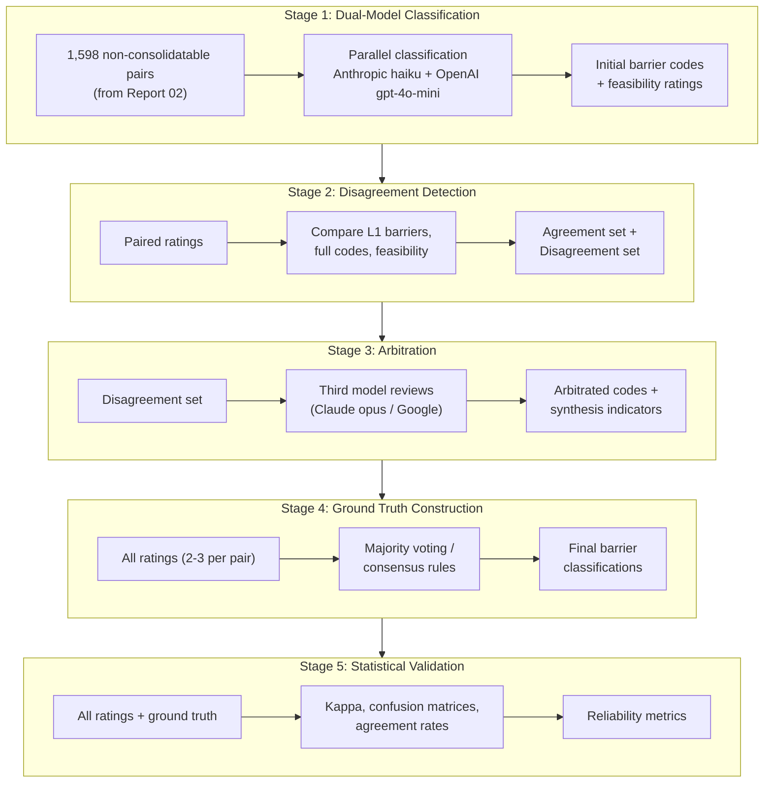

# Report 03: Analysis Pipeline Data Flow

## Overview Diagram

## Stage Descriptions

### Stage 1: Dual-Model Barrier Classification

**Input:** 1,598 question pairs identified as non-consolidatable in Report 02's ACS comparison analysis.

**Process:** Each pair is independently classified by two LLMs (Anthropic claude-haiku-4-5 and OpenAI gpt-4o-mini) using identical prompts. Models assign:
- Primary harmonization barrier (6-category taxonomy with subcategories)
- Feasibility rating (F1/F2/F3)
- Confidence score and reasoning

**Output:** Two independent ratings per pair, enabling inter-rater reliability assessment.

**Rationale:** Dual-model approach provides built-in validation. Disagreements identify ambiguous cases requiring human-like judgment.

---

### Stage 2: Disagreement Detection

**Input:** Paired ratings from Stage 1.

**Process:** Systematic comparison at multiple granularity levels:
- L1 agreement: Do both raters assign same barrier category?
- L2 agreement: Do both raters assign same full code (category + subcategory)?
- Feasibility agreement: Do both raters assign same feasibility tier?

**Output:**
- Agreement set: Pairs where raters concur (high confidence)
- Disagreement set: Pairs requiring arbitration

**Rationale:** Disagreement patterns reveal systematic differences in model interpretation, informing taxonomy refinement.

---

### Stage 3: Arbitration

**Input:** Disagreement set from Stage 2.

**Process:** Third model (Claude opus-4-5 or Google gemini-2.0-flash) reviews each disagreement with full context:
- Original question pair
- Both rater responses with reasoning
- Instructions to either select one rater or synthesize a new classification

**Output:**
- Final barrier code for each arbitrated pair
- Synthesis indicator (did arbitrator create new classification vs. select existing?)
- Arbitrator reasoning

**Rationale:** Arbitration resolves disagreements while preserving decision audit trail. Synthesis detection identifies cases where neither original rater captured the correct classification.

---

### Stage 4: Ground Truth Construction

**Input:** All ratings (2-3 per pair depending on arbitration path).

**Process:** Consensus rules applied:
- 3-way agreement: Accept unanimous classification
- 2-way agreement: Accept majority classification
- No majority: Flag for manual review or accept arbitrator decision

**Output:** Final barrier classification for each pair, serving as ground truth for validation.

**Rationale:** Ground truth enables calculation of per-model accuracy and systematic error patterns.

---

### Stage 5: Statistical Validation

**Input:** All ratings plus constructed ground truth.

**Process:** Standard inter-rater reliability metrics:
- Cohen's Kappa (pairwise agreement)
- Fleiss' Kappa (multi-rater agreement)
- Confusion matrices (systematic misclassification patterns)
- Agreement rates at L1 and L2 levels

**Output:** Reliability metrics supporting methodology validity claims.

**Rationale:** Quantitative validation demonstrates that AI-assisted classification achieves acceptable reliability for survey methodology research.
