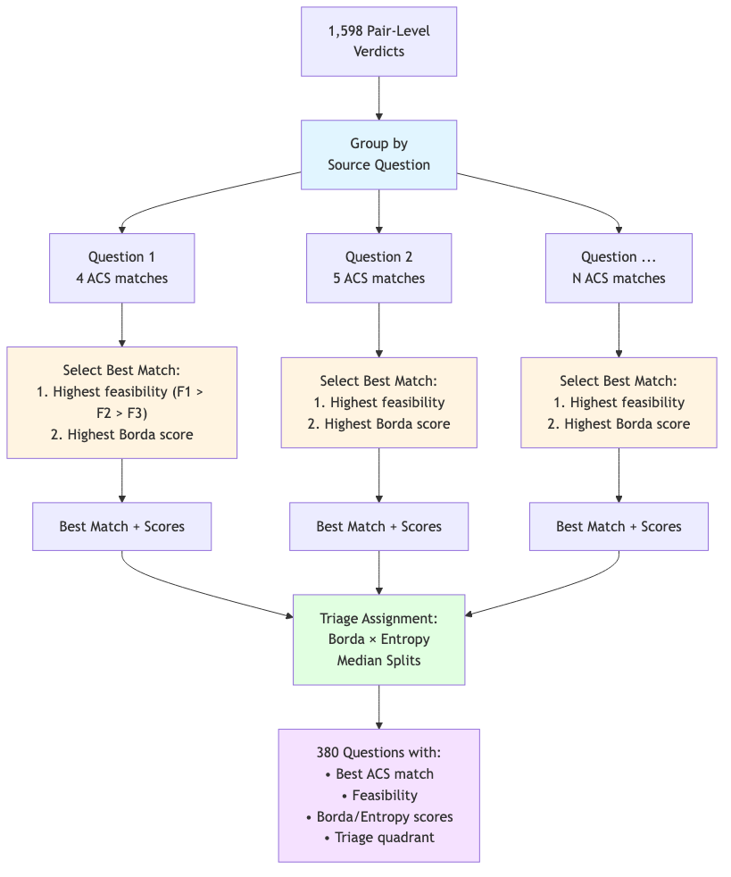

## The Problem {.smaller}

- Federal surveys ask overlapping questions
- Respondent burden + data silos
- **This report:** Capstone analysis — which questions can actually consolidate?

::: {.notes}
Brief — already covered in Reports 1-2
:::

---

## Why It Matters

**For Respondents:**
- Declining survey response rates + increasing costs
- Overlapping questions create unnecessary burden
- Consolidation reduces redundant questions

**For Federal Agencies:**
- **Expert time is the scarce resource**, not expert capability
- Traditional approach: weeks/months of manual comparison
- **Our goal:** Multiply expert effectiveness → faster burden reduction

::: {.notes}
Dual value proposition: (1) Burden reduction for respondents (2) Expert efficiency to achieve it faster
:::

---

## The Challenge

::: {.incremental}
- Determining consolidation **requires expert judgment** (this doesn't change)
- Traditional timeline: **weeks to months** for manual review of 1,598 pairs
- Our approach: **AI handles pre-work, experts focus on highest-value decisions**
- Result: Structured expert review table ready for validation
:::

---

## What Experts Get

| What AI Provides | What Experts Do |
|------------------|-----------------|
| Pre-screened pairs with best matches | Validate match quality |
| Initial F1/F2/F3 classification | Confirm or override |
| Documented reasoning | Understand and critique |
| Confidence scores | Prioritize review effort |
| Barrier codes | Verify diagnosis |

**76%** classified with high confidence → spot-check
**24%** flagged for expert review → where judgment adds most value

---

## Starting Point

- **7,400+** survey questions across **49** federal surveys
- Mapped to Census Bureau standard taxonomy
- [Report 1 established concept classification]

---

## Concept Classification (Report 1)

- LLM ensemble with arbitrator pattern
- Each question → best concept match
- Taxonomy: Demographics, Economics, Education, Health, etc.

{width=80%}

---

## Key Insight

::: {.callout-important}
Same concept ≠ swappable data
:::

- "Income" questions can measure completely different constructs
- Demographics (age, sex, race) = expected overlap (minority of questions)
- **Specialized content** = where real analysis matters

---

## Harmonization Framework

Adopted standard survey harmonization classification:

| Level | Definition |
|-------|------------|
| **F1** | Directly consolidable — no transformation needed |
| **F2** | Consolidable with transformation — needs recoding |
| **F3** | Not consolidable — fundamental barriers |

Barrier codes: CC (construct/concept), TC (temporal), RS (response scale)

---

## Pairwise Comparison

- Within concept categories, compare all question pairs
- **1,598 pairs** analyzed (CPS-ACS, FoodAPS-ACS)
- Naive but exhaustive — expect many F3, looking for matches

---

## Multi-Model Ensemble

Three frontier models to reduce bias:

| Model | Behavior |
|-------|----------|
| OpenAI | Moderate synthesis, slight pro-self bias |
| Anthropic | High synthesis, neutral |
| Google | Deferential, conservative |

Different profiles = documented finding, not noise

---

## Agreement & Arbitration

- **κ = 0.845** — high inter-rater agreement
- Voting, entropy, Borda scoring
- Arbitration resolves disagreements → final verdict

---

## Evaluating AI for Survey Harmonization

**Construct Validity:**
- Three different architectures (OpenAI, Anthropic, Google) with different training
- **High convergence (κ = 0.845)** = task is well-defined, not model artifact

**Documented Behavioral Differences:**
- Google: Deferential, conservative (low synthesis)
- OpenAI: Moderate synthesis, slight self-bias
- Anthropic: High synthesis, neutral

**Cost/Quality Design:** Fast models rate → flagship models arbitrate

**Result:** Reusable methodology for future survey harmonization work

---

## Question-Level Rollup

- Pair analysis → **380 unique source questions**
- Each with best ACS match
- Two-axis triage: Direction (Borda) × Stability (Entropy)

{width=70%}

---

## Headline Results

{width=80%}

- **CPS:** 41.7% consolidable (100 of 240 questions)
- **FoodAPS:** 48.6% consolidable (68 of 140 questions)

---

## Why Questions Can't Consolidate

{width=80%}

**97% of F3 = Construct/Concept differences (CC)**

Not fixable barriers — fundamentally different measurements

---

## Harmonization Code Distribution

{width=95%}

::: {.notes}
Left: Overall F1/F2/F3 distribution across 1,598 pairs
Right: Top 10 barrier sub-codes for F3 pairs - CC.1 (concept definition) dominates at 70%
:::

---

## Example: High Consolidability (F1)

**CPS:** "How many hours per week do you USUALLY work?"

**ACS:** "What is your best estimate of hours per week you usually work?"

- Verdict: **F1** (directly consolidable)
- Confidence: Borda=1.0, Entropy=1.0
- Same construct, same framing, same reference

---

## Example: Medium Consolidability (F2)

**CPS:** "EXCLUDING overtime, tips, commissions — what is hourly rate?"

**ACS:** "What is your hourly rate of pay?"

- Verdict: **F2** (consolidable with transformation)
- Transformation needed: scope alignment (ACS includes all components)

---

## Example: Not Consolidable (F3)

**CPS:** "Do you WANT to work full time (35+ hours)?"

**ACS:** "Did this person WORK for pay last week?"

- Verdict: **F3** — Barrier: **CC.1**
- Same domain (employment), entirely different constructs
- Preference vs. behavior — not reconcilable

---

## Expert Review Load

{width=80%}

- **76%** (287 questions) classified with high confidence → spot-check recommended
- **24%** (93 questions) flagged for expert review → **where human judgment adds most value**
- **This IS the efficiency gain:** Experts review 93 questions, not 1,598 pairs

::: {.notes}
Traditional: Expert reviews all 1,598 pairs = weeks/months
AI-assisted: Expert reviews 93 flagged questions = focused effort on highest-ROI decisions
:::

---

## Deliverables

**Primary:** Expert review table (`expert_review_combined.csv`)
- 380 questions with best ACS matches
- F1/F2/F3 classifications with confidence scores
- Barrier codes and reasoning for each decision
- Triage routing (Q1-Q4) for prioritized review

**Breakdown:**
- 168 consolidable (F1+F2) — ready for validation
- 212 non-consolidable (F3) — with documented barriers
- 93 flagged for expert review — highest-value decisions
- Full methodology — reproducible for additional surveys

---

## What This Proves

::: {.incremental}
- **< 1 day processing time** for work that traditionally takes weeks/months
- **Expert efficiency → faster burden reduction** — identify consolidation opportunities at scale
- **Human oversight preserved throughout** — AI provides initial judgment, experts validate
- **The table is the deliverable** — 380 questions, pre-analyzed, ready for expert review
:::

::: {.notes}
AI doesn't replace burden reduction goals — it accelerates the path to achieving them through expert efficiency
:::

---

## What's Next

1. Expert validation of recommendations
2. Expand to additional federal surveys
3. Application to survey editing/imputation

---

## Summary

**Findings:**
- **~44% consolidation potential** — 168 questions could reduce respondent burden
- **97% of failures** = construct differences (not fixable)

**Method:**
- **< 1 day processing** for work that traditionally takes weeks/months
- **AI provides initial judgment, experts provide final validation**
- **The real product:** 380 questions, pre-analyzed, ready for expert review

**Impact:** Accelerates path to burden reduction through expert efficiency

::: {.notes}
Expert review table: output/analysis/expert_review_combined.csv
Dual value: (1) Identifies burden reduction opportunities (2) Efficiently, preserving expert judgment
:::

---

## Questions?

Contact: [your info]

Repository: [link]

Expert review tables: [link to output]

---

# Appendix {.appendix}

---

## Pipeline Architecture

{width=90%}

---

## LLM Ensemble Pattern

{width=90%}

---

## Question-Level Rollup

{width=90%}

---

## Harmonization Code Distribution

{width=95%}

::: {.notes}
Left: Overall F1/F2/F3 distribution across 1,598 pairs
Right: Top 10 barrier sub-codes for F3 pairs - CC.1 (concept definition) dominates at 70%
:::

---

## Question-Level Consolidation Distribution

{width=95%}

::: {.notes}
Left: CPS (41.7% consolidable) vs FOODAPS (48.6% consolidable) breakdown
Right: F3 questions by barrier code - CC.1 dominates at 76.9% of non-consolidable questions
:::

---

## Harmonization Taxonomy {.smaller}

**Primary Source:** Fortier et al. (2011, 2017) DataSHaPER/Maelstrom framework

**Supporting:** Wolf et al. (2016), Saris & Gallhofer (2014), Slomczynski & Tomescu-Dubrow (2018)

| Code | Feasibility | Definition | Action Required |
|------|-------------|------------|-----------------|
| **F1** | **Direct recode** | Mechanically transformable with simple recoding or collapsing | Simple data transformation |
| **F2** | **Statistical adjustment** | Requires modeling, imputation, or bridging studies | Statistical harmonization |
| **F3** | **Incompatible** | Fundamentally different constructs; not harmonizable without re-fielding | No harmonization possible |

::: {.notes}
Fortier et al. (2011) found 38% of variables could be harmonized across 53 studies
:::

---

## Barrier Code Taxonomy (1/3) {.smaller}

### Temporal Constraints (TC)

| Code | Subtype | Definition | Example |
|------|---------|------------|---------|
| **TC** | Temporal/Chronological | Reference period or timing differences | — |
| TC.1 | Reference period length | Different recall windows | 7-day vs 12-month |
| TC.2 | Temporal framing | Point-in-time vs habitual vs retrospective | "last week" vs "usually" |
| TC.3 | Calendar alignment | Fixed vs rolling reference periods | Calendar year vs "past 12 months" |

### Construct Constraints (CC)

| Code | Subtype | Definition | Example |
|------|---------|------------|---------|
| **CC** | Construct/Concept | Concept definition or operationalization differences | — |
| CC.1 | Concept definition | Different meaning of core term | "Employment" including/excluding unpaid work |
| CC.2 | Operationalization | Different behavioral indicators | "Food insecurity" via different batteries |
| CC.3 | Boundary conditions | Different thresholds or cutoffs | Income brackets with different boundaries |
| CC.4 | Scope inclusions | Different components counted | "Income" including/excluding specific sources |

---

## Barrier Code Taxonomy (2/3) {.smaller}

### Population/Coverage Constraints (PC)

| Code | Subtype | Definition | Example |
|------|---------|------------|---------|
| **PC** | Population/Coverage | Universe, frame, or sample design differences | — |
| PC.1 | Universe definition | Target population differs | Civilian vs all residents |
| PC.2 | Frame exclusions | Different sampling exclusions | Group quarters, territories |
| PC.3 | Age bounds | Different age eligibility | 15+ vs 16+ vs 18+ |
| PC.4 | Geographic scope | Different geographic coverage | 50 states vs states + territories |

### Response Scale Constraints (RS)

| Code | Subtype | Definition | Example |
|------|---------|------------|---------|
| **RS** | Response Scale | Scale type, categories, or format differences | — |
| RS.1 | Scale type | Fundamentally different formats | Binary vs 5-point vs continuous |
| RS.2 | Category structure | Different number/boundaries | 5-point vs 7-point Likert |
| RS.3 | Anchoring/labels | Different verbal anchors | "Strongly agree" differences |
| RS.4 | Numeric vs verbal | Number scale vs labeled categories | 0-10 slider vs frequency labels |

---

## Barrier Code Taxonomy (3/3) {.smaller}

### Mode/Context Constraints (MC)

| Code | Subtype | Definition | Example |
|------|---------|------------|---------|
| **MC** | Mode/Context | Interview mode or questionnaire context differences | — |
| MC.1 | Interview mode | Different data collection modes | CATI vs web self-administered |
| MC.2 | Question routing | Different skip patterns | Subset vs all respondents |
| MC.3 | Contextual priming | Preceding questions affect interpretation | Question order effects |
| MC.4 | Proxy response | Proxy vs self-report rules | Household head vs individual |

### Processing/Metadata Constraints (PM)

| Code | Subtype | Definition | Example |
|------|---------|------------|---------|
| **PM** | Processing/Metadata | Coding, weighting, or documentation differences | — |
| PM.1 | Coding schemes | Different classification systems | Occupation coding differences |
| PM.2 | Derived variables | Different construction algorithms | Poverty calculation methods |
| PM.3 | Documentation gaps | Insufficient metadata | Missing questionnaire context |

---

## Triage Quadrants: Operational Framework {.smaller}

Two-axis classification using Borda (direction) and Entropy (stability):

| Quadrant | Borda | Entropy | Count | Description | Action |
|----------|-------|---------|-------|-------------|--------|
| **Q1** | High | High | 151 | Confident consolidable — classifiers agreed, leaning accept | Auto-process, spot-check |
| **Q2** | Low | High | 136 | Confident non-consolidable — classifiers agreed, leaning reject | Auto-process, low priority |
| **Q3** | High | Low | 40 | Uncertain accept — leaning yes but contested | **Expert review priority** |
| **Q4** | Low | Low | 53 | Uncertain reject — genuinely ambiguous | Expert review secondary |

**Thresholds:** Median split on question-level best-match scores

- Borda median: 0.167
- Entropy median: 0.330

**Rationale:** Separates "what's the answer?" (Borda) from "how much did they argue?" (Entropy)

---

## Key Citations {.smaller}

**Harmonization Framework:**

- Fortier, I., et al. (2011). Is rigorous retrospective harmonization possible? Application of the DataSHaPER approach across 53 large studies. *International Journal of Epidemiology*, 40(5), 1314-1328.
- Fortier, I., et al. (2017). Maelstrom Research guidelines for rigorous retrospective data harmonization. *International Journal of Epidemiology*, 46(1), 103-115.

**Survey Methodology:**

- Wolf, C., et al. (2016). Harmonizing survey questions between cultures and over time. In *The SAGE Handbook of Survey Methodology* (pp. 502-524). SAGE.
- Saris, W. E., & Gallhofer, I. N. (2014). *Design, Evaluation, and Analysis of Questionnaires for Survey Research* (2nd ed.). Wiley.

**Data Harmonization:**

- Slomczynski, K. M., & Tomescu-Dubrow, I. (2018). Basic principles of survey data recycling. In *Advances in Comparative Survey Methods* (pp. 937-962). Wiley.
- Tomescu-Dubrow, I., et al. (Eds.). (2024). *Survey Data Harmonization in the Social Sciences*. Wiley.
