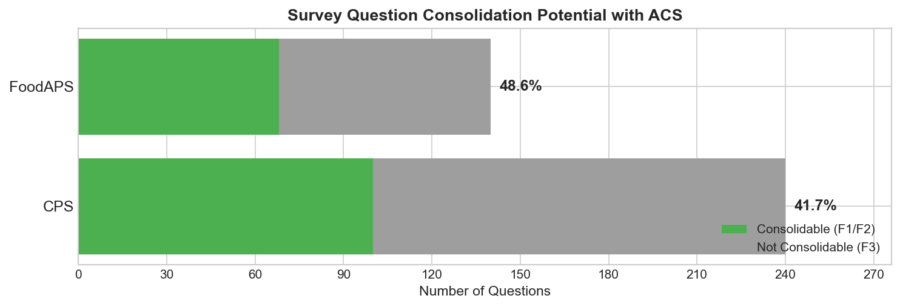
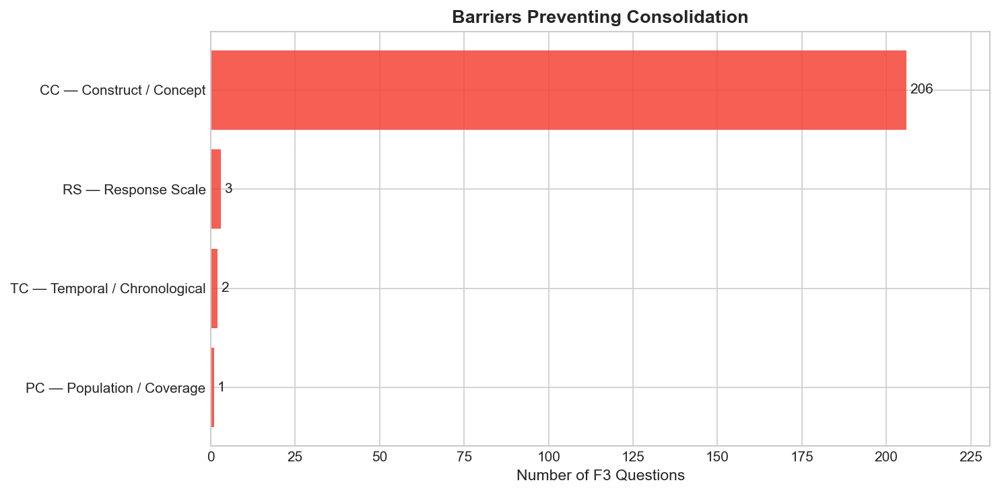
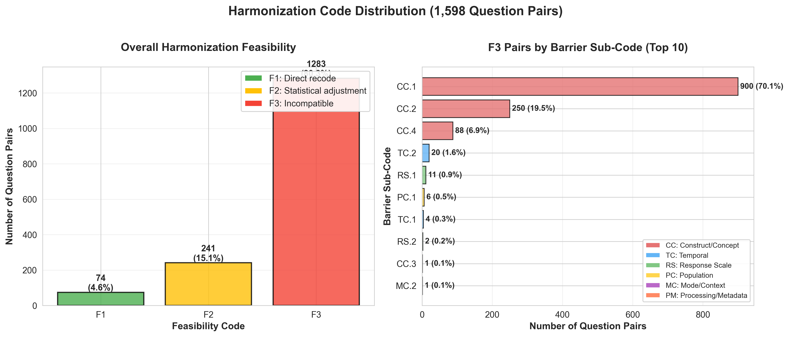
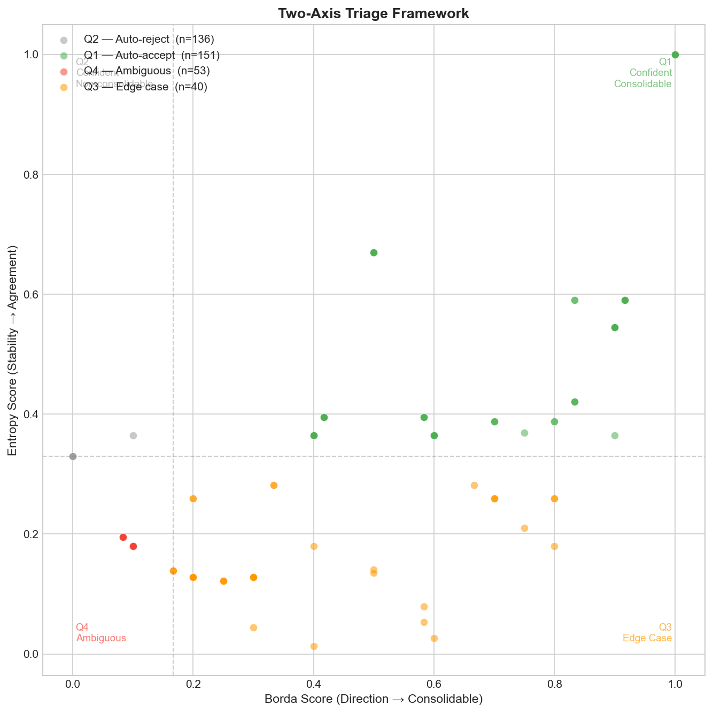

## Disclaimer

::: {.callout-warning}
**DRAFT** — These materials are in development and have not been independently validated.
:::

The views expressed are the author's own and do not necessarily represent the views of the U.S. Census Bureau or the U.S. Department of Commerce.

This is exploratory research assessing feasibility of AI-assisted survey analysis methods.

::: {.notes}
For detailed methodology validation, see Report 3B: AI Methodology Validation
:::

---

## Why It Matters

The federal statistical system already collects an enormous mosaic of data. The gap isn't in what we collect — it's in our ability to connect it. AI-assisted harmonization analysis reveals where surveys share useful touchpoints that can serve as bridge variables, increasing explanatory power without collecting a single additional data point.

Where questions may be interchangeable, the same analysis identifies consolidation opportunities — with the added benefit of encouraging language standardization across instruments.

::: {.notes}
Primary value: enrichment through cross-survey linkage — fill coverage gaps, enhance data quality from existing investment. Secondary value: consolidation where feasible, done rigorously to minimize data quality loss. Better explanatory power may naturally reduce survey count, tolerate higher non-response, and decrease expensive follow-ups.
:::

---

## The Challenge

::: {.incremental}
- Characterizing harmonization potential **requires expert judgment** (this doesn't change)
- Traditional timeline: **weeks to months** for manual review of 1,598 pairs
- Our approach: **AI handles classification, experts focus on highest-value decisions**
- Result: Bridge variable quality assessment + expert review table ready for validation
:::

---

## What Experts Get

| What AI Provides | What Experts Do |
|------------------|-----------------|
| Pre-screened pairs with best matches | Validate match quality |
| Initial F1/F2/F3 classification | Confirm or override |
| Documented reasoning | Understand and critique |
| Confidence scores | Prioritize review effort |
| Barrier codes | Verify diagnosis |

**76%** classified with high confidence → spot-check
**24%** flagged for expert review → where judgment adds most value

---

## Starting Point

- **6,987** survey questions across **47** federal survey instruments
- Mapped to Census Bureau standard taxonomy
- [Report 1 established concept classification]

---

## Method Overview {.smaller}

::: {.incremental}
- Multi-model LLM ensemble approach (brief validation — see Report 3B for details)
- Three frontier models to reduce bias
- **High inter-rater agreement (κ = 0.843)** = well-defined task
- **< 1 day processing time** for work that traditionally takes weeks/months
:::

::: {.notes}
For detailed methodology validation including construct validity analysis, arbitrator behavioral differences, and cost/quality tradeoffs, see Report 3B
:::

---

## Harmonization Framework

Adopted standard survey harmonization classification:

| Level | Definition |
|-------|------------|
| **F1** | Directly consolidable — no transformation needed |
| **F2** | Consolidable with transformation — needs recoding |
| **F3** | Not consolidable — fundamental barriers |

Barrier codes: CC (construct/concept), TC (temporal), RS (response scale)

---

## Headline Results

{width=80%}

- **CPS:** 42.5% harmonizable (102 of 240 questions) — potential bridge variables for cross-survey linkage
- **FoodAPS:** 48.6% harmonizable (68 of 140 questions)

::: {.notes}
F1 = high-quality bridge variables (direct linkage). F2 = usable bridges with adjustment. These are the touchpoints that enable cross-survey enrichment.
:::

<!-- MANUAL_UPDATE: consolidation rates from stage4_survey_summary.json -->

---

## Characterizing Bridge Variable Quality

{width=80%}

**97% of F3 constraints = Construct/Concept differences (CC)**

These aren't failures — they're quality indicators. F3 pairs with CC barriers measure fundamentally different constructs and cannot serve as bridge variables. The remaining F3 barriers (temporal, response scale) indicate potentially usable linkages with known limitations.

---

## Harmonization Code Distribution

{width=95%}

::: {.notes}
Left: Overall F1/F2/F3 distribution across 1,598 pairs
Right: Top 10 barrier sub-codes for F3 pairs - CC.1 (concept definition) dominates at 70%
:::

---

## Example: High Consolidability (F1)

**CPS:** "How many hours per week do you USUALLY work?"

**ACS:** "What is your best estimate of hours per week you usually work?"

- Verdict: **F1** (directly consolidable)
- Confidence: Borda=1.0, Entropy=1.0
- Same construct, same framing, same reference

---

## Example: Medium Consolidability (F2)

**CPS:** "EXCLUDING overtime, tips, commissions — what is hourly rate?"

**ACS:** "What is your hourly rate of pay?"

- Verdict: **F2** (consolidable with transformation)
- Transformation needed: scope alignment (ACS includes all components)

---

## Example: Not Consolidable (F3)

**CPS:** "Do you WANT to work full time (35+ hours)?"

**ACS:** "Did this person WORK for pay last week?"

- Verdict: **F3** — Barrier: **CC.1**
- Same domain (employment), entirely different constructs
- Preference vs. behavior — not reconcilable

---

## Expert Review Triage

{width=70%}

- Two-axis classification: Direction (Borda) × Stability (Entropy)
- **76%** (287 questions) = high confidence → spot-check recommended
- **24%** (93 questions) = flagged for expert review

::: {.notes}
Traditional: Expert reviews all 1,598 pairs = weeks/months
AI-assisted: Expert reviews 93 flagged questions = focused effort on highest-ROI decisions
:::

---

## Expert Review Load

{width=80%}

- **This IS the efficiency gain:** Experts review 93 questions, not 1,598 pairs
- AI provides initial judgment, experts provide final validation
- Focus expert time where it adds most value

---

## Deliverables

**Primary:** Expert review table (`expert_review_combined.csv`)
- 380 questions with best ACS matches
- F1/F2/F3 classifications with confidence scores
- Barrier codes and reasoning for each decision
- Triage routing (Q1-Q4) for prioritized review

**Breakdown:**
- 170 harmonizable (F1+F2) — bridge variable candidates ready for validation
- 210 constrained (F3) — with documented quality limitations
- 93 flagged for expert review — highest-value decisions
- Full methodology — reproducible for additional surveys

---

## What This Proves

::: {.incremental}
- **< 1 day processing time** for work that traditionally takes weeks/months
- **Bridge variable identification at scale** — systematic harmonization analysis across entire survey topology
- **Human oversight preserved throughout** — AI provides initial classification, experts validate
- **The table is the deliverable** — 380 questions with harmonization quality scores, ready for expert review
:::

::: {.notes}
Primary: enrichment through bridge variables. Secondary: consolidation where questions are truly interchangeable. Both delivered in the same expert review table.
:::

---

## What's Next

1. Expert validation of harmonization classifications
2. Cross-survey enrichment analysis — identifying multi-hop bridge variable paths across the full survey topology (Report 04)
3. Expand to additional federal surveys

---

## Summary

**Findings:**
- **~45% harmonization potential** — 170 questions identified as bridge variable candidates (F1+F2)
- **97% of constraints** = construct differences — quality indicators, not failures

**Method:**
- **< 1 day processing** for work that traditionally takes weeks/months
- **AI provides initial classification, experts provide final validation**
- **The real product:** 380 questions with harmonization quality scores, ready for expert review

**Impact:** Enables cross-survey data enrichment from existing federal data collection. Where questions are interchangeable, consolidation with language standardization becomes feasible.

::: {.notes}
Expert review table: output/analysis/expert_review_combined.csv
Primary: bridge variable catalog for cross-survey enrichment. Secondary: consolidation opportunities where questions are truly interchangeable.

For AI methodology validation details, see Report 3B
:::

---

## Questions?

Contact: [your info]

Repository: [link]

Expert review tables: [link to output]
