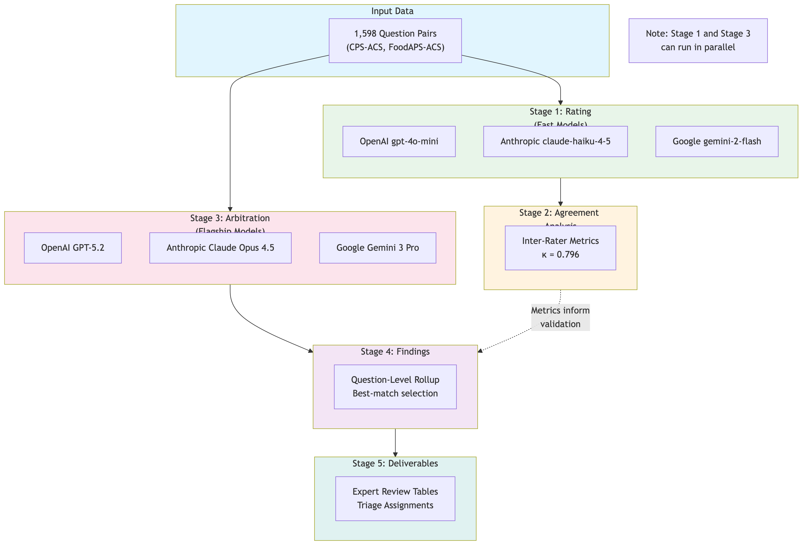
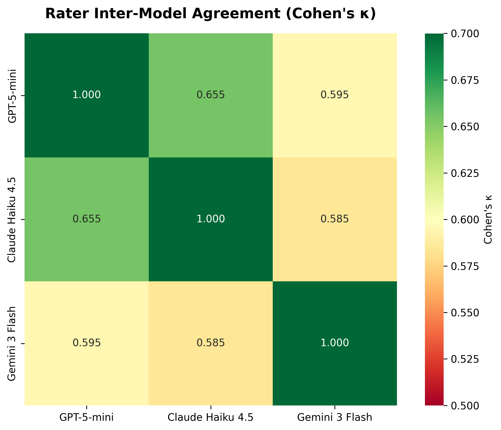
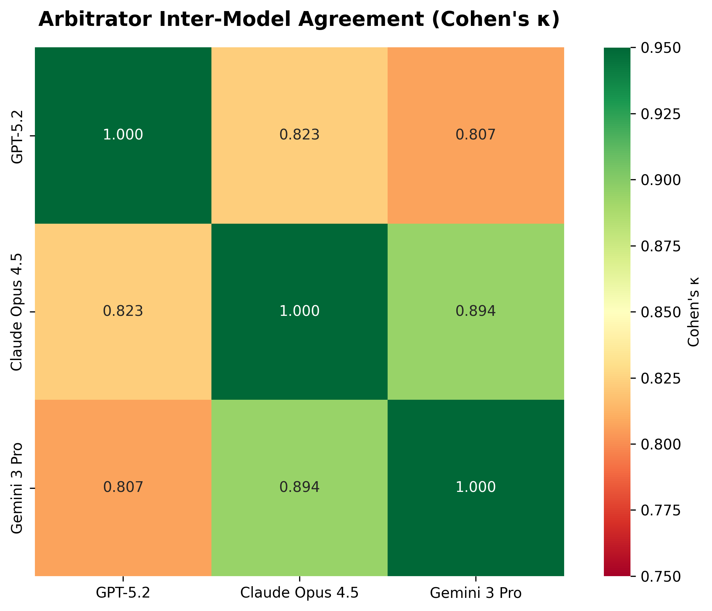
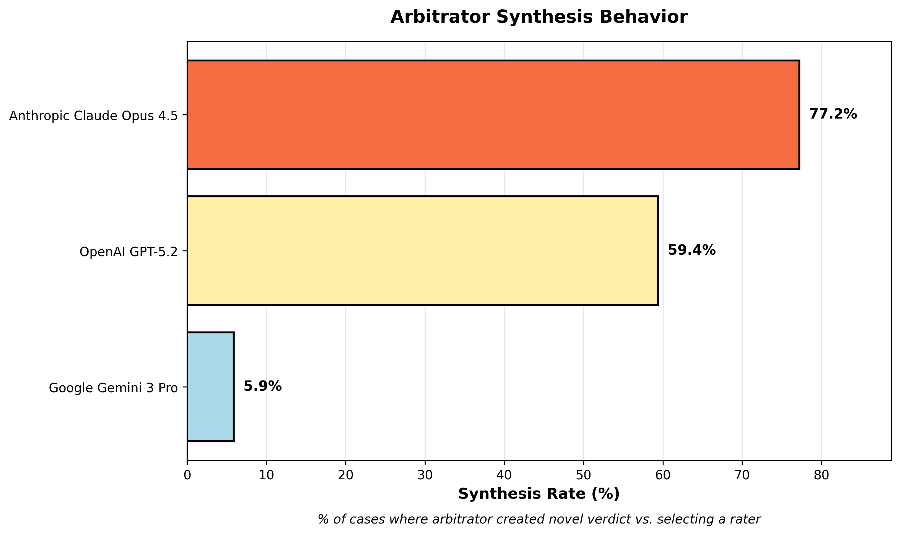
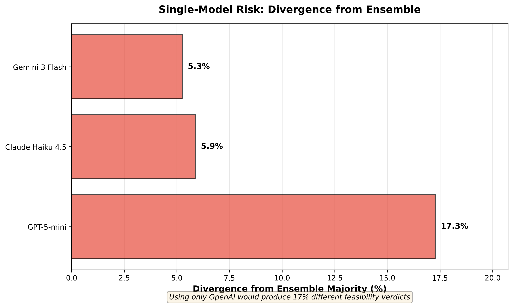
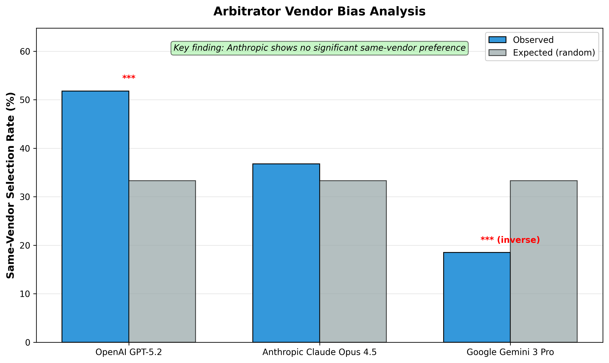
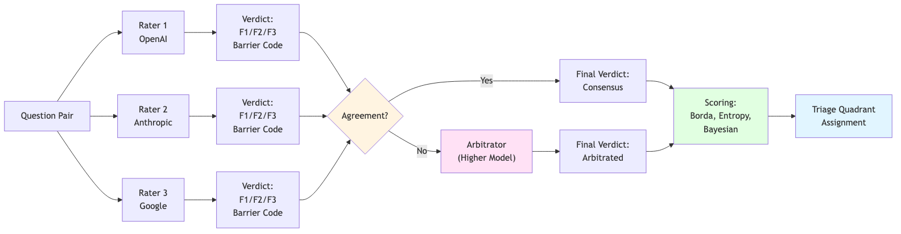

## Disclaimer

::: {.callout-warning}
**DRAFT** — These materials are in development and have not been independently validated.
:::

The views expressed are the author's own and do not necessarily represent the views of the U.S. Census Bureau or the U.S. Department of Commerce.

This is exploratory research assessing feasibility of AI-assisted survey analysis methods.

::: {.notes}
For survey-specific findings, see Report 3A: Survey Harmonization Findings
:::

---

## Research Question

**Can multi-model LLM ensemble reliably classify survey question harmonization compatibility?**

::: {.incremental}
- **Challenge:** Survey harmonization requires nuanced expert judgment
- **Approach:** Three-tier architecture (raters → arbitrators → triage)
- **Validation:** Construct validity through independent model convergence
- **Analysis:** Behavioral patterns in arbitrator decision-making
:::

---

## Pairwise Comparison Task

- Within concept categories, compare all question pairs
- **1,598 pairs** analyzed (CPS-ACS, FoodAPS-ACS)
- Harmonization classification: F1/F2/F3 with barrier codes
- Naive but exhaustive — expect many F3, looking for matches

---

## Three-Tier Architecture

{width=90%}

1. **Rating tier:** 3 fast models independently classify all pairs
2. **Arbitration tier:** 3 flagship models independently re-evaluate ALL pairs
3. **Triage tier:** Best-match rollup with confidence scoring

---

## Multi-Model Ensemble Design

Three frontier models to reduce bias:

| Model | Behavior |
|-------|----------|
| OpenAI | Moderate synthesis, slight pro-self bias |
| Anthropic | High synthesis, neutral |
| Google | Deferential, conservative |

**Different profiles = documented finding, not noise**

---

## Construct Validity: Why Trust These Results?

Three independent architectures → same judgments = well-defined task

:::: {.columns}
::: {.column width="50%"}
**Rater Agreement**
{height="300px"}

Fleiss κ = 0.611 (substantial)
:::

::: {.column width="50%"}
**Arbitrator Agreement**
{height="300px"}

Fleiss κ = 0.843 (almost perfect)
:::
::::

::: {.notes}
Convergence INCREASES with reasoning depth (0.611 → 0.843)
:::

---

## Rater Agreement

- **κ = 0.611** (Fleiss) — substantial agreement
- Three independent architectures converge on same patterns
- Disagreement rate manageable for arbitration tier

---

## Arbitrator Agreement

- **κ = 0.843** (Fleiss) — almost perfect agreement
- Flagship models with deeper reasoning → higher convergence
- Full arbitration coverage enables behavioral analysis across all pairs

---

## Arbitrator Behavioral Differences

Not a bug — a feature. Diversity captures multiple valid interpretations.

{height="350px"}

| Arbitrator | Synthesis Rate | Style |
|------------|---------------|-------|
| Google (Gemini 3 Pro) | 6% | Deferential — trusts raters |
| OpenAI (GPT-5.2) | 59% | Balanced |
| Anthropic (Claude Opus 4.5) | 77% | Active synthesis |

::: {.notes}
No single model dominates. Ensemble balances conservative and synthetic approaches.
:::

---

## Why Not Just Use One Model?

Single-model divergence from ensemble majority:

{height="350px"}

<!-- MANUAL_UPDATE: these numbers from stage2_agreement_metrics.json -->
- **OpenAI alone:** 17.3% different feasibility verdicts (~277 pairs)
- **Anthropic alone:** 5.9% (~94 pairs)
- **Google alone:** 5.3% (~85 pairs)

**The 3rd model catches what any 2 would miss.**

---

## Do Arbitrators Favor Their Own Vendor's Rater?

{height="350px"}

<!-- MANUAL_UPDATE: p-values from stage3_arbitration_metrics.json -->
| Arbitrator | Same-Vendor Selection | Expected | Significant? |
|------------|----------------------|----------|--------------|
| OpenAI | 51.8% | 33.3% | Yes (p<0.001) |
| Anthropic | 36.8% | 33.3% | **No** (p=0.159) |
| Google | 18.5% | 33.3% | Yes — AGAINST own |

**Finding:** Anthropic shows no same-vendor preference. Google actively avoids own vendor.

---

## Cost/Quality: Is the 3rd Model Worth It?

**Two-model scenarios — tie frequency:**

| Pair | Feasibility Ties |
|------|-----------------|
| OpenAI + Anthropic | 23.2% |
| OpenAI + Google | 22.1% |
| Anthropic + Google | 11.0% ← lowest |

**Recommendation:**
- <1,000 pairs: 2 models + human tiebreaking
- >1,000 pairs: 3 models for automated triage

The 3rd model's value is highest when first two disagree.

---

## LLM Ensemble Pattern

{width=90%}

---

## Methodology Validation Summary

| Validation Check | Result | Interpretation |
|-----------------|--------|----------------|
| Rater convergence | κ = 0.611 | Substantial — task well-defined |
| Arbitrator convergence | κ = 0.843 | Almost perfect — disagreements resolvable |
| Single-model risk | 5-17% | Multi-model approach justified |
| Vendor bias | Mixed | Anthropic unbiased; OpenAI self-favoring |

**Conclusion:** Multi-model ensemble provides robust classifications suitable for survey harmonization analysis.

---

## Implications for AI-Assisted Research

::: {.incremental}
- **Construct validity** through independent architecture convergence
- **Behavioral diversity** provides multiple valid perspectives
- **Cost/quality tradeoffs** enable scaling to larger datasets
- **Transparent biases** better than hidden single-model assumptions
:::

**Reusable methodology for future survey harmonization work**

---

## What's Next

1. Apply to additional federal surveys
2. Extend to survey editing/imputation use cases
3. Investigate optimal ensemble sizes for different task types

---

## Summary

**Research Question:** Can multi-model LLM ensembles reliably classify survey harmonization?

**Answer:** Yes, with documented construct validity

**Evidence:**
- High convergence (κ = 0.611 → 0.843)
- Documented behavioral differences
- Quantified single-model risk
- Vendor bias patterns identified

**Impact:** Validated methodology for AI-assisted survey analysis

::: {.notes}
For survey-specific findings and burden reduction implications, see Report 3A
:::

---

## Questions?

Contact: [your info]

Repository: [link]

Methodology documentation: [link]

---

# Appendix {.appendix}

---

## Harmonization Framework

Adopted standard survey harmonization classification:

| Level | Definition |
|-------|------------|
| **F1** | Directly consolidable — no transformation needed |
| **F2** | Consolidable with transformation — needs recoding |
| **F3** | Not consolidable — fundamental barriers |

Barrier codes: CC (construct/concept), TC (temporal), RS (response scale)

---

## Harmonization Taxonomy {.smaller}

**Primary Source:** Fortier et al. (2011, 2017) DataSHaPER/Maelstrom framework

**Supporting:** Wolf et al. (2016), Saris & Gallhofer (2014), Slomczynski & Tomescu-Dubrow (2018)

| Code | Feasibility | Definition | Action Required |
|------|-------------|------------|-----------------|
| **F1** | **Direct recode** | Mechanically transformable with simple recoding or collapsing | Simple data transformation |
| **F2** | **Statistical adjustment** | Requires modeling, imputation, or bridging studies | Statistical harmonization |
| **F3** | **Incompatible** | Fundamentally different constructs; not harmonizable without re-fielding | No harmonization possible |

::: {.notes}
Fortier et al. (2011) found 38% of variables could be harmonized across 53 studies
:::

---

## Barrier Code Taxonomy (1/3) {.smaller}

### Temporal Constraints (TC)

| Code | Subtype | Definition | Example |
|------|---------|------------|---------|
| **TC** | Temporal/Chronological | Reference period or timing differences | — |
| TC.1 | Reference period length | Different recall windows | 7-day vs 12-month |
| TC.2 | Temporal framing | Point-in-time vs habitual vs retrospective | "last week" vs "usually" |
| TC.3 | Calendar alignment | Fixed vs rolling reference periods | Calendar year vs "past 12 months" |

### Construct Constraints (CC)

| Code | Subtype | Definition | Example |
|------|---------|------------|---------|
| **CC** | Construct/Concept | Concept definition or operationalization differences | — |
| CC.1 | Concept definition | Different meaning of core term | "Employment" including/excluding unpaid work |
| CC.2 | Operationalization | Different behavioral indicators | "Food insecurity" via different batteries |
| CC.3 | Boundary conditions | Different thresholds or cutoffs | Income brackets with different boundaries |
| CC.4 | Scope inclusions | Different components counted | "Income" including/excluding specific sources |

---

## Barrier Code Taxonomy (2/3) {.smaller}

### Population/Coverage Constraints (PC)

| Code | Subtype | Definition | Example |
|------|---------|------------|---------|
| **PC** | Population/Coverage | Universe, frame, or sample design differences | — |
| PC.1 | Universe definition | Target population differs | Civilian vs all residents |
| PC.2 | Frame exclusions | Different sampling exclusions | Group quarters, territories |
| PC.3 | Age bounds | Different age eligibility | 15+ vs 16+ vs 18+ |
| PC.4 | Geographic scope | Different geographic coverage | 50 states vs states + territories |

### Response Scale Constraints (RS)

| Code | Subtype | Definition | Example |
|------|---------|------------|---------|
| **RS** | Response Scale | Scale type, categories, or format differences | — |
| RS.1 | Scale type | Fundamentally different formats | Binary vs 5-point vs continuous |
| RS.2 | Category structure | Different number/boundaries | 5-point vs 7-point Likert |
| RS.3 | Anchoring/labels | Different verbal anchors | "Strongly agree" differences |
| RS.4 | Numeric vs verbal | Number scale vs labeled categories | 0-10 slider vs frequency labels |

---

## Barrier Code Taxonomy (3/3) {.smaller}

### Mode/Context Constraints (MC)

| Code | Subtype | Definition | Example |
|------|---------|------------|---------|
| **MC** | Mode/Context | Interview mode or questionnaire context differences | — |
| MC.1 | Interview mode | Different data collection modes | CATI vs web self-administered |
| MC.2 | Question routing | Different skip patterns | Subset vs all respondents |
| MC.3 | Contextual priming | Preceding questions affect interpretation | Question order effects |
| MC.4 | Proxy response | Proxy vs self-report rules | Household head vs individual |

### Processing/Metadata Constraints (PM)

| Code | Subtype | Definition | Example |
|------|---------|------------|---------|
| **PM** | Processing/Metadata | Coding, weighting, or documentation differences | — |
| PM.1 | Coding schemes | Different classification systems | Occupation coding differences |
| PM.2 | Derived variables | Different construction algorithms | Poverty calculation methods |
| PM.3 | Documentation gaps | Insufficient metadata | Missing questionnaire context |

---

## Key Citations {.smaller}

**Harmonization Framework:**

- Fortier, I., et al. (2011). Is rigorous retrospective harmonization possible? Application of the DataSHaPER approach across 53 large studies. *International Journal of Epidemiology*, 40(5), 1314-1328.
- Fortier, I., et al. (2017). Maelstrom Research guidelines for rigorous retrospective data harmonization. *International Journal of Epidemiology*, 46(1), 103-115.

**Survey Methodology:**

- Wolf, C., et al. (2016). Harmonizing survey questions between cultures and over time. In *The SAGE Handbook of Survey Methodology* (pp. 502-524). SAGE.
- Saris, W. E., & Gallhofer, I. N. (2014). *Design, Evaluation, and Analysis of Questionnaires for Survey Research* (2nd ed.). Wiley.

**Data Harmonization:**

- Slomczynski, K. M., & Tomescu-Dubrow, I. (2018). Basic principles of survey data recycling. In *Advances in Comparative Survey Methods* (pp. 937-962). Wiley.
- Tomescu-Dubrow, I., et al. (Eds.). (2024). *Survey Data Harmonization in the Social Sciences*. Wiley.
